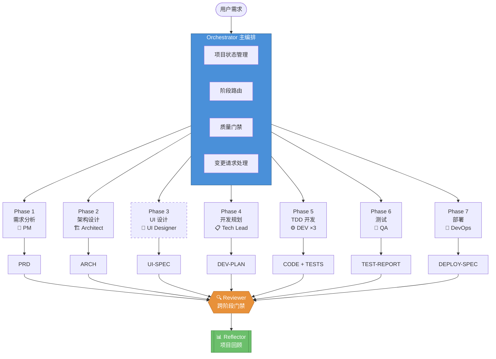
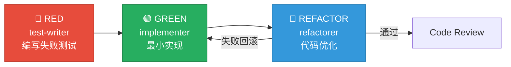
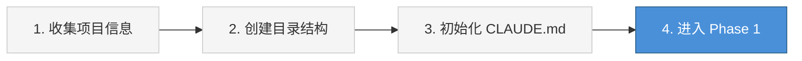

<div align="center">

# CataForge

**AI 驱动的全生命周期软件开发工作流框架**

[](https://github.com/lync-cyber/CataForge/releases/tag/v0.1.0)
[](LICENSE)
[](https://docs.anthropic.com/en/docs/claude-code)
[](#)
[](#)

通过 **12 个专业化 AI Agent** 和 **21 个可复用 Skill** 的协作，将软件开发从需求到部署的全流程结构化、自动化。

[快速开始](#-快速开始) · [框架架构](#-框架架构) · [贡献指南](#-贡献指南) · [版本规则](#-版本规则)

</div>

---

## 核心特性

| 特性 | 说明 |
|:-----|:-----|
| **全链路工作流** | 需求 → 架构 → UI 设计 → 开发规划 → TDD 开发 → 测试 → 部署，7 阶段 + 回顾 |
| **文档驱动** | 每阶段产出标准化文档（PRD / ARCH / UI-SPEC / DEV-PLAN / TEST-REPORT / DEPLOY-SPEC），文档间通过 ID 交叉引用 |
| **双层质量门禁** | Layer 1: Python 脚本结构检查 → Layer 2: AI 语义审查，脚本异常时自动降级为 AI-only |
| **TDD 三子代理** | RED（test-writer）→ GREEN（implementer）→ REFACTOR（refactorer），每阶段独立上下文窗口 |
| **按需加载** | 通过 NAV-INDEX 导航索引精准加载最小必要上下文，避免 token 浪费 |
| **安全隔离** | 每个 Agent 声明 `allowed_paths`，agent-dispatch 通过 `git diff` 后置校验写入范围 |
| **自学习闭环** | On-Correction Learning + Adaptive Review + Retrospective，持续积累项目经验 |

---

## 框架架构

### 工作流总览



> Phase 3（UI 设计）为可选阶段，后端/CLI/API-only 项目可跳过。

### TDD 引擎



### Agent 一览

<table>
<tr>
<th>层级</th>
<th>Agent</th>
<th>阶段</th>
<th>主要产出</th>
</tr>
<tr>
<td rowspan="4"><strong>规划层</strong></td>
<td>product-manager</td>
<td>Phase 1</td>
<td>PRD（F-NNN, AC-NNN）</td>
</tr>
<tr>
<td>architect</td>
<td>Phase 2</td>
<td>ARCH（M-NNN, API-NNN, E-NNN）+ 分卷</td>
</tr>
<tr>
<td>ui-designer</td>
<td>Phase 3</td>
<td>UI-SPEC（P-NNN, C-NNN）<em>[可选]</em></td>
</tr>
<tr>
<td>tech-lead</td>
<td>Phase 4</td>
<td>DEV-PLAN（T-NNN, Sprint 规划）</td>
</tr>
<tr>
<td rowspan="3"><strong>执行层</strong></td>
<td>test-writer</td>
<td>Phase 5 RED</td>
<td>失败测试用例</td>
</tr>
<tr>
<td>implementer</td>
<td>Phase 5 GREEN</td>
<td>最小实现代码</td>
</tr>
<tr>
<td>refactorer</td>
<td>Phase 5 REFACTOR</td>
<td>优化后的代码</td>
</tr>
<tr>
<td rowspan="2"><strong>质量层</strong></td>
<td>reviewer</td>
<td>跨阶段</td>
<td>文档 / 代码审查报告</td>
</tr>
<tr>
<td>qa-engineer</td>
<td>Phase 6</td>
<td>集成 / E2E 测试报告</td>
</tr>
<tr>
<td rowspan="3"><strong>元协调层</strong></td>
<td>orchestrator</td>
<td>全程</td>
<td>CLAUDE.md 状态管理</td>
</tr>
<tr>
<td>devops</td>
<td>Phase 7</td>
<td>DEPLOY-SPEC, CHANGELOG</td>
</tr>
<tr>
<td>reflector</td>
<td>项目完成后</td>
<td>RETRO 回顾报告</td>
</tr>
</table>

### 关键设计模式

| 模式 | 描述 |
|:-----|:-----|
| **文档生命周期** | `draft` → `review` → `approved`（或 `needs_revision` → 返工循环）。`doc-gen` skill 负责模板实例化、超 500 行自动拆分、NAV-INDEX 注册 |
| **TDD 引擎** | orchestrator 直接驱动三个子代理，通过文件系统传递状态（非上下文内传递），确保阶段间隔离 |
| **变更请求** | `change-guard` skill 分析变更影响范围，按偏移等级路由: L1 直接执行 / L2 修订受影响文档 / L3 级联修订 |
| **自学习** | 用户纠正 → 记录偏差 → 反复问题注入提示 → 项目回顾 → 经验写入 learnings |

---

## 项目结构

```
CataForge/
├── CLAUDE.md                            # 项目状态（orchestrator 独占维护）
├── pyproject.toml                       # 项目元数据与框架版本号
├── .claude/
│   ├── settings.json                    # 框架配置（权限、Hook、环境变量）
│   ├── agents/                          # 12 个 Agent 定义
│   │   ├── orchestrator/
│   │   ├── product-manager/
│   │   ├── architect/
│   │   ├── ui-designer/
│   │   ├── tech-lead/
│   │   ├── test-writer/
│   │   ├── implementer/
│   │   ├── refactorer/
│   │   ├── reviewer/
│   │   ├── qa-engineer/
│   │   ├── devops/
│   │   └── reflector/
│   ├── skills/                          # 21 个 Skill
│   │   ├── agent-dispatch/              #   子代理调度
│   │   ├── doc-gen/                     #   文档生成（含 15 个模板）
│   │   ├── doc-nav/                     #   文档导航与按需加载
│   │   ├── doc-review/                  #   文档审查（含 doc_check.py）
│   │   ├── code-review/                 #   代码审查（含 code_lint.py）
│   │   ├── tdd-engine/                  #   TDD 三阶段编排
│   │   ├── req-analysis/                #   需求分析
│   │   ├── arc-design/                  #   架构设计
│   │   ├── ui-design/                   #   UI 设计
│   │   ├── task-decomp/                 #   任务拆分
│   │   ├── dep-analysis/                #   依赖分析（含 dep_analysis.py）
│   │   ├── tech-eval/                   #   技术评估
│   │   ├── research/                    #   调查研究
│   │   ├── testing/                     #   测试策略与执行
│   │   ├── deploy-config/               #   部署配置
│   │   ├── change-guard/                #   变更请求分析
│   │   ├── sprint-review/               #   Sprint 完成度审查
│   │   ├── start-orchestrator/          #   编排流程入口
│   │   ├── penpot-sync/                 #   Penpot Token 同步 [可选]
│   │   ├── penpot-implement/            #   Penpot 组件代码生成 [可选]
│   │   └── penpot-review/               #   设计-代码一致性验证 [可选]
│   ├── rules/                           # 共享规则
│   │   ├── COMMON-RULES.md              #   所有 Agent 行为规则
│   │   └── ORCHESTRATOR-PROTOCOLS.md    #   编排器专用协议
│   ├── hooks/                           # Tool Hook（Python，跨平台）
│   ├── scripts/                         # 框架工具脚本
│   └── schemas/                         # JSON Schema
└── docs/                                # 项目文档（运行时生成）
```

---

## 快速开始

### 前置条件

| 依赖 | 版本 | 说明 |
|:-----|:-----|:-----|
| [Claude Code](https://docs.anthropic.com/en/docs/claude-code) | 最新版 | AI Agent 运行时 |
| Python | 3.8+ | Hook 脚本和审查脚本 |
| Git | 任意 | 版本控制 |

### 方式一：作为模板创建新项目

```bash
git clone https://github.com/lync-cyber/CataForge.git my-project
cd my-project
rm -rf .git && git init
claude
```

### 方式二：为已有项目引入

```bash
cd your-existing-project
cp -r /path/to/CataForge/.claude .claude/
cp /path/to/CataForge/CLAUDE.md .
claude
```

### 启动工作流

在 Claude Code 中输入 `/start-orchestrator` 或直接描述需求：

```
> 我想开发一个任务管理 Web 应用，支持看板视图和团队协作...
```

首次运行时 orchestrator 自动执行引导协议：



---

## 框架升级

```bash
# 本地路径升级
python .claude/scripts/upgrade.py /path/to/new-CataForge --dry-run   # 预览变更
python .claude/scripts/upgrade.py /path/to/new-CataForge             # 执行升级

# 远程升级（需配置 .claude/upgrade-source.json）
python .claude/scripts/check-upgrade.py --check    # 检测新版本
python .claude/scripts/check-upgrade.py --apply     # 执行升级
```

> 升级仅更新框架文件（.claude/），保留项目状态（CLAUDE.md、docs/、src/）。

---

## 版本规则

CataForge 遵循 [语义化版本 (SemVer)](https://semver.org/lang/zh-CN/) 规范：

| 版本位 | 递增条件 | 示例 |
|:-------|:---------|:-----|
| **MAJOR** | 不兼容的框架变更（Agent/Skill 接口、协议格式等） | `1.0.0` → `2.0.0` |
| **MINOR** | 向后兼容的新功能（新增 Agent/Skill、新协议、新模板） | `0.1.0` → `0.2.0` |
| **PATCH** | 向后兼容的修复（Bug 修复、文档修正、脚本优化） | `0.1.0` → `0.1.1` |

> `0.x` 阶段 API 可能变化，MINOR 递增可能包含不兼容变更。`1.0.0` 起严格遵守 SemVer。

---

## 贡献指南

<details>
<summary><strong>新增 Agent</strong></summary>

1. 创建 `.claude/agents/{agent-name}/AGENT.md`
2. YAML frontmatter 必填字段：`name`, `description`, `tools`, `disallowedTools`, `allowed_paths`, `model`, `maxTurns`
3. 在 `skills:` 字段声明该 Agent 使用的 Skill
4. 参考已有 Agent（如 `architect/AGENT.md`）

</details>

<details>
<summary><strong>新增 Skill</strong></summary>

1. 创建 `.claude/skills/{skill-name}/SKILL.md`
2. 必填字段：`name`, `description`；可选：`argument-hint`, `suggested-tools`, `depends`, `user-invocable`
3. 按需添加 `templates/`（文档模板）和 `scripts/`（确定性脚本）子目录
4. SKILL.md 控制在 500 行以内（渐进加载原则）

</details>

<details>
<summary><strong>贡献规范</strong></summary>

- **单一事实来源** — 规则在 COMMON-RULES.md 定义一次，其他文件通过引用使用
- **中文文档** — 框架文档和提示词使用中文；代码、变量、CLI 参数使用英文
- **解释 why** — 约束规则附带原因说明，避免无理由的"禁止"
- **Commit 格式** — `feat:` / `fix:` / `refactor:` / `learn:` / `chore:`

</details>

---

<div align="center">

## 许可证

[MIT](LICENSE) &copy; 2026 CataForge Contributors

</div>
