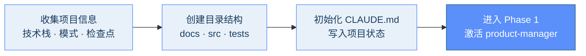
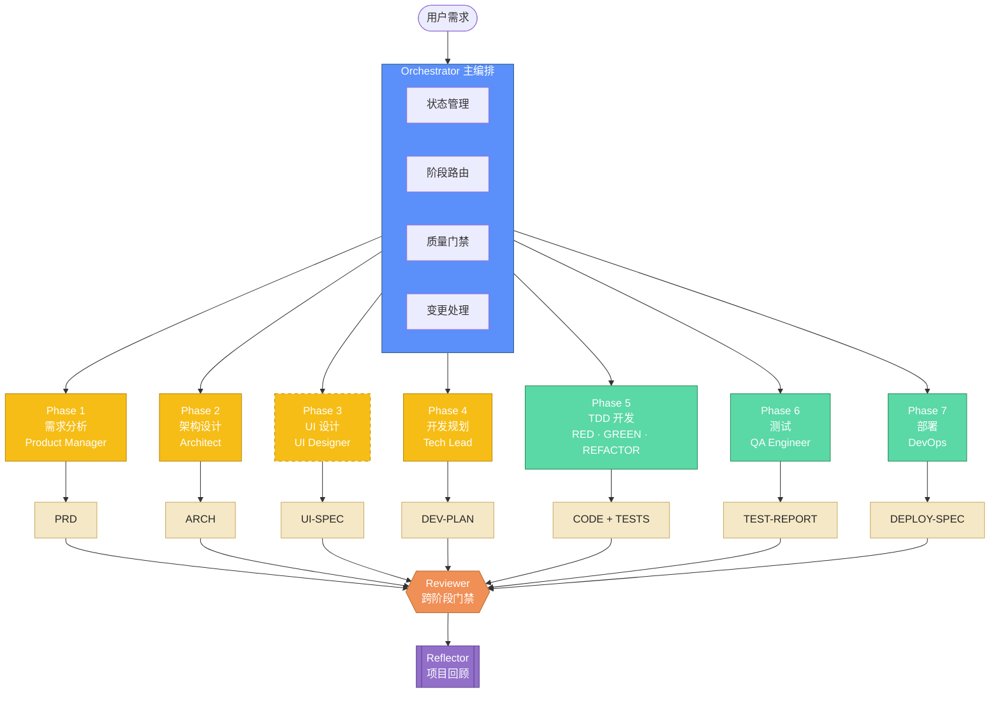
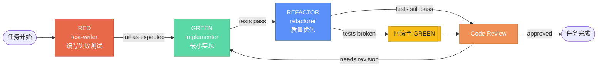

<div align="center">

# CataForge

**中文原生 · AI 驱动的全生命周期软件开发工作流框架**

*给 AI 一套工程方法论，而不是一个万能提示词*

[](https://github.com/lync-cyber/CataForge/releases)
[](LICENSE)
[](https://docs.anthropic.com/en/docs/claude-code)
[](#中文原生核心差异化)
[](#贡献指南)

**[简介](#简介)** · **[中文原生](#中文原生核心差异化)** · **[快速开始](#快速开始)** · **[架构](#框架架构)** · **[使用方法](#使用方法)**

</div>

---

## 目录

- [简介](#简介)
- [中文原生：核心差异化](#中文原生核心差异化)
- [核心特性与适用场景](#核心特性与适用场景)
- [快速开始](#快速开始)
- [框架架构](#框架架构)
- [使用方法](#使用方法)
- [框架升级](#框架升级)
- [Roadmap](#roadmap)
- [贡献指南](#贡献指南)
- [许可证](#许可证)

<details>
<summary>更多资料</summary>

- [项目结构](#项目结构)
- [Agent 与 Skill 一览](#agent-与-skill-一览)
- [质量门禁测试](#质量门禁测试)
- [版本规则](#版本规则)

</details>

---

## 简介

**CataForge** 是一个运行在 [Claude Code](https://docs.anthropic.com/en/docs/claude-code) 之上的结构化软件开发框架，**专为中文开发场景深度设计**。它通过 **13 个专业化 AI Agent** 和 **22 个可复用 Skill** 的协作，将软件开发从需求到部署的全生命周期转化为一条由状态机驱动、由文档证据链保证的工作流。

与"让 LLM 直接写代码"不同，CataForge 强制每个阶段产出结构化文档（PRD / ARCH / DEV-PLAN / TEST-REPORT 等），并通过**双层质量门禁**（Python 脚本校验 + AI 语义审查）在每次阶段转换时阻断低质量产出，从根源上抑制"看起来对、实际跑不起来"的典型 AI 代码生成失败模式。

---

## 中文原生：核心差异化

市面上绝大多数 AI 开发框架以英文为第一公民，中文团队面临**英文提示词 + 英文模板 + 英文术语**的三重翻译损耗。CataForge 从提示词、Agent 定义、文档模板到用户问答全链路原生中文。

| 维度 | 英文优先框架 | **CataForge** |
|:-----|:-------------|:---------------|
| **Agent 提示词** | 英文原生，中文需自行改写 | 13 个 Agent 全部中文提示词 |
| **文档模板** | 英文 README / SPEC | 20 个中文模板：PRD / ARCH / UI-SPEC / DEV-PLAN / TEST-REPORT |
| **用户交互** | 英文提问、英文选项 | 中文选择题优先，每批 ≤3 题 |
| **需求澄清** | "Please provide more details" | "这里不太清楚，我准备了 3 个选项请你选一下……" |
| **审查报告** | 英文 issue 描述 | 中文问题描述 + 中文改进建议，保留代码标识符英文 |
| **术语一致性** | 各 Agent 独立翻译 | COMMON-RULES 中文术语统一对照 |
| **需求到代码可追溯** | 无 | ID 交叉引用：F-001 → T-003 → 测试用例 |
| **阶段间质量控制** | 依赖人工 | 双层门禁（脚本 + AI）阻断低质量产出 |
| **TDD 强制** | 可选 | 强制 RED → GREEN → REFACTOR 三子代理 |
| **变更请求处理** | 手动重做 | change-guard 分析影响范围并级联修订 |
| **自学习闭环** | 无 | 用户纠正 → CORRECTIONS-LOG → Retrospective → learnings |

### 中英文混用边界

为兼顾中文可读性与代码可搜索性：
- **中文**：文档正文、审查报告、用户交互、Commit 描述
- **英文**：代码、变量名、CLI 参数、框架参数（`doc_type` / `template_id`）、枚举值（`status` / `severity`）

> 避免两个极端：全英文导致团队阅读成本高；全中文导致 grep 失效、框架参数错位。

---

## 核心特性与适用场景

| 特性 | 说明 |
|:-----|:-----|
| **原生中文框架** | 提示词、模板、交互、审查全链路中文，零翻译损耗 |
| **全链路工作流** | 需求 → 架构 → UI → 开发规划 → TDD 开发 → 测试 → 部署，共 7 阶段 + 回顾 |
| **双层质量门禁** | Layer 1 脚本静态校验 → Layer 2 AI 语义审查，脚本异常时自动降级 |
| **TDD 三子代理** | RED（test-writer）→ GREEN（implementer）→ REFACTOR（refactorer），独立上下文 |
| **三种执行模式** | standard / agile-lite / agile-prototype，按项目规模选择 |
| **按需加载** | NAV-INDEX 精准定位章节，避免 token 浪费 |
| **安全隔离** | 每个 Agent 声明 `allowed_paths`，`git diff` 后置校验写入范围 |
| **自学习闭环** | On-Correction Learning + Adaptive Review + Retrospective |
| **自升级机制** | 本地/远程升级，保留项目状态并自动校验完整性 |

**适用场景一览：**

| 场景 | 推荐模式 | 产出 |
|:-----|:---------|:-----|
| 中大型正式交付项目 | `standard` | 7 阶段 + 完整文档 |
| 轻量工具 / 小型 Web 项目 | `agile-lite` | prd-lite + arch-lite + dev-plan-lite |
| 原型 / PoC / 验证脚本 | `agile-prototype` | 单一 brief.md |
| 已有项目引入 AI 协作 | 任选 | 复制 `.claude/` 即可 |

---

## 快速开始

### 前置条件

- [Claude Code](https://docs.anthropic.com/en/docs/claude-code) 最新版
- Python 3.8+
- Git
- _可选_：[ruff](https://github.com/astral-sh/ruff) / Node.js 18+ / dotnet（Hooks 自动检测，缺失时静默跳过）

### 安装

```bash
# 方式一：作为模板创建新项目
git clone https://github.com/lync-cyber/CataForge.git my-project
cd my-project && rm -rf .git && git init
python .claude/scripts/setup.py
claude

# 方式二：为已有项目引入
cp -r /path/to/CataForge/.claude your-existing-project/.claude/
cp /path/to/CataForge/CLAUDE.md /path/to/CataForge/.env.example your-existing-project/
cd your-existing-project && python .claude/scripts/setup.py && claude
```

### 一分钟体验

进入 Claude Code 后直接描述需求（或输入 `/start-orchestrator`）：

```text
> 我想开发一个任务管理 Web 应用，支持看板视图和团队协作
```

orchestrator 会自动引导 4 步初始化，然后进入需求分析：



---

## 框架架构

> 配色语义（跨图一致）：
> **蓝** = 编排核心 · **黄** = 规划阶段 · **绿** = 执行阶段 · **橙** = 质量门禁 · **紫** = 元协调 · **虚线** = 可选/跳过

### 工作流总览



### TDD 引擎



---

## 使用方法

### 执行模式对照

| 模式 | 阶段集合 | 文档产出 | TDD | 人工检查点 |
|:-----|:--------|:--------|:----|:----------|
| **standard** | 7 阶段全跑 | PRD / ARCH / UI-SPEC / DEV-PLAN / TEST-REPORT / DEPLOY-SPEC | RED → GREEN → REFACTOR | pre_dev + pre_deploy |
| **agile-lite** | Phase 1+2 合并 | prd-lite + arch-lite + dev-plan-lite（各 ≤50 行） | RED+GREEN 合并，REFACTOR 可选 | 仅 pre_dev |
| **agile-prototype** | brief + development | 单一 brief.md（≤150 行） | RED+GREEN 合并，跳过 REFACTOR | 无 |

### 变更请求与修订

项目推进中用户可随时提出变更，`change-guard` skill 自动分析影响范围：

- **L1 局部澄清**：直接执行，无需级联
- **L2 单文档扩展**：激活对应 Agent 以 `task_type=amendment` 修订受影响章节
- **L3 跨文档影响**：自需求链上游起逐级修订，级联到下游所有受影响文档

---

## 框架升级

```bash
# 本地路径升级
python .claude/scripts/upgrade.py local /path/to/new-CataForge --dry-run
python .claude/scripts/upgrade.py local /path/to/new-CataForge

# 远程升级（需配置 .claude/framework.json）
python .claude/scripts/upgrade.py check
python .claude/scripts/upgrade.py upgrade --dry-run
python .claude/scripts/upgrade.py upgrade

# 独立验证
python .claude/scripts/upgrade.py verify
```

> 升级仅更新框架文件（`.claude/`），保留项目状态（`CLAUDE.md` / `docs/` / `src/`），升级完成后自动执行后置验证。

---

## Roadmap

- [x] v0.7.1 — 脚本共享模块 `_common.py`、Penpot 部署 Python 重写、跨脚本去重
- [x] v0.7.0 — 框架自升级、correction hook、migration 检查、提示词快照
- [x] v0.6.x — agile-lite / agile-prototype 执行模式
- [x] v0.5.x — Penpot MCP 设计工具集成
- [ ] v0.8.x — 多语言 Agent 变体（英文 / 日文 fallback）
- [ ] v0.9.x — 项目模板库（常见技术栈预设）
- [ ] v1.0.0 — 稳定 API，严格 SemVer

详见 [Releases](https://github.com/lync-cyber/CataForge/releases) 与 `docs/changelog.md`。

---

## 项目结构

<details>
<summary>展开查看完整目录</summary>

```text
CataForge/
├── CLAUDE.md                            # 项目状态（orchestrator 独占维护）
├── pyproject.toml                       # 项目元数据与框架版本号
├── .env.example                         # 环境变量配置示例
├── .claude/
│   ├── settings.json                    # 框架配置（权限、Hook、环境变量）
│   ├── agents/                          # 13 个 Agent 定义
│   │   ├── orchestrator/                #   主编排智能体
│   │   ├── product-manager/             #   需求分析
│   │   ├── architect/                   #   架构设计
│   │   ├── ui-designer/                 #   UI 设计
│   │   ├── tech-lead/                   #   开发规划
│   │   ├── test-writer/                 #   TDD RED
│   │   ├── implementer/                 #   TDD GREEN
│   │   ├── refactorer/                  #   TDD REFACTOR
│   │   ├── reviewer/                    #   跨阶段审查
│   │   ├── qa-engineer/                 #   集成 / E2E 测试
│   │   ├── devops/                      #   部署与发布
│   │   ├── debugger/                    #   运行时诊断
│   │   └── reflector/                   #   项目回顾
│   ├── skills/                          # 22 个 Skill
│   │   ├── agent-dispatch/              #   子代理调度
│   │   ├── doc-gen/                     #   文档生成（含 20 个模板）
│   │   ├── doc-nav/                     #   文档导航与按需加载
│   │   ├── doc-review/                  #   文档审查
│   │   ├── code-review/                 #   代码审查
│   │   ├── tdd-engine/                  #   TDD 三阶段编排
│   │   ├── change-guard/                #   变更请求分析
│   │   ├── sprint-review/               #   Sprint 审查
│   │   ├── debug/                       #   调试诊断
│   │   ├── start-orchestrator/          #   编排流程入口
│   │   └── ...                          #   更多 Skill
│   ├── rules/                           # 共享规则（自动注入所有 Agent）
│   ├── hooks/                           # Tool Hook（Python，跨平台）
│   ├── scripts/                         # 框架工具脚本
│   │   ├── _common.py                   #   共享工具模块（项目根检测、UTF-8、.env 解析、颜色输出）
│   │   ├── setup.py                     #   环境检测与初始化
│   │   ├── setup_penpot.py              #   Penpot 本地部署与 MCP 启动
│   │   ├── upgrade.py                   #   框架升级（本地 / 远程）
│   │   ├── event_logger.py              #   统一事件日志
│   │   ├── load_section.py              #   文档章节按需加载
│   │   └── phase_reader.py              #   项目阶段读取
│   └── schemas/                         # JSON Schema
├── tests/                               # 质量门禁测试
└── docs/                                # 项目文档（运行时生成）
```

</details>

---

## Agent 与 Skill 一览

<details>
<summary>展开查看所有 Agent 与职责</summary>

| 层级 | Agent | 阶段 | 主要产出 |
|:-----|:------|:-----|:---------|
| **规划层** | product-manager | Phase 1 | PRD（F-NNN, AC-NNN） |
| **规划层** | architect | Phase 2 | ARCH（M-NNN, API-NNN, E-NNN）+ 分卷 |
| **规划层** | ui-designer | Phase 3 _[可选]_ | UI-SPEC（P-NNN, C-NNN） |
| **规划层** | tech-lead | Phase 4 | DEV-PLAN（T-NNN, Sprint 规划） |
| **执行层** | test-writer | Phase 5 RED | 失败测试用例 |
| **执行层** | implementer | Phase 5 GREEN | 最小实现代码 |
| **执行层** | refactorer | Phase 5 REFACTOR | 优化后的代码 |
| **质量层** | reviewer | 跨阶段 | 文档 / 代码审查报告 |
| **质量层** | qa-engineer | Phase 6 | 集成 / E2E 测试报告 |
| **元协调层** | orchestrator | 全程 | CLAUDE.md 状态管理 |
| **元协调层** | devops | Phase 7 | DEPLOY-SPEC, CHANGELOG |
| **元协调层** | debugger | 按需 | 运行时错误诊断报告 |
| **元协调层** | reflector | 项目完成后 | RETRO 回顾报告 |

**关键设计模式：**

- **文档生命周期**：`draft` → `review` → `approved`（或 `needs_revision` → 返工循环），doc-gen skill 负责模板实例化、超 300 行自动拆分、NAV-INDEX 注册
- **TDD 引擎**：orchestrator 直接驱动三个子代理，通过文件系统传递状态，确保阶段间上下文隔离
- **变更请求**：change-guard skill 按偏移等级路由（L1 / L2 / L3）
- **自学习**：用户纠正 → 记录偏差 → 反复问题注入提示 → 项目回顾 → 经验写入 learnings

</details>

---

## 质量门禁测试

<details>
<summary>展开查看测试覆盖</summary>

```bash
python -m pytest tests/ -v -s
```

| 测试文件 | 覆盖范围 |
|:---------|:---------|
| `test_framework_integrity.py` | 所有 AGENT.md / SKILL.md 的 frontmatter 格式、字段完整性、交叉引用 |
| `test_upgrade_utils.py` | 版本解析、JSON 加载、分支名校验 |
| `test_upgrade_merge.py` | settings.json 合并、CLAUDE.md 章节提取与回填 |
| `test_upgrade_verify.py` | 升级后功能适用性检查、文件完整性验证 |
| `test_guard_dangerous.py` | 危险命令拦截（`rm -rf` / `git push --force` 等） |
| `test_validate_agent_result.py` | agent-result XML 标签和状态码校验 |
| `test_dep_analysis.py` | 环检测、拓扑排序、关键路径、Sprint 分组 |
| `test_doc_check.py` | 文档 TODO 检查、代码块过滤、元数据校验 |
| `test_setup.py` | Python 版本检测、项目依赖检测 |

> 框架升级或迭代后运行测试，确保 AGENT / SKILL 引用未断裂、核心脚本逻辑未被破坏。

</details>

---

## 版本规则

遵循 [语义化版本 (SemVer)](https://semver.org/lang/zh-CN/)：

- **MAJOR** — 不兼容变更（Agent / Skill 接口、协议格式）
- **MINOR** — 向后兼容新功能（新增 Agent / Skill / 模板）
- **PATCH** — 向后兼容修复（Bug 修复、文档修正）

> `0.x` 阶段 API 可能变化，MINOR 递增可能包含不兼容变更。`1.0.0` 起严格遵守 SemVer。

---

## 贡献指南

欢迎贡献 Agent、Skill、模板和文档改进。提交 PR 前请确保 `pytest tests/` 全部通过。

<details>
<summary><strong>新增 Agent</strong></summary>

1. 创建 `.claude/agents/{agent-name}/AGENT.md`
2. YAML frontmatter 必填字段：`name`、`description`、`tools`、`disallowedTools`、`allowed_paths`、`model`、`maxTurns`
3. 在 `skills:` 字段声明该 Agent 使用的 Skill
4. 参考已有 Agent（如 `architect/AGENT.md`）

</details>

<details>
<summary><strong>新增 Skill</strong></summary>

1. 创建 `.claude/skills/{skill-name}/SKILL.md`
2. 必填字段：`name`、`description`；可选：`argument-hint`、`suggested-tools`、`depends`、`user-invocable`
3. 按需添加 `templates/`（文档模板）和 `scripts/`（确定性脚本）子目录
4. SKILL.md 控制在 500 行以内（渐进加载原则）

</details>

<details>
<summary><strong>贡献规范</strong></summary>

- **单一事实来源** — 规则在 `COMMON-RULES.md` 定义一次，其他文件通过引用使用
- **中文文档** — 框架文档和提示词使用中文；代码、变量、CLI 参数使用英文
- **解释 why** — 约束规则附带原因说明，避免无理由的"禁止"
- **Commit 格式** — `feat:` / `fix:` / `refactor:` / `learn:` / `chore:`

</details>

---

<div align="center">

## 许可证

[MIT](LICENSE) &copy; 2026 CataForge Contributors

**如果 CataForge 对你有帮助，欢迎 Star 支持**

[返回顶部](#cataforge)

</div>
