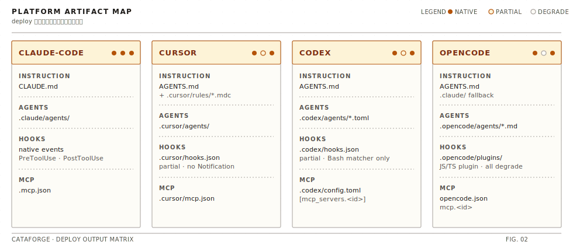

# CataForge

[](https://www.python.org/)
[](https://pypi.org/project/cataforge/)
[](./LICENSE)
[](./tests)
[](./docs/manual-verification-guide.md)

一个面向 AI 编程工作流的统一框架：用一套 `.cataforge/` 规范，同时驱动 Agent、Skill、Hook、MCP 与多 IDE 适配。

> **当前版本：0.1.1**

## 项目概述

`CataForge` 解决的是"同一套 AI 工程流程在不同 IDE/Agent 运行时重复建设、配置分裂、行为不一致"的问题。

核心价值：
- 统一抽象：把平台差异封装到 `PlatformAdapter`，核心运行时不直接耦合某个 IDE。
- 统一配置：以 `.cataforge/framework.json` 作为单一配置源，避免多处配置漂移。
- 统一交付：通过 `deploy` 将 agents/rules/hooks/MCP 注入目标平台。
- 中文工程友好：内置规则与流程文档对中文团队和中文提示词场景友好。

适用场景：
- 需要在 `Claude Code`、`Cursor`、`CodeX`、`OpenCode` 间迁移/共用工作流的团队。
- 有"子 agent 调度 + 可复用 skill + 安全钩子 + MCP 服务"落地需求的项目。
- 希望将 AI 协作流程产品化、可审计、可验证的开源项目。

## 核心特性（Features）

- **多平台适配层**：统一能力 ID，按平台映射原生工具名与事件模型（Claude Code / Cursor / CodeX / OpenCode）。
- **模块化部署**：`deploy` 一次执行 agent/rule/hook/降级策略的完整投放。
- **13 个专业 Agent**：覆盖产品经理、架构师、UI 设计师、技术主管、TDD 三阶段执行者、评审员、QA、DevOps 等角色。
- **24 个可复用 Skill**：涵盖文档生成、代码审查、TDD 引擎、Sprint 回顾、变更守卫、设计工具集成等领域。
- **TDD 驱动开发**：内置 RED→GREEN→REFACTOR 三阶段开发引擎，支持 standard/light 两种模式。
- **多层质量门禁**：文档双层审计（脚本 + AI）、代码双层审查（lint + AI）、Sprint 完成度检查。
- **Skill 体系**：支持项目本地技能与内置技能共存，支持脚本型与说明型技能。
- **MCP 管理**：支持 YAML 声明式注册、生命周期控制、平台配置注入。
- **Hook 桥接**：平台支持原生 hook 时直接接入，不支持时自动降级为规则注入/提示检查。
- **三种执行模式**：standard（完整 7 阶段）、agile-lite（轻量敏捷）、agile-prototype（快速原型）。
- **学习系统**：On-Correction Learning 钩子 + 反思者 Agent 提取跨项目经验。
- **可测试**：核心模块含测试覆盖（当前仓库 `pytest` 通过 105 项用例）。

## 架构设计（Architecture Overview）

高层组件职责：
- `core`: 配置管理、项目路径、事件总线、核心类型定义。
- `platform`: 平台适配器（Claude Code / Cursor / CodeX / OpenCode）与一致性检查。
- `deploy`: 部署编排器，负责将规范化资产投放到目标平台。
- `agent`: agent 发现、校验、frontmatter 翻译、结果解析。
- `skill`: skill 发现、元数据加载与执行框架。
- `hook`: hooks.yaml 解析与平台 hook 配置桥接。
- `mcp`: MCP 服务注册与生命周期管理。
- `plugin`: 插件发现（entry points + 本地目录）、manifest 校验。
- `docs`: 文档索引与 doc-nav 段落加载。
- `integrations`: 外部工具集成（Penpot 设计工具）。
- `schema`: 数据模型校验（插件 manifest 等）。
- `utils`: 通用工具（frontmatter 解析、Markdown 处理、YAML、Docker 等）。
- `cli`: 统一命令入口。

<details>
<summary>源码结构（13 子包 · 点击展开）</summary>

```text
src/cataforge/
  cli/            # setup/deploy/doctor/skill/mcp/hook/agent/... 命令
  core/           # ConfigManager, ProjectPaths, EventBus, 核心类型
  platform/       # PlatformAdapter + registry + conformance + 各平台实现
  deploy/         # Deployer（统一发布编排）+ 模板渲染
  agent/          # agent 发现/校验/格式翻译/结果解析
  skill/          # skill 发现/加载/执行
  hook/           # hooks.yaml 解析 -> 平台配置桥接 + 内置 hook 脚本
  mcp/            # MCP 注册与生命周期管理
  plugin/         # 插件发现（entry points + 本地目录）
  docs/           # 文档索引与段落加载
  integrations/   # Penpot 设计工具集成
  schema/         # 数据模型校验
  utils/          # frontmatter/markdown/yaml/docker 等通用工具
```

</details>

详细架构与工作流说明：[`docs/workflow.md`](./docs/workflow.md)

## 快速开始（Quick Start）

### 环境要求

- Python `>=3.10`
- 建议：`pip` / `uv`，以及 `venv`（或 `uv venv`）
- 可选外部工具：`ruff`, `npx`, `docker`, `git`

> CLI 入口已在启动时自动将 stdout/stderr 切换为 UTF-8，无需再手动设置 `PYTHONUTF8=1` 或 `chcp 65001`。

### 安装步骤

推荐使用 `uv`（更快、无需手动激活 venv）：

```bash
# 方式 A：uv tool（装成全局 CLI，推荐终端用户）
uv tool install .

# 方式 B：项目本地开发
uv venv && uv pip install -e ".[dev]"
```

或使用 `pip`：

```bash
python -m venv .venv
source .venv/Scripts/activate       # Windows (bash)
# source .venv/bin/activate         # macOS/Linux
pip install -e ".[dev]"
```

### 最小可运行示例

安装后直接使用 `cataforge` 命令：

```bash
cataforge doctor
cataforge setup --platform cursor
cataforge deploy --check --platform cursor
```

> 若未安装、仅想从源码直跑，可用 `python -m cataforge ...`（仍无需 `PYTHONUTF8=1`）。

成功标志：
- `doctor` 输出 `Diagnostics complete.`
- `setup` 输出 `Setup complete.`
- `deploy --check` 输出 `Deploy complete.`

> 想从 **0 开始** 在四个 IDE 里都跑通一遍？见 [手动验证指南](./docs/manual-verification-guide.md) — 含 IDE 客户端安装、真部署、在 IDE 内真实观测 Agent / Hook / MCP 的完整流程。

## 文档（Documentation）

- 文档导航：[`docs/README.md`](./docs/README.md)
- Agent 与 Skill 清单：[`docs/agents-and-skills.md`](./docs/agents-and-skills.md)
- 架构与工作流说明：[`docs/workflow.md`](./docs/workflow.md)
- 手动验证指南：[`docs/manual-verification-guide.md`](./docs/manual-verification-guide.md)

## 在不同 AI IDE 中使用

<p align="center">
  
</p>

以下为当前实现状态（来自平台 profile 与适配器逻辑）：

### Claude Code

- 原生支持：是（Agent、Hook、MCP 均可原生映射）
- 关键路径：`.claude/agents`、`CLAUDE.md`、`.mcp.json`
- 最小配置：

```json
{
  "runtime": {
    "platform": "claude-code"
  }
}
```

### Cursor

- 原生支持：大部分原生支持（`AskUserQuestion` 等能力会降级处理）
- 关键路径：`.cursor/agents`、`.cursor/hooks.json`、`.cursor/rules/*.mdc`、`.cursor/mcp.json`
- 适配点：规则会额外生成 Cursor MDC 格式文件
- 最小配置：

```json
{
  "runtime": {
    "platform": "cursor"
  }
}
```

### CodeX

- 原生支持：中等（以 `AGENTS.md` + `.codex/config.toml` 为主）
- 关键路径：`AGENTS.md`、`.codex/config.toml`
- 适配点：
  - 指令文件按 Codex 原生体系输出为 `AGENTS.md`
  - MCP 写入 `.codex/config.toml` 的 `mcp_servers`
- 最小配置：

```json
{
  "runtime": {
    "platform": "codex"
  }
}
```

### OpenCode

- 原生支持：中等（`.opencode` 目录 + `opencode.json`）
- 关键路径：`.opencode/agents/*.md`、`opencode.json`、`AGENTS.md`
- 适配点：hook 配置不可用时自动注入安全规则；`.claude` 路径仅作兼容后备
- 最小配置：

```json
{
  "runtime": {
    "platform": "opencode"
  }
}
```

## 使用示例（Usage）

### 示例 1：列出并运行技能

输入：

```bash
cataforge skill list
```

输出示例（节选）：

```text
agent-dispatch (instructional): agent-dispatch
code-review (instructional): code-review
sprint-review (instructional): sprint-review
```

### 示例 2：多平台干运行部署

输入：

```bash
cataforge deploy --check --platform codex
```

输出示例（节选）：

```text
would write AGENTS.md ← PROJECT-STATE.md (platform=codex)
would merge mcp_servers.demo → ...\.codex\config.toml
Deploy complete.
```

## 目录结构（Project Structure）

<details>
<summary>完整项目目录（点击展开）</summary>

```text
CataForgeNext/
  pyproject.toml               # 包定义、依赖、脚本入口
  src/cataforge/               # 框架源码（88 个 Python 模块，13 个子包）
  tests/                       # 自动化测试（105 项用例）
  docs/                        # 项目文档
  .cataforge/
    framework.json             # 统一框架配置（单一来源）
    PROJECT-STATE.md           # 项目状态模板（编排器专属写入区）
    agents/                    # 13 个 Agent 定义（AGENT.md）
    skills/                    # 23 个 Skill 定义（SKILL.md）
    hooks/hooks.yaml           # 平台无关 hook 规范
    rules/                     # 通用规则与子代理协议
    platforms/*/profile.yaml   # 各平台能力映射与降级策略
```

</details>

## Roadmap / TODO

### 已落地

- `upgrade check / apply / verify` — 走**包管理器 + scaffold 刷新**模型（而非远程自升级脚本）。
- `doctor` — migration_check FAIL 时 exit 1，可作 CI gate。
- `setup --force-scaffold` — 保留 `runtime.platform` / `upgrade.state` / `PROJECT-STATE.md` 等用户字段。
- `deploy` — 自动清理 commands / agents 孤儿产物，重部署幂等。

### 下一步

**P1 — 打磨**

- `pyproject.toml` 的 `requires-python` 核对与 `uv tool` 行为对齐（避免绕过）。
- `setup` 未指定 `--platform` 且 framework.json 未设置时，回显默认平台提示。

**P2 — 跨平台完整性**

- Cursor / Codex / OpenCode 的 skills 与 commands 适配（当前仅 Claude Code 原生支持；Cursor 的 `.cursor/rules` 与 slash command 格式待实测）。
- Cursor 的 `--apply-permissions` 落地（当前为 stub）。
- OpenCode hooks 包装为 `.opencode/plugins/*.ts` 的 adapter。
- `scripts/framework/setup.py` 栈检测扩展（deno / bun / ruby / php / java / dotnet / monorepo）。

**P3 — 质量与 DX**

- migration_check 分级（error / warning / info），让 lint 级规则不阻塞 CI。
- `doctor --json` 机器可读输出。
- `setup.py --write-env-block`：直接对 `CLAUDE.md` §执行环境 区块做幂等替换。
- 扩充 `.cataforge/commands/`（当前仅 `/bootstrap`），补 `/doctor-fix` / `/deploy` 等。
- MCP 持久化注册体验（CLI `register` 与声明式目录联动）。
- 社区插件模板与更多官方平台 profile。

## 开发与测试

```bash
pytest -q
```

当前仓库基线：`116 passed`。

## License

MIT
