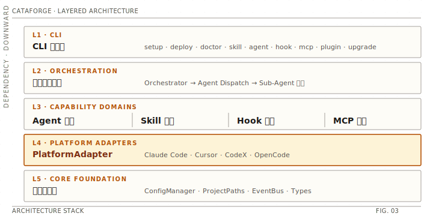

# 架构概览

> CataForge 采用分层架构，依赖方向向下；`PlatformAdapter` 层是屏蔽 IDE 差异的核心抽象。

<div align="center">
  
</div>

## 五层架构

| 层 | 职责 | 关键模块 |
|---|------|---------|
| **CLI** | 统一命令入口，参数解析、子命令路由 | `cli/` |
| **Runtime** | 运行时编排：部署、Agent 调度、Skill 执行、Hook 桥接、MCP 生命周期 | `deploy/` · `agent/` · `skill/` · `hook/` · `mcp/` |
| **Platform Adapter** | **屏蔽 IDE 差异的核心抽象**：能力映射、格式翻译、降级策略 | `platform/` |
| **Core** | 框架基础设施：配置管理、路径解析、事件总线、核心类型 | `core/` |
| **Plugin / Docs / Utils** | 扩展点与通用能力 | `plugin/` · `docs/` · `integrations/` · `schema/` · `utils/` |

---

## 核心模块职责

| 模块 | 目录 | 职责 |
|------|------|------|
| **core** | `src/cataforge/core/` | 配置管理（framework.json）、项目路径解析、事件总线、核心类型定义 |
| **platform** | `src/cataforge/platform/` | 平台适配器抽象、4 个平台实现、能力一致性检查、适配器注册中心 |
| **deploy** | `src/cataforge/deploy/` | 部署编排引擎，将 agent/rule/hook/MCP 投放到目标平台 |
| **agent** | `src/cataforge/agent/` | Agent 发现、frontmatter 校验、格式翻译（AGENT.md → 平台原生）、结果解析 |
| **skill** | `src/cataforge/skill/` | Skill 发现、元数据加载、执行框架（支持脚本型与说明型） |
| **hook** | `src/cataforge/hook/` | hooks.yaml 规范解析 → 平台 hook 配置桥接，含 9 个内置 hook 脚本 |
| **mcp** | `src/cataforge/mcp/` | MCP 服务器 YAML 声明注册、start/stop 生命周期管理 |
| **plugin** | `src/cataforge/plugin/` | 插件发现（Python entry points + 本地目录扫描）、manifest 校验 |
| **docs** | `src/cataforge/docs/` | 文档索引（NAV-INDEX）、doc-nav 段落精准加载 |
| **integrations** | `src/cataforge/integrations/` | 外部工具集成（Penpot 设计工具 API 对接） |
| **schema** | `src/cataforge/schema/` | 数据模型校验（插件 manifest 等） |
| **utils** | `src/cataforge/utils/` | YAML frontmatter 解析、Markdown 处理、Docker 工具、通用模式匹配 |
| **cli** | `src/cataforge/cli/` | 统一命令行入口 |

---

## 源码结构

```text
src/cataforge/
  cli/            # setup/deploy/doctor/skill/mcp/hook/agent/... 命令
  core/           # ConfigManager, ProjectPaths, EventBus, 核心类型
  platform/       # PlatformAdapter + registry + conformance + 各平台实现
  deploy/         # Deployer（统一发布编排）+ 模板渲染
  agent/          # agent 发现/校验/格式翻译/结果解析
  skill/          # skill 发现/加载/执行
  hook/           # hooks.yaml 解析 → 平台配置桥接 + 内置 hook 脚本
  mcp/            # MCP 注册与生命周期管理
  plugin/         # 插件发现（entry points + 本地目录）
  docs/           # 文档索引与段落加载
  integrations/   # Penpot 设计工具集成
  schema/         # 数据模型校验
  utils/          # frontmatter/markdown/yaml/docker 等通用工具
```

---

## 关键设计原则

### 1. 单一配置源

`.cataforge/framework.json` 是所有运行时决策的唯一来源（runtime 平台、模式、常量、功能开关、升级策略、迁移检查）。CLI 的 `--platform` 参数仅为临时覆盖。

### 2. 规范与平台解耦

`.cataforge/` 下的 `agents/` / `skills/` / `rules/` / `hooks/` 是**平台无关**的规范资产。平台相关的细节封装在 `platforms/<id>/profile.yaml` 与对应的 `PlatformAdapter`。

### 3. 能力降级而非跳过

当目标平台不支持某能力时，框架优先选择**降级策略**（如 `rules_injection`、`prompt_check`），仅在无降级路径时才 `SKIP` 并记录日志。

### 4. 幂等部署

`cataforge deploy` 多次执行幂等，自动清理上次部署的孤儿产物（被删除 / 重命名的命令、agents 子目录、历史文件）。

---

## 关键配置文件

`framework.json` 是单一配置源；各平台的能力映射、降级策略封装在 `platforms/<id>/profile.yaml`。完整文件清单（含 `PROJECT-STATE.md` / `COMMON-RULES.md` / `SUB-AGENT-PROTOCOLS.md` / `ORCHESTRATOR-PROTOCOLS.md` / `hooks.yaml` 等）与字段说明见 [`../reference/configuration.md`](../reference/configuration.md) §文件总览。

---

## 参考

- 运行时流程（Bootstrap / 阶段 / TDD / 中断恢复）：[`runtime-workflow.md`](./runtime-workflow.md)
- 平台适配机制（Adapter / 能力矩阵 / 降级）：[`platform-adaptation.md`](./platform-adaptation.md)
- 审查与学习系统：[`quality-and-learning.md`](./quality-and-learning.md)
