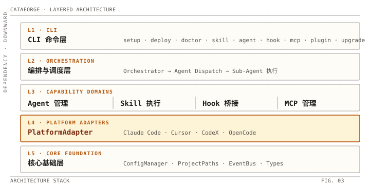

# 架构概览

> CataForge 采用分层架构，依赖方向向下；`PlatformAdapter` 层是屏蔽 IDE 差异的核心抽象。

<div align="center">
  
</div>

> 本图为下表的可视化总览，下表为权威来源；图与表内容应保持一致。

## 分层架构

依赖方向单向向下：`interface → application → {runtime, domain} → adapter → core → utils`。
模块级（静态）反向 import 会形成依赖环，由 `check_layer_dependencies` 守卫拦截。

| 层 | 职责 | 顶层包 |
|---|------|---------|
| **interface** | 唯一对外交付面（driving adapter）：命令入口、参数解析、子命令路由 | `interface/cli/` |
| **application** | 用例编排：在 interface 与领域之间下沉业务逻辑的薄服务层 | `application/services/` |
| **runtime** | 运行时编排：部署、Agent 调度、Skill 执行、Hook 桥接、MCP 生命周期、插件加载 | `runtime/`（`deploy` · `agent` · `skill` · `hook` · `mcp` · `plugin`）|
| **domain** | 领域子系统：知识图谱与文档索引 | `domain/`（`kg` · `docs`）|
| **adapter** | 对外部系统适配（driven adapter）：**屏蔽 IDE 差异的核心抽象** + 外部工具集成 | `adapter/`（`platform` · `integrations`）|
| **core** | 框架基础设施：配置管理、路径解析、事件总线、核心类型、数据模型校验 | `core/`（含 `core/schema`）|
| **utils** | 共享内核（绝对底层，连 core 也依赖它）：frontmatter / markdown / yaml / docker 等通用工具 | `utils/` |

---

## 核心模块职责

| 模块 | 目录 | 职责 |
|------|------|------|
| **core** | `src/cataforge/core/` | 配置管理（framework.json）、项目路径解析、事件总线、核心类型定义 |
| **platform** | `src/cataforge/adapter/platform/` | 平台适配器抽象、4 个平台实现、能力一致性检查、适配器注册中心 |
| **deploy** | `src/cataforge/runtime/deploy/` | 部署编排引擎，将 agent/rule/hook/MCP 投放到目标平台 |
| **agent** | `src/cataforge/runtime/agent/` | Agent 发现、frontmatter 校验、格式翻译（AGENT.md → 平台原生）、结果解析 |
| **skill** | `src/cataforge/runtime/skill/` | Skill 发现、元数据加载、执行框架（支持脚本型与说明型） |
| **hook** | `src/cataforge/runtime/hook/` | hooks.yaml 规范解析 → 平台 hook 配置桥接，含 9 个内置 hook 脚本 |
| **mcp** | `src/cataforge/runtime/mcp/` | MCP 服务器 YAML 声明注册、start/stop 生命周期管理 |
| **plugin** | `src/cataforge/runtime/plugin/` | 插件发现（Python entry points + 本地目录扫描）、manifest 校验 |
| **docs** | `src/cataforge/domain/docs/` | 文档索引（`.doc-index.json`）、context navigate 段落精准加载、legacy NAV-INDEX 迁移 |
| **integrations** | `src/cataforge/adapter/integrations/` | 外部工具集成（Penpot 设计工具 API 对接） |
| **schema** | `src/cataforge/core/schema/` | 数据模型校验（插件 manifest 等） |
| **utils** | `src/cataforge/utils/` | YAML frontmatter 解析、Markdown 处理、Docker 工具、通用模式匹配 |
| **cli** | `src/cataforge/interface/cli/` | 统一命令行入口 |

---

## 源码结构

```text
src/cataforge/
  interface/
    cli/          # setup/deploy/doctor/skill/mcp/hook/agent/... 命令（薄层：解析→调用→渲染）
  application/
    services/     # 业务逻辑下沉层（bootstrap/issue/upgrade/doctor_summary…）
  runtime/
    deploy/       # Deployer（统一发布编排）+ 模板渲染
    agent/        # agent 发现/校验/格式翻译/结果解析
    skill/        # skill 发现/加载/执行
    hook/         # hooks.yaml 解析 → 平台配置桥接 + 内置 hook 脚本
    mcp/          # MCP 注册与生命周期管理
    plugin/       # 插件发现（entry points + 本地目录）
  domain/
    kg/           # 知识图谱（facade + 内部 store + ingest/export/schemas）
    docs/         # 文档索引与段落加载
  adapter/
    platform/     # PlatformAdapter + registry + conformance + 各平台实现
    integrations/ # Penpot 设计工具集成
  core/           # ConfigManager, ProjectPaths, EventBus, 核心类型, schema/ 数据模型校验
  utils/          # frontmatter/markdown/yaml/docker 等通用工具
```

---

## 关键设计原则

### 1. 单一配置源

`.cataforge/framework.json` 是所有运行时决策的唯一来源（runtime 平台、模式、常量、功能开关、升级策略、迁移检查）。CLI 的 `--platform` 参数仅为临时覆盖。

### 2. 规范与平台解耦

`.cataforge/` 下的 `agents/` / `skills/` / `rules/` / `hooks/` 是**平台无关**的规范资产。平台相关的细节封装在 `platforms/<id>/profile.yaml` 与对应的 `PlatformAdapter`。

### 3. 能力降级而非跳过

当目标平台不支持某能力时，框架优先选择**降级策略**（如 `rules_injection`、`prompt_check`），仅在无降级路径时才 `SKIP` 并记录日志。

### 4. 幂等部署

`cataforge deploy` 多次执行幂等，自动清理上次部署的孤儿产物（被删除 / 重命名的命令、agents 子目录、历史文件）。

---

## 关键配置文件

`framework.json` 是单一配置源；各平台的能力映射、降级策略封装在 `platforms/<id>/profile.yaml`。完整文件清单（含 `PROJECT-STATE.md` / `COMMON-RULES.md` / `SUB-AGENT-PROTOCOLS.md` / `ORCHESTRATOR-PROTOCOLS.md` / `hooks.yaml` 等）与字段说明见 [`../reference/configuration.md`](../reference/configuration.md) §文件总览。

---

## 参考

- 运行时流程（Bootstrap / 阶段 / TDD / 中断恢复）：[`runtime-workflow.md`](./runtime-workflow.md)
- 平台适配机制（Adapter / 能力矩阵 / 降级）：[`platform-adaptation.md`](./platform-adaptation.md)
- 审查与学习系统：[`quality-and-learning.md`](./quality-and-learning.md)
