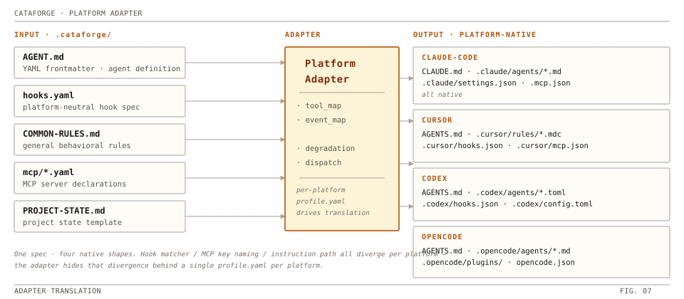

# 平台适配机制

> CataForge 通过 `PlatformAdapter` 抽象层屏蔽 IDE 差异。同一份 `.cataforge/` 规范资产经 Adapter 翻译为各平台原生文件。

<div align="center">
  
</div>

## 1. 适配原理

`PlatformAdapter` 是一组接口契约，每个平台（`claude-code` / `cursor` / `codex` / `opencode`）有独立实现：

- **能力声明**：在 `profile.yaml` 中声明原生支持的能力。
- **路径映射**：规范资产 → 平台原生目录（如 `.cataforge/agents/` → `.claude/agents/`）。
- **格式翻译**：规范格式 → 平台原生格式（YAML frontmatter ↔ TOML ↔ read-first 指令注入）。
- **能力与策略解析**：显式区分 native、conditional、replacement、unsupported 与 unenforced。

---

## 2. 平台能力矩阵

| 能力 | Claude Code | Cursor | CodeX | OpenCode |
|------|-------------|--------|-------|----------|
| Agent 定义格式 | YAML frontmatter（`.claude/agents/`） | YAML frontmatter（`.cursor/agents/`） | TOML（`.codex/agents/`） | YAML frontmatter（`.opencode/agents/`） |
| 指令文件 | `CLAUDE.md` | `AGENTS.md` + `.mdc` | `AGENTS.md` | `AGENTS.md` + `opencode.json.instructions` |
| Agent 调度 | Agent（同步） | Task（同步） | `spawn_agent`（异步） | task（同步） |
| Skill 面 | `.claude/skills`（原生） | `.claude/skills`（共用同一目录） | `.agents/skills`（原生，open agent skills 标准） | 无 —— read-first 降级 |
| Hook 配置 | `.claude/settings.json` | `.cursor/hooks.json` | `.codex/hooks.json`（原生 PreToolUse / PostToolUse；非托管 hook 须 `/hooks` 信任后才执行） | `.opencode/plugins/cataforge-hooks.ts`（deploy 生成 TS plugin 桥接） |
| MCP 配置 | `.mcp.json` | `.cursor/mcp.json` | `.codex/config.toml` | `opencode.json` |
| 上下文自动注入 | `CLAUDE.md` + `.claude/rules` 目录镜像 | `.cursor/rules/*.mdc` `alwaysApply:true` | `AGENTS.md` 层级合并（32 KiB 上限） | `opencode.json.instructions` |
| 并行 Agent | 支持 | 支持（8 并发） | 支持（best-of-N） | 有限 |
| Worktree 隔离 | 支持 | 支持 | 不支持 | 不支持 |
| 多模型路由 | opus / sonnet / haiku | opus / sonnet / gpt / gemini | per-agent（custom agent TOML 的 `model` / `model_reasoning_effort`） | 用户运行时自选（deploy 不写 `model:`） |

---

## 3. 上下文注入（`context_injection`）

每个 `profile.yaml` 声明平台如何把规则 / 指令加载进 LLM 上下文。`cataforge deploy` 读取这些字段，把差异烘焙（指部署时把平台差异固化进产物，运行时不再按平台分支）到静态产物里——运行时 LLM 看到的是已为当前平台定制好的 markdown，无需再做平台判断。

**Deploy 期如何消费**：

- `runtime.deploy.steps.deploy_instruction_files` 经 `adapter.get_instruction_preamble()` 读取 `auto_injection.preamble_files`，按 `inline_file_syntax.template` 渲染为指令文件顶部前缀 —— 该机制仅对 `at_mention` 平台生效，且四平台 profile 当前均声明 `preamble_files: []`：claude-code 的规则经 `.cataforge/rules/` → `.claude/rules/` 目录镜像**单路注入**，CLAUDE.md 顶部没有 `@import` 前缀（同一规则经 preamble + 目录镜像两路会在上下文出现两份）。
- `OpenCodeAdapter.post_instruction_deploy` 读取 `rules_distribution.files`，写入 `opencode.json.instructions`，LLM 启动时自动加载。
- `context_injection` 仍可省略并使用平台默认路径；capability 与 hook policy schema 不提供旧语法兼容。

完整字段表与四平台实际声明对照见 [`../reference/configuration.md`](../reference/configuration.md) §context_injection 字段。

---

## 4. Hook policy 与 fallback

### Hook 降级

每个平台在 `profile.yaml#hooks.policies.<script>` 声明 `native` / `hybrid` /
`degraded` / `unsupported`。`hybrid` 同时生成原生 hook 与 fallback；`degraded`
只生成 fallback。fallback 由平台 profile 自己持有，不再使用全局模板。

| 策略 | 说明 | 产物 |
|------|------|------|
| **rules_injection** | 安全规则文本注入规则层 | staging → 平台 rules target |
| **prompt_instruction** | Agent 指令片段注入 | staging → 平台 rules target |
| **prompt_checklist** | 自检清单注入 | staging → 平台 rules target |
| **skip** | 仅记录 `SKIP: …` 行，不写文件 | —（模板须带 `reason`） |

fallback 同时声明 `coverage: equivalent|partial|none`、`reason` 与 `asset` 或
`content`。schema 拒绝未知策略；conformance 禁止把缺失资产标成 equivalent。
生成文件只存在于 deploy 临时 staging，再与手写 overrides 一起渲染到平台目标；
deploy 不写回 `.cataforge` 源树。

### Skill 面降级（opencode）

`skill_definition.needs_deploy: false` 的平台没有 skills 目录可部署。translator（`_inject_skills_fallback`）把 AGENT.md frontmatter 的 `skills:` 清单渲染为 agent 正文顶部的 **read-first 指令**——「执行任务前先读取 `.cataforge/skills/<id>/SKILL.md`」——skill 上下文保持可达而非静默丢失。`cataforge doctor` 的「Agent skill dependencies」段校验每个声明的 skill id 都有 `.cataforge/skills/<id>/SKILL.md` 源。

### Hook 身份注入链

hook 进程判定自身平台（`runtime.hook.base.get_platform()`）按四级解析：

1. `CATAFORGE_PLATFORM` 环境变量（显式覆盖；claude-code 的 `settings_defaults` 在 deploy 时把 `env.CATAFORGE_PLATFORM=claude-code` set-if-absent 播种进 `.claude/settings.json`；opencode 的 TS plugin 在 spawn hook 脚本时注入 `env: { ...process.env, CATAFORGE_PLATFORM: 'opencode' }`）
2. `--cataforge-platform <id>` 命令行参数 —— deploy 生成的 JSON hook 配置（claude-code / cursor / codex）统一在 hook 命令后追加
3. IDE 环境变量探测（`CURSOR_PROJECT_DIR` / `CLAUDE_PROJECT_DIR`；codex / opencode 无平台注入的环境变量，依赖前两级）
4. framework.json 兜底 —— **多平台项目（`deployment.targets` ≥ 2）在此层显式 FAIL**：共享缺省值会静默误判会话身份，错误信息提示设置 `CATAFORGE_PLATFORM` 或重新 deploy 让 hook 命令携带平台参数

---

## 5. 多平台共存模型

四平台产物可在同一项目长期共存，模型由三部分组成：

- **targets 声明**：`framework.json#deployment.targets` 是项目启用平台集合；`deployment.default_platform` 是缺省平台。无参 `cataforge deploy` 部署全部 targets；`setup --platform` 把新 default 并入 targets 而不删除其他成员。
- **per-platform 部署状态**：每个平台的部署记录在 `.cataforge/state/deploy/<platform>/`（gitignored）——`state.json`（platform + package_version）与 `manifest.json`（`owned_paths` 所有权清单 + `source_digest` / `package_version` drift 基线）。manifest 是 doctor「Deploy integrity / Deployment provenance」的权威；drift 按各平台自己的基线判定。
- **共享产物所有权**：`AGENTS.md` 由 cursor / codex / opencode 三平台以 section-merge 共写；`.claude/skills` 由 claude-code 与 cursor 共用（两平台 profile 的 skill `target_dir` 相同）。**跨平台保护集**（`load_other_platform_owned`）保证一个平台的 prune / `--rebuild` 只处理「在本平台 prior manifest 中 ∧ 不被其他任何平台 manifest 认领」的路径；共享路径由最后一个 owner 在其自身 deploy 中删除，无需独立的共享清单协调。

共享指令文件按**平台受众**渲染：`运行时:` 字段是声明 targets 的排序集合，平台相关占位符（`{RULES_DIR}` 等）渲染为平台中立的 `.cataforge/` 源路径——文件字节只取决于受众集合，与部署顺序无关。

操作指南（启用多 targets、迁移、锁与并行开发）见 [`../guide/multi-platform.md`](../guide/multi-platform.md)。

---

## 6. 跨平台目录隔离

每个平台部署只生成**自己命名空间**下的产物（`.claude/` / `.cursor/` / `.codex/` / `.opencode/`），互不干扰。两个声明式例外：共享 `AGENTS.md`（§5）；codex 的 skills 面写入开放标准目录 `.agents/skills`（open agent skills 的仓库级扫描路径，不在 `.codex/` 命名空间内）。

- **Cursor 部署默认不会触及 `.claude/rules`**（skill 目录 `.claude/skills` 是声明的共用面，见 §5）。
- 仅当 `.cataforge/platforms/cursor/profile.yaml` 设置 `rules.cross_platform_mirror: true` 时，才会在 `.claude/rules` 创建 Markdown 镜像，供 "Cursor + Claude Code 双栖" 场景共享 prompt。
- 干运行时明示状态：`SKIP: .claude/rules Markdown mirror`。

---

## 7. 部署流程

`cataforge deploy` 命令执行以下步骤：

```text
0. 获取项目级部署锁（.cataforge/state/locks/deploy.lock）——被其他部署持有时
   立即拒绝并给出 git worktree 引导；TTL 过期的死锁自动回收
1. 迁移 legacy 单槽部署记录（.deploy-state / .deploy-manifest.json →
   state/deploy/<platform>/，幂等）
2. 读取本平台 prior manifest，扣除跨平台保护集（§5）
3. self-heal：从打包 scaffold 补齐 .cataforge/ 缺失文件（不覆盖已有文件）
4. 解析 override / plugin 层，确定 agents / skills 源目录
5. 按步骤管线投放：agent 定义 → 指令文件（PROJECT-STATE.md → CLAUDE.md /
   AGENTS.md，section-merge）→ hook 配置 → 平台附加输出 → 规则 → skill →
   slash command → 降级产物 → override 规则 → MCP 配置
6. per-platform commit：本平台成功后写自己的 state.json + manifest.json
   （含 drift 基线）——失败的平台不产生成功记录，也不覆盖其他平台的记录
```

支持 `--dry-run` 干运行模式，仅输出预期动作不实际执行；`deploy --platform all` 在同一把锁内对每个平台独立执行上述 1–6。

---

## 8. 部署幂等与孤儿清理

多次 `cataforge deploy` 幂等。prune 以**上一次 manifest** 为界：只删除上次部署认领、本次不再产出、且未被其他平台认领的路径——用户手工创建的文件从未进 manifest，永远不会被清理。无需 `git clean -fd .claude/` 再重部署——这是 [`overview.md`](./overview.md) §4 "幂等部署" 原则的具体实现。

---

## 参考

- 各平台使用与最小配置：[`../guide/platforms.md`](../guide/platforms.md)
- 多平台共存操作指南：[`../guide/multi-platform.md`](../guide/multi-platform.md)
- 配置模型决策记录：[`adr-multi-platform-config.md`](./adr-multi-platform-config.md)
- 架构分层：[`overview.md`](./overview.md)
- 平台 profile 文件规格：[`../reference/configuration.md`](../reference/configuration.md)
