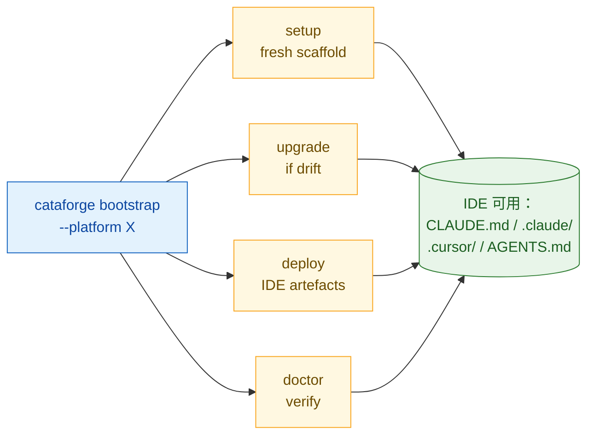

# 快速开始

> 目标：**1 条命令**跑通一个 Cursor 工作流的完整部署 + 验证。

## 前置

已完成 [`installation.md`](./installation.md) 中的任一安装方式，`cataforge --version` 可用。

## 整体流程



- **bootstrap** 按 `.cataforge/framework.json` / `.scaffold-manifest.json` / `.deploy-state` 三份产物文件判断每步是否需要运行，已经 current 的步骤自动 skip。
- 再次运行 bootstrap 完全幂等——全通过的项目只会再跑一次 doctor。
- 底层四个子命令（`setup` / `upgrade apply` / `deploy` / `doctor`）仍独立可用，见 [CLI 参考](../reference/cli.md)。

## 最短路径（1 条命令）

```bash
cataforge bootstrap --platform cursor       # 可选 claude-code / cursor / codex / opencode
```

初次运行会依次：初始化 `.cataforge/` → 渲染 `.cursor/` 等 IDE 产物 → 跑 doctor 验证。

想先预览、不落盘：

```bash
cataforge bootstrap --platform cursor --dry-run
```

`--dry-run` 会打印每步的 skip / run 决策与原因，比如：

```text
Plan (dry-run):
  • setup    run   — no .cataforge/ at <path> — fresh scaffold
  ○ upgrade  skip  — fresh scaffold already current
  • deploy   run   — fresh install — initial deploy required
  • doctor   run   — verification gate
```

## 成功标志

| 命令 | 末行关键字 |
|------|-----------|
| `cataforge bootstrap --platform cursor --dry-run` | `target platform: cursor` |
| `cataforge bootstrap --platform cursor` | `Diagnostics complete.` |

## 查看产物

Cursor 落盘位置：

```text
AGENTS.md
.cursor/agents/*/AGENT.md
.cursor/hooks.json
.cursor/rules/*.mdc
.cursor/mcp.json              # 若声明了 MCP
```

> 所有部署产物默认被 `.gitignore` 排除（有意为之）。用 `git status -u` 审阅完整清单。

## 切换平台

`.cataforge/` 规范同一份。bootstrap **拒绝隐式改写** `runtime.platform`（避免误操作锁定错误平台），切换要显式走 `setup`：

```bash
cataforge setup --platform claude-code --show-diff   # 先改 runtime.platform
cataforge bootstrap                                   # 检测到平台漂移，自动重新 deploy
```

## 从源码直跑（不安装）

```bash
python -m cataforge bootstrap --platform cursor --dry-run
python -m cataforge bootstrap --platform cursor
```

## 下一步

根据你的意图选路径：

| 你想 … | 去 |
|---------|----|
| **在 Claude Code / Cursor 真实跑一遍** | [`../guide/platforms.md`](../guide/platforms.md) — 各 IDE 的原生支持与降级策略 |
| **跑 4 平台端到端验证** | [`../guide/manual-verification.md`](../guide/manual-verification.md) — 5 步交叉验证 |
| **把 CataForge 升到新版本** | [`../guide/upgrade.md`](../guide/upgrade.md) — 升级流程与文件保留规则 |
| **定制 Agent / Skill** | [`../reference/agents-and-skills.md`](../reference/agents-and-skills.md) — 用户可以做什么 vs. 不能动什么 |
| **看 CataForge 怎么工作的** | [`../architecture/overview.md`](../architecture/overview.md) — 架构分层、翻译层设计 |
