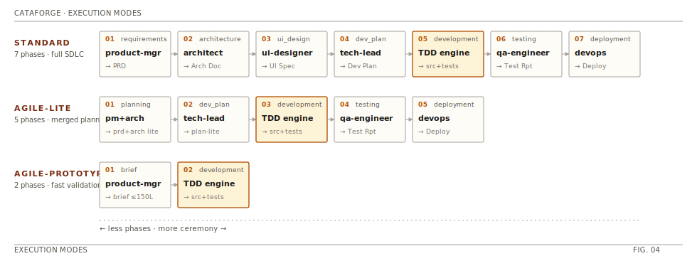
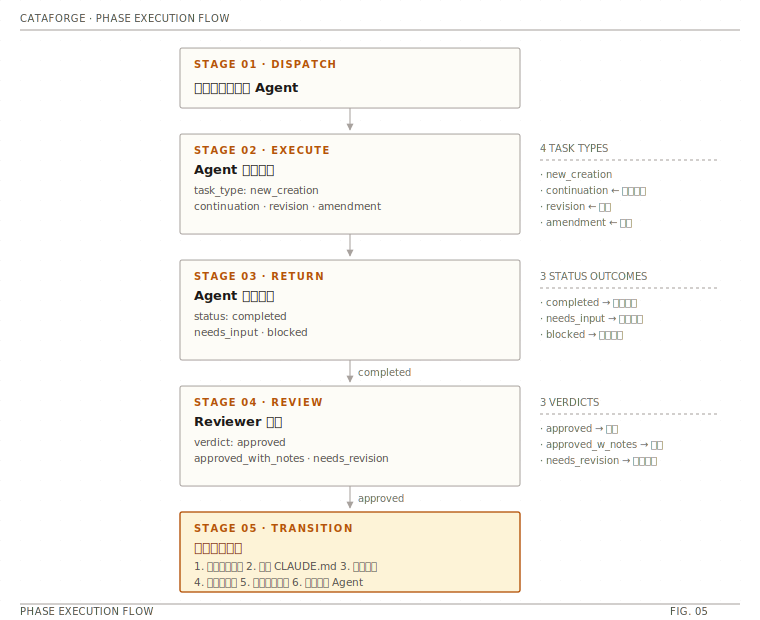

# 执行模式

> CataForge 支持三种执行模式，适应不同规模项目。**用户在 Bootstrap 阶段选一种，后续阶段按该模式编排**。

<p align="center">
  
</p>

## 模式总览

| 模式 | 阶段数 | 产出文档形态 | 适用 |
|------|:-----:|-------------|------|
| **standard** | 7 | PRD / Architecture Doc / UI Spec / Dev Plan / Test Report / Deploy Spec | 正式项目、多角色协作 |
| **agile-lite** | 5 | prd-lite / arch-lite / dev-plan-lite（各 ≤ 50 行） | 小团队、已有共识 |
| **agile-prototype** | 2 | brief（≤ 150 行）→ 直接开发 | 快速原型、MVP 验证 |

---

## standard：完整 SDLC

七阶段流水线，每阶段固定 Agent 负责、固定产物、固定审查闸。

```text
Requirements → Architecture → Design → Planning
             → Development (TDD) → Testing → Deployment
```

- **Requirements**：`product-manager` 产出 `PRD`。
- **Architecture**：`architect` 产出 `Architecture Doc`。
- **Design**：`ui-designer` 产出 `UI Spec`（可选 Penpot 集成）。
- **Planning**：`tech-lead` 产出 `Dev Plan`，任务分解 + 依赖建模。
- **Development**：`tdd-engine` 编排 RED→GREEN→REFACTOR（详见 [`tdd-workflow.md`](./tdd-workflow.md)）。
- **Testing**：`qa-engineer` 产出 `Test Report`。
- **Deployment**：`devops` 产出 `Deploy Spec`。

## agile-lite：轻量敏捷

五阶段：**合并需求与架构** 为单一 lite 文档，其它阶段使用简化模板。

- 每份 lite 文档 ≤ 50 行（由 `doc-gen` 模板强约束）。
- 保留 TDD 引擎与质量闸，但 `doc-review` Layer 2（AI 审查）对轻量文档默认跳过。

## agile-prototype：快速原型

两阶段：**brief → 开发**。

- 单一 `brief.md` ≤ 150 行，直接指导开发。
- 无独立 UI/架构文档，TDD 引擎优先 light 模式。
- 适合在 Hackathon、PoC、spike 场景快速验证可行性。

---

## 如何选择

| 特征 | 建议模式 |
|------|---------|
| 有多角色协作、合规需求、长生命周期 | `standard` |
| 团队熟悉领域、已有共识、迭代快 | `agile-lite` |
| 一次性验证、探索、学习 | `agile-prototype` |

## 切换模式

执行模式由 Bootstrap 阶段决定（`start-orchestrator` skill 交互询问），写入 `.cataforge/framework.json` 后续阶段沿用。

```json
{
  "runtime": {
    "mode": "agile-lite"
  }
}
```

> 切换模式会影响已生成文档的模板适配。中途切换请评估现有产物是否需要重新生成。

---

## 阶段执行流程

无论哪种模式，每个阶段都遵循统一的五段执行：

<p align="center">
  
</p>

详见 [`../architecture/runtime-workflow.md`](../architecture/runtime-workflow.md)。

---

## 参考

- TDD 引擎工作流：[`tdd-workflow.md`](./tdd-workflow.md)
- 运行时协议与中断恢复：[`../architecture/runtime-workflow.md`](../architecture/runtime-workflow.md)
- 质量闸机制：[`../architecture/quality-and-learning.md`](../architecture/quality-and-learning.md)
