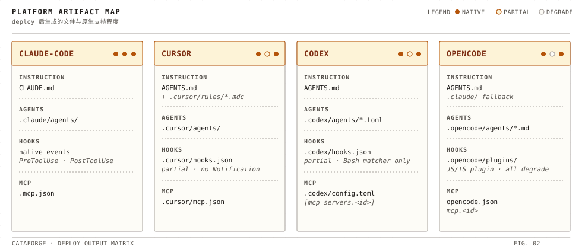

# 平台适配指南

> 本文说明 CataForge 在 Claude Code / Cursor / CodeX / OpenCode 四个 IDE 上的原生支持情况、产物落盘位置与最小配置。
>
> 原理层面（`PlatformAdapter` 抽象、翻译关系、降级策略）请看 [`../architecture/platform-adaptation.md`](../architecture/platform-adaptation.md)；多平台共存操作请看 [`multi-platform.md`](./multi-platform.md)。

<div align="center">
  
</div>

## 概览

| 平台 | Agent | Hook | MCP | 指令文件 |
|------|:-----:|:----:|:---:|---------|
| Claude Code | ✅ 原生 | ✅ 原生 | ✅ 原生 | `CLAUDE.md` |
| Cursor | ✅ 原生 | ✅ 原生 | ✅ 原生 | `AGENTS.md` + `.mdc` |
| CodeX | 🟡 中等 | 🟡 仅 Bash | ✅ 原生 | `AGENTS.md` |
| OpenCode | ✅ 原生 | 🟡 TS plugin 桥接 | ✅ 原生 | `AGENTS.md` + `opencode.json.instructions` |

- ✅ 原生映射；🟡 部分支持 / 经桥接实现。

---

## Claude Code

- **原生支持**：Agent、Hook、MCP 均可原生映射。
- **关键路径**：`.claude/agents/`、`.claude/skills/`、`CLAUDE.md`、`.claude/settings.json`、`.mcp.json`。
- **上下文注入**：规则经 `.cataforge/rules/` → `.claude/rules/` 目录镜像**单路注入**，Claude Code 原生自动加载该目录。CLAUDE.md 顶部没有 `@import` 前缀（profile 声明 `preamble_files: []`）——同一规则若经 preamble 与目录镜像两路注入，会在上下文出现两份。
- **平台身份**：deploy 把 `env.CATAFORGE_PLATFORM=claude-code` set-if-absent 播种进 `.claude/settings.json`，hook 进程据此显式识别平台。
- **最小配置**（`.cataforge/framework.json` 片段，schema v2）：

```json
{
  "deployment": {
    "default_platform": "claude-code",
    "targets": ["claude-code"]
  }
}
```

## Cursor

- **原生支持**：大部分原生支持（`AskUserQuestion` 与 `Notification` 会降级）。
- **关键路径**：`.cursor/agents/`、`.cursor/hooks.json`、`.cursor/rules/*.mdc`、`.cursor/mcp.json`、`AGENTS.md`；skill 目录与 Claude Code 共用 `.claude/skills/`。
- **上下文注入**：`.cursor/rules/*.mdc` 使用 `alwaysApply: true` —— Cursor 会在每次对话前把规则前置到上下文。
- **适配点**：
  - 规则额外生成 Cursor 原生消费的 MDC 格式文件。
  - **默认不触及 `.claude/rules`**。仅当 `.cataforge/platforms/cursor/profile.yaml` 设置 `rules.cross_platform_mirror: true` 时，才会在 `.claude/rules` 创建 Markdown 镜像，供 "Cursor + Claude Code 双栖" 场景共享 prompt。
- **最小配置**：

```json
{
  "deployment": {
    "default_platform": "cursor",
    "targets": ["cursor"]
  }
}
```

## CodeX

- **原生支持**：中等，以 `AGENTS.md` + `.codex/config.toml` 为主。
- **关键路径**：`AGENTS.md`、`.codex/agents/*.toml`、`.codex/hooks.json`、`.codex/config.toml`。
- **上下文注入**：`AGENTS.md` 按根→当前目录分层合并，单路径 32 KiB 上限；Codex 无 `@` 语法，子代理（`fork_context=false`）不继承主上下文，因此 `dispatch-prompt.md` override 显式指示"先 Read .cataforge/rules/COMMON-RULES.md"。
- **适配点**：
  - 指令文件按 Codex 原生体系输出为 `AGENTS.md`。
  - MCP 写入 `.codex/config.toml` 的 `[mcp_servers.<id>]`。
  - Hooks 仅支持 `Bash` matcher，其它事件降级。
  - 无 skills 面 —— agent 声明的 skill 依赖降级为正文内 read-first 指令（先读取 `.cataforge/skills/<id>/SKILL.md`）。
- **最小配置**：

```json
{
  "deployment": {
    "default_platform": "codex",
    "targets": ["codex"]
  }
}
```

## OpenCode

- **原生支持**：中等，以 `.opencode/` 目录 + `opencode.json` 为主。
- **关键路径**：`.opencode/agents/*.md`、`.opencode/plugins/cataforge-hooks.ts`、`opencode.json`、`AGENTS.md`。
- **上下文注入**：`opencode.json.instructions` 字段由 profile 驱动写入（默认 `["AGENTS.md", ".cataforge/rules/*.md", ".cataforge/platforms/opencode/overrides/rules/*.md"]`）—— OpenCode 启动时自动加载这些文件，无需让 LLM 自己 read。
- **适配点**：
  - Hook 经 deploy 自动生成的 `.opencode/plugins/cataforge-hooks.ts` 桥接：TS plugin 订阅 `tool.execute.before` 等事件，spawn 与其他平台相同的 Python hook 脚本，block / observe 语义一致（block hook spawn 失败按 fail-closed 拒绝）；仅 `notify_permission` 降级（OpenCode 无 Notification 事件）。
  - 无 skills 面 —— 与 Codex 相同的 read-first 降级契约。
  - deploy 不写 per-agent `model:`（`user_resolved: true`，模型由用户运行时自选）。
- **最小配置**：

```json
{
  "deployment": {
    "default_platform": "opencode",
    "targets": ["opencode"]
  }
}
```

---

## 跨平台目录隔离

每个平台部署只生成自己命名空间下的产物（`.claude/` / `.cursor/` / `.codex/` / `.opencode/`），互不干扰；跨平台共享的路径（`AGENTS.md`、`.claude/skills`）受保护集防止误删。`deploy --dry-run` 明示 `SKIP: .claude/rules Markdown mirror` 等跳过项。机制细节见 [`../architecture/platform-adaptation.md`](../architecture/platform-adaptation.md) §5–§6。

---

## 启用多平台

`deployment.targets` 是**集合语义**：`setup --platform` 把新平台设为缺省并**追加**进 targets，已有成员保留，因此启用第二个平台不会挤掉第一个：

```bash
cataforge setup --platform cursor    # default_platform=cursor，targets 并入 cursor
cataforge deploy                     # 无参 deploy = 部署全部声明 targets
cataforge deploy --platform all      # 对所有支持平台各跑一轮（逐平台独立提交状态）
cataforge doctor --platform all      # 按平台逐一体检
```

仅调整声明集合而不动缺省平台时用 `cataforge config set deployment.targets "claude-code,cursor"`。多平台共存的完整操作（状态模型、共享 AGENTS.md 的 SSOT、锁与并行开发、旧项目迁移）见 [`multi-platform.md`](./multi-platform.md)。

### 不要这样做

```bash
# 反例：手改 framework.json 切平台
sed -i 's/"default_platform": "cursor"/"default_platform": "claude-code"/' .cataforge/framework.json
cataforge deploy
```

为什么：`setup --platform` / `config set` 会校验平台 id 合法、把缺省平台并入 `targets`、弹出 legacy `runtime.platform` 键，且写盘全程持 `config.lock`。绕开它们手改 JSON 容易造成 `default_platform ∉ targets`（`cataforge config validate` FAIL）或与并发写互相覆盖。

正确做法见上方 `cataforge setup --platform <id>` / `cataforge config set`。

---

## 参考

- 多平台共存指南：[`multi-platform.md`](./multi-platform.md)
- 端到端在 4 个 IDE 内真实跑通：[`manual-verification.md`](./manual-verification.md)
- 适配器翻译关系与降级机制：[`../architecture/platform-adaptation.md`](../architecture/platform-adaptation.md)
- 平台 profile 配置文件：[`../reference/configuration.md`](../reference/configuration.md)
