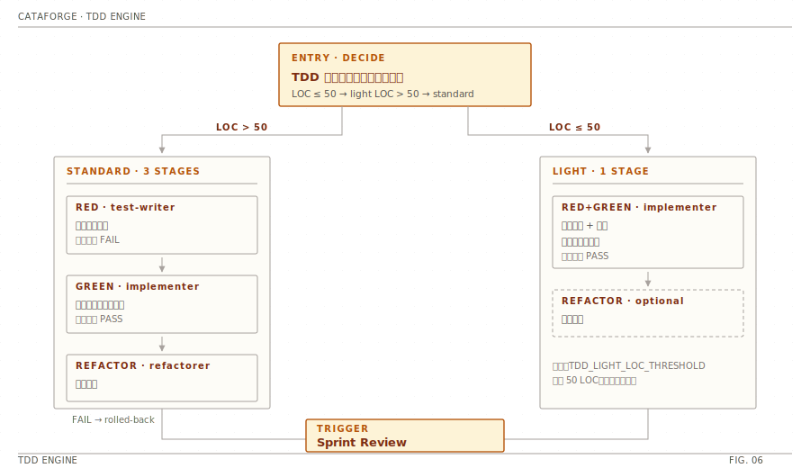

# TDD 工作流

CataForge 在 Development 阶段用 TDD 引擎按微任务推进 RED → GREEN → REFACTOR 三阶段循环。**默认走 light 模式**（合并 RED+GREEN），仅在任务量大或安全敏感时升 standard。

阈值由 `.cataforge/framework.json` 的 `constants` 段控制：

- `TDD_LIGHT_LOC_THRESHOLD`（默认 `150`）— LOC 高于此值或 `security_sensitive: true` / 跨模块时 tech-lead 应标 standard
- `TDD_DEFAULT_MODE`（默认 `light`）— 任务卡 `tdd_mode` 缺省值
- `TDD_REFACTOR_TRIGGER`（默认 `[complexity, duplication, coupling]`）— REFACTOR 条件触发的 category 清单
- `SPRINT_REVIEW_MICRO_TASK_COUNT`（默认 `3`）— 每 N 个微任务触发一次 Sprint Review

<div align="center">
  
</div>

## 三阶段做什么

| 阶段 | 负责 Agent | 目标 | 写入 |
|------|-----------|------|------|
| **RED** | `test-writer`（Sonnet） | 编写失败的测试用例（必须 FAIL） | `tests/` |
| **GREEN** | `implementer`（Sonnet） | 编写最小实现让测试转绿 | `src/`、`tests/` |
| **REFACTOR** | `refactorer`（Opus，条件触发） | 在测试全绿前提下优化代码 | `src/`、`tests/` |

REFACTOR 失败时状态回滚为 `rolled-back`，保留 GREEN 阶段产出，REFACTOR 改动作废。

## 模式档位

| 模式 | 阶段顺序 | 触发 |
|------|---------|------|
| **light**（默认） | implementer 一次写测试+实现 → REFACTOR 按条件触发 | `tdd_mode` 缺省 / LOC ≤ `TDD_LIGHT_LOC_THRESHOLD` |
| **standard** | RED → GREEN → REFACTOR（条件触发） | LOC > 阈值 / `security_sensitive: true` / 跨模块（context_load 引用 ≥2 个 M-xxx） |
| **prototype-inline** | implementer 主线程内联，无子代理调度 | 执行模式 = `agile-prototype` |
| **chore-skip** | 跳过 TDD，implementer 单次实现 + lint hook | `task_kind ∈ {chore, config, docs}` |

## REFACTOR 条件触发

standard / light 模式下 REFACTOR 不再无条件运行。判定顺序：

1. 任务卡 `tdd_refactor: required` → 强制触发
2. `tdd_refactor: skip` → 直接跳过
3. 缺省 `auto` → GREEN 后跑一次 `cataforge skill run code-review -- {impl_files} --focus complexity,duplication,coupling`，命中任一 finding 才触发

## 端到端示例 · 一个微任务

假设 `dev-plan` 中有一项微任务：

```yaml
T-005:
  title: "为 ConfigManager.load 加 schema 校验"
  task_kind: feature
  loc_estimate: 80          # ≤ 150 → 走 light
  tdd_mode: light           # 缺省也是 light
  tdd_refactor: auto
  security_sensitive: false
  acceptance_criteria:
    - "未知 key 抛 ConfigSchemaError"
    - "缺必填字段抛 ConfigSchemaError"
    - "合法配置返回 Config 实例"
```

引擎调度 1-2 次子代理：

```text
0. orchestrator
   → 写任务 bundle 到 .cataforge/.cache/tdd/T-005-context.md
     （AC + 接口契约 + 目录结构 + 命名规范 + test_command）

1. implementer (LIGHT — RED+GREEN 合并)
   → Read T-005-context.md
   → 写 tests/core/test_config_loader.py 3 个测试，全 FAIL
   → 改 src/cataforge/core/config.py，3 个测试转 PASS
   → 状态：completed，移交 REFACTOR 判定

2. orchestrator → code-review --focus complexity,duplication,coupling (Layer 1 only)
   → Layer 1 无 finding → 跳过 REFACTOR
   → 状态：completed
```

每个阶段都会向 `docs/EVENT-LOG.jsonl` 追加 `agent_dispatch` 与 `tdd_phase` 事件。

## 边界情况

### 安全敏感任务强制升 standard

```yaml
T-007:
  title: "为登录接口加输入校验"
  security_sensitive: true   # 强制 standard + 不短路 code-review L2
  tdd_mode: light            # 字段会被 tdd-engine 忽略，按 standard 跑
```

### REFACTOR 触发后又失败

```text
3'. refactorer (REFACTOR)
    → pytest 报 1 失败
    → 引擎丢弃 REFACTOR 阶段的代码改动
    → 状态：rolled-back
    → 保留 GREEN 产出，记入 EVENT-LOG 供 reflector 分析
```

### chore 类任务跳过 TDD

```yaml
T-008:
  title: "调整 framework.json TDD 阈值"
  task_kind: config          # 跳过 TDD，仅 implementer 单次实现 + lint hook
```

## 并行调度（同 sprint_group 任务）

`task-dep-analysis` 输出 `sprint_groups` 后，orchestrator 在同组内的独立任务可一次消息内并发派发（上限 3）：

```text
sprint_group_1 = ["T-001", "T-004"]   # 并行 light 模式
sprint_group_2 = ["T-002", "T-003"]   # group 1 完成后再并行
```

REFACTOR 阶段强制串行（避免源码冲突）。详见 [`../architecture/runtime-workflow.md`](../architecture/runtime-workflow.md) §Parallel Task Dispatch。

## Sprint Review 触发

每完成 `SPRINT_REVIEW_MICRO_TASK_COUNT`（默认 3）个微任务，`reviewer` 调 `sprint-review` skill 审查 AC 覆盖率与范围偏移。详见 [`../architecture/quality-and-learning.md`](../architecture/quality-and-learning.md) §4。

## 配置

```json
{
  "constants": {
    "TDD_LIGHT_LOC_THRESHOLD": 150,
    "TDD_DEFAULT_MODE": "light",
    "TDD_REFACTOR_TRIGGER": ["complexity", "duplication", "coupling"],
    "SPRINT_REVIEW_MICRO_TASK_COUNT": 3,
    "CODE_REVIEW_L2_SKIP_TASK_KINDS": ["chore", "config", "docs"],
    "CODE_REVIEW_L2_SKIP_LIGHT_MAX_AC": 2,
    "ADAPTIVE_REVIEW_DOWNGRADE_CLEAN_TASKS": 10
  }
}
```

## 状态码

TDD 三阶段返回的状态码定义见 [`../reference/status-codes.md`](../reference/status-codes.md) §1。最常见四个：`completed` / `needs_revision` / `rolled-back` / `needs_input`。

## 参考

- 整体执行模式：[`execution-modes.md`](./execution-modes.md)
- 阶段执行与中断恢复：[`../architecture/runtime-workflow.md`](../architecture/runtime-workflow.md)
- 审查与学习系统：[`../architecture/quality-and-learning.md`](../architecture/quality-and-learning.md)
