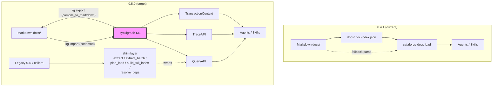
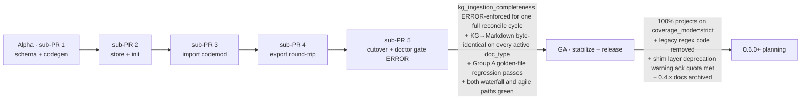

# CataForge 0.5.0 — Knowledge Graph Migration Design

> **Schema source of truth has moved.** As of sub-PR 1 (schema + codegen), the canonical LinkML schemas live at [src/cataforge/domain/kg/schemas/core.yaml](../../../src/cataforge/domain/kg/schemas/core.yaml) and [src/cataforge/domain/kg/schemas/governance.yaml](../../../src/cataforge/domain/kg/schemas/governance.yaml). The copies under [schemas/](schemas/) in this proposal directory are a frozen design-time snapshot at the round-2 / spike-1 checkpoint and **will not be updated** as implementation evolves. Read the package copies for current behavior; read the proposal copies for design intent.

Multi-agent orchestrated design proposal for replacing CataForge 0.4.1 Markdown-only tooling with a knowledge-graph layer modeling business-document domain entities and first-class cross-SDLC traceability.

## Executive summary

CataForge is a document-driven SDLC framework whose 6 role agents (product-manager / architect / tech-lead / ui-designer / qa-engineer / devops) produce business documents (PRD / Arch / UI-Spec / Dev-Plan / Test / DevOps) for user software projects. 0.4.1 stores those documents as Markdown plus a JSON index (`docs/.doc-index.json`). The 0.5.0 release replaces the index with an embedded RDF knowledge graph (pyoxigraph + LinkML) while preserving Markdown as a derived export for human review and version control.

**Why migrate:** 0.4.1 suffers from three structural defects audited in [Task 1](task-1-current-system.md) §1.4 — LLM query inefficiency (full-parse fallback when the index is stale), document rot (ID-continuity warnings are non-blocking, content-hash staleness needs manual `validate`), and cross-document semantic relationships implemented as regex glob matching (false-positive bidirectional coverage, false-negative xref checks). A graph layer addresses all three structurally: SPARQL replaces full-parse, SHACL replaces regex precondition checks, and typed traceability predicates (`cf:verifies`, `cf:implements`, `cf:satisfies`, `cf:delivers`, `cf:affects`) replace string-presence heuristics.

**Scope boundary:** the graph models **business-document domain entities** (Requirement, Feature, Component, Task, TestCase, Deployment, …). CataForge's own framework assets (`.cataforge/skills/*/SKILL.md`, `.cataforge/agents/*/AGENT.md`, `.cataforge/rules/*.md`) stay file-system-resident. A `governance.yaml` sub-ontology is shipped alongside `core.yaml` but `KGConfig.governance = False` by default; only internal skills like `framework-review` flip the switch.

## Documents in this proposal

| File | Author | Concern |
|------|--------|---------|
| [task-1-current-system.md](task-1-current-system.md) | Agent-T1 (sonnet) | 0.4.1 audit: generation flow, 16-row call-point inventory, defect cases, 9 entity prefixes (F/AC/M/API/E/C/P/T-NNN + SR), SDLC role × artifact map |
| [task-2-toolstack.md](task-2-toolstack.md) | Agent-T2 (sonnet) | Tool-stack selection: **pyoxigraph 0.5.8** + **LinkML 1.11.1** + **oxrdflib 0.5.0** + optional pyshacl; Kùzu / Neo4j / SPARQLWrapper eliminated |
| [task-3-domain-ontology.md](task-3-domain-ontology.md) | Agent-T3 (opus) | Business domain ontology: 34 LinkML classes under abstract `cf:SoftwareArtifact`, 5 traceability predicates, waterfall+agile dual-track, governance sub-ontology, plugin extension protocol |
| [schemas/core.yaml](schemas/core.yaml) | Agent-T3 + Orchestrator errata | LinkML schema, business ontology — single source of truth |
| [schemas/governance.yaml](schemas/governance.yaml) | Agent-T3 | LinkML schema, framework governance (default off) |
| [queries/traceability.sparql](queries/traceability.sparql) | Agent-T3 | 6 SPARQL templates for coverage / impact / delivery / chain queries |
| [task-4-export-pipeline.md](task-4-export-pipeline.md) | Agent-T4 (sonnet) | Graph → Markdown pipeline (5-stage: SPARQL → hydrate → Jinja2 → post-process → write), byte-identical idempotency, JSON-Lines diff, incremental export |
| [task-5-cli-api.md](task-5-cli-api.md) | Agent-T5 (sonnet) | 12 `cataforge kg *` subcommands + Python API (`QueryAPI` / `TraceAPI` / `TransactionContext`) + 5-exception hierarchy + 5 0.4.x shim functions |
| [task-6-migration-mapping.md](task-6-migration-mapping.md) | Agent-T6 (opus) | Group A (15 business-doc) + Group B (framework-asset) call-point classification, per-row semantic-equivalence analysis, breaking-change shims, regression suite, efficiency quantification |
| [task-7-rollout-strategy.md](task-7-rollout-strategy.md) | Agent-T7 (sonnet) | Alpha / Beta / GA phased rollout with verifiable entry/exit conditions, six-stage migration pipeline, rollback procedure, 8-row risk register, dual-track design |

## Architecture at a glance

## Consistency check (O1)

Three-way alignment was verified across [Task 3](task-3-domain-ontology.md) (ontology) ↔ [Task 5](task-5-cli-api.md) (API surface) ↔ [Task 6](task-6-migration-mapping.md) (migration mapping). Agent-T6 surfaced 5 inconsistencies during cross-context reasoning; their resolutions are recorded here.

| # | Inconsistency | Resolution | Action item |
|---|---------------|-----------|-------------|
| C1 | [Task 5](task-5-cli-api.md) §5.2 `QueryAPI` exposes typed accessors for Feature / Module / Component / Task / TestCase only. Call-points A2 / A3 / A5 read `API-NNN` and `P-NNN` entities and currently must fall back to generic `kg.query.entity()`. | **Errata for implementation phase**: add `QueryAPI.api(api_id)` and `QueryAPI.page(page_id)` mirroring the five existing accessors. Patterns already declared in `core.yaml` (`API-NNN`, `P-NNN`). | Implementation tracks `QueryAPI.api()` + `QueryAPI.page()` add — open Task 5 follow-up ticket at 0.5.0-alpha kickoff. |
| C2 | [Task 4](task-4-export-pipeline.md) `render_entity(uri, template=...)` is referenced by [Task 6](task-6-migration-mapping.md) §6.5 shims but Task 5's `cataforge.domain.kg` package surface does not name it as a public re-export. | **Errata for implementation phase**: `cataforge.domain.kg.export.render_entity` is a public symbol; re-export from `src/cataforge/domain/kg/__init__.py`. | Implementation tracks `__all__` audit at Alpha gate; doctor adds `import cataforge.domain.kg; cataforge.domain.kg.render_entity` smoke test. |
| C3 | arch §1.4 "Tech-stack narrative" sections have no class in `core.yaml`; call-point A4 (devops) reads this section. | **User decision: add `cf:TechStack` class** — applied to [schemas/core.yaml](schemas/core.yaml) (TechStack class, slots `narrative_body` + `stack_layers` + `affects`, pattern `^(TS-[0-9]{3,}|tech-stack(-[a-z0-9]+)?)$`). [Task 6](task-6-migration-mapping.md) §6.5 #5 `source_section()` shim is now **demoted to deprecated escape hatch** rather than the canonical answer. | Migration codemod ([Task 7](task-7-rollout-strategy.md) §7.2) extends to extract arch §1.4 into TechStack instances; `kg.query.entity(<TechStack URI>)` returns narrative_body. |
| C4 | `Component` and `UIComponent` collide on the `C-NNN` prefix: arch docs use `C-NNN` for architecture components, ui-spec docs use `C-NNN` for UI widgets. Task 3 §3.1 description was contradictory. | **User decision: remap ui-spec C-NNN → UIComponent UC-NNN** via migration codemod. `core.yaml` `Component` description updated to make binding explicit: arch C-NNN → Component, ui-spec C-NNN → UIComponent (renamed). UI fields on Component are kept as legacy disambiguation but deprecated. | Migration codemod ([Task 7](task-7-rollout-strategy.md) §7.2) rewrites ui-spec `C-NNN` headings to `UC-NNN`; xref-resolver maps all inbound references; doctor ERRORs on un-codemodded ui-spec `C-NNN` during Alpha. |
| C5 | Task spec mentioned `cf:coveredBy` as a SPARQL target. `core.yaml` only declares `cf:verifies` ↔ `cf:verified_by` (no `coveredBy`). | **Confirmed: `cf:verified_by` is the correct inverse**; [Task 6](task-6-migration-mapping.md) §6.4 A13 and §6.8 example 3 use `cf:verifies+` transitive closure, which matches the actual schema. No code change. | None — spec wording in [Task 3](task-3-domain-ontology.md) §3.3 will be normalized to `verifies` / `verified_by` at next anti-rot sweep. |

**Traceability completeness check**: every `cf:` predicate declared in [schemas/core.yaml](schemas/core.yaml) is surfaced by [Task 5](task-5-cli-api.md)'s `TraceAPI` (`from_requirement` / `coverage` / property-path traversal). Confirmed.

**Namespace isolation check**: `https://cataforge.dev/ontology/` (business) and `https://cataforge.dev/governance/` (framework governance) remain disjoint; governance imports business but not the reverse. Confirmed in [schemas/governance.yaml](schemas/governance.yaml) `imports:` clause.

**Process-model exposure check**: `Project.process_model` enum + `assigned_to_sprint` / `belongs_to_phase` / unified `belongs_to_work_unit` are exposed via [Task 5](task-5-cli-api.md) `QueryAPI`. Confirmed.

## User decisions (O3)

Captured via interactive prompt. Round 1 was during the initial proposal integration; Round 2 was during the Alpha scope clarification that followed the spike validation. All decisions are reflected in the documents listed.

### Round 1 — proposal integration

| Decision | User answer | Affected files |
|----------|-------------|----------------|
| Framework governance sub-ontology release timing | **0.5.0 enabled but default off** — `governance.yaml` ships, `KGConfig.governance=False` default, only internal skills flip the switch | [schemas/governance.yaml](schemas/governance.yaml), [task-5-cli-api.md](task-5-cli-api.md) `KGConfig`, [task-7-rollout-strategy.md](task-7-rollout-strategy.md) Alpha gate |
| arch §1.4 tech-stack content modeling | **Add a `cf:TechStack` class** (recommended) over the `source_section()` escape hatch | [schemas/core.yaml](schemas/core.yaml) (TechStack added), [task-6-migration-mapping.md](task-6-migration-mapping.md) §6.5 #5 demoted to deprecated, [task-7-rollout-strategy.md](task-7-rollout-strategy.md) §7.2 codemod scope extended |
| ui-spec `C-NNN` binding in 0.5.0 | **Remap ui-spec C-NNN → UIComponent UC-NNN** via migration codemod (recommended) | [schemas/core.yaml](schemas/core.yaml) Component description, [task-7-rollout-strategy.md](task-7-rollout-strategy.md) §7.2 codemod gains a UI rewrite pass |

### Round 2 — Alpha scope clarification

| Decision | User answer | Affected files |
|----------|-------------|----------------|
| Alpha first-slice doc_type breadth | **PRD + Arch + Test three layers** — Requirement → Component → TestCase full chain; multi-hop traceability validated at Alpha rather than deferred | [task-7-rollout-strategy.md](task-7-rollout-strategy.md) §7.1 Alpha scope, sub-PR 3 import scope |
| Coexistence with 0.4.x Markdown loader | **Full cutover; Beta dual-track removed** — no markdown-loader fallback during normal operation, per-doc_type flag rollback is the only escape hatch | [task-7-rollout-strategy.md](task-7-rollout-strategy.md) §7.1 (collapsed to 2 phases), §7.4 R-04 escalated to H/H, §7.5 rewritten as rolling cutover |
| Waterfall + agile process-model coverage | **Both at Alpha** — `Project.process_model=waterfall` and `=agile` both walk through `belongs_to_work_unit`; Alpha fixture covers both | [task-7-rollout-strategy.md](task-7-rollout-strategy.md) §7.1 exit condition, sub-PR 3 fixture |
| Feature flag granularity | **Per-doc_type — `KGConfig.kg_active_doc_types: set[str]`** — neither global single-switch nor per-call-site; allows incremental cutover doc_type by doc_type | [task-5-cli-api.md](task-5-cli-api.md) `KGConfig`, [task-6-migration-mapping.md](task-6-migration-mapping.md) §6.5 flag-aware dispatch, [task-7-rollout-strategy.md](task-7-rollout-strategy.md) §7.5 |
| Doctor `kg_ingestion_completeness` gate enforcement | **ERROR severity in Alpha kickoff PR** (sub-PR 5) — no WARN-to-ERROR promotion period; gate is hard-enforced from the moment cutover lands | [task-7-rollout-strategy.md](task-7-rollout-strategy.md) §7.1 sub-PR 5 deliverable |
| Sub-PR sequencing | **Strict linear** — each sub-PR must merge to main before the next opens; no parallelism between sub-PR streams | [task-7-rollout-strategy.md](task-7-rollout-strategy.md) §7.1 sub-PR sequence |

## Roadmap

The rollout is fully specified in [task-7-rollout-strategy.md](task-7-rollout-strategy.md) §7.1. **Two phases** (Alpha build+cutover → GA stabilize+release; the earlier Beta dual-track phase was collapsed at proposal-review time). Within Alpha, a **strict linear sub-PR sequence** drives implementation. Cutover progresses per-doc_type via `KGConfig.kg_active_doc_types`. Each gate is a **verifiable condition set**, not a calendar date.

**Rollback triggers** ([Task 7](task-7-rollout-strategy.md) §7.1): `kg_ingestion_completeness` below threshold after two `cataforge kg repair` runs; agent semantic divergence on a previously-passing fixture; pyoxigraph deserialization failure on an existing store. Primary rollback action is **per-doc_type flag rollback** — remove the affected doc_type from `kg_active_doc_types` to revert that doc_type's reads to legacy loader without disrupting others. Systemic rollback (full KG snapshot restore) is the secondary path documented at task-7 §7.3.

**Top risks** ([Task 7](task-7-rollout-strategy.md) §7.4, 10 rows after the full-cutover risk re-scoring): the highest-impact unknowns are (a) **agent/skill semantic divergence** (R-04, elevated to H/H because no markdown-loader fallback during normal operation; mitigated by golden-file regression in sub-PR 5 and per-doc_type rollback granularity); (b) **traceability-extraction false-pos/false-neg** during codemod (R-08, dry-run produces structured changeset for human review); (c) **feature flag misconfiguration** (R-06, new — partial `kg_active_doc_types` can cause cross-doc_type inconsistency; `cataforge kg validate` checks traceability fan-out); (d) **`bool(QueryBoolean)` idiom** (R-09, new from [CataForge#142](https://github.com/lync-cyber/CataForge/issues/142) spike — wrapped through a single `ask()` utility); (e) **`rdfs:subClassOf` non-materialization** (R-10, new from same spike — `kg init` bootstraps subclass triples).

## How to read this proposal

If you have to pick **one document**, read [task-3-domain-ontology.md](task-3-domain-ontology.md) — every downstream task derives from it.

If you're implementing 0.5.0:
1. Read [task-7-rollout-strategy.md](task-7-rollout-strategy.md) §7.1 first — it defines the strict linear sub-PR sequence (sub-PR 1 schema+codegen → 5 cutover+doctor gate ERROR).
2. For each sub-PR, the relevant detail-spec lives in: sub-PR 1 → [schemas/core.yaml](schemas/core.yaml) + spike-1 fixes from [CataForge#142](https://github.com/lync-cyber/CataForge/issues/142). Sub-PR 2 → [Task 5](task-5-cli-api.md) §5.2 `KGConfig` (note `kg_active_doc_types`). Sub-PR 3 → [Task 7](task-7-rollout-strategy.md) §7.2 migration script. Sub-PR 4 → [Task 4](task-4-export-pipeline.md) §4.1–§4.6. Sub-PR 5 → [Task 6](task-6-migration-mapping.md) §6.2 call-point mapping + §6.5 flag-aware dispatch.
3. Gate progression on [Task 7](task-7-rollout-strategy.md) §7.1 verifiable conditions; never on dates.

If you're reviewing for risk:
1. Read [task-7-rollout-strategy.md](task-7-rollout-strategy.md) §7.4 (risk register) first.
2. Then [task-6-migration-mapping.md](task-6-migration-mapping.md) §6.4 (semantic-equivalence A/B/C analysis per high-risk migration).
3. Cross-check against the consistency findings in this README's **O1** section.

## Open follow-ups

None block 0.5.0 design; dispositions are tracked in
[docs/reference/kg-verified-behaviors.md](../../reference/kg-verified-behaviors.md).

Resolved during Alpha (sub-PR 1–6):

- **Task 5 errata C1** — `QueryAPI.api()` + `QueryAPI.page()` typed accessors landed in sub-PR 5.
- **Task 4 errata C2** — `cataforge.domain.kg.export.render_entity` public-exported in sub-PR 5.
- **Task 4 `[待验证]`** — pyoxigraph SPARQL property-path `a/rdfs:subClassOf*` verified (see reference doc).
- **Task 3 `[待验证]`** — LinkML codegen produces well-formed artefacts; `belongs_to_work_unit` uses LinkML inheritance + verified subclass closure rather than `union_of`; TC-NNN pattern enforced at schema level.

Deferred with documented escape hatch (not Alpha blockers):

- **SHACL `sh:closed true` runtime enforcement** — `--shacl` is wired but always
  reports `shacl_skipped=True` until the pyoxigraph ↔ rdflib bridge lands.
  Schema-level write-time checks back-stop this; revisit for GA.
- **Natural-language query LLM surface** — out of scope; re-open at 0.6.0+ planning.

## Conventions used

- Schema and instance URIs: business under `https://cataforge.dev/ontology/`, framework governance under `https://cataforge.dev/governance/`, instance data under `https://cataforge.dev/instance/`.
- Entity-ID prefixes (binding from [Task 1](task-1-current-system.md) §1.6, finalized by [Task 3](task-3-domain-ontology.md) §3.1 plus the C4 / C3 resolutions above): F (Feature), AC (AcceptanceCriteria), M (Module), API (API), E (DataModel — was "entity", remapped), C (Component, arch context), UC (UIComponent — ui-spec C-NNN remapped here), P (Page), T (Task), TC (TestCase), SR (StoryRequirement / Risk pending), EP (Epic), TS (TechStack, new in C3), ADR (ArchitectureDecision), and others declared in `core.yaml`.
- `sort_key` (format `<code>:<padded-numeric>`) is the deterministic traversal key. Required on every `cf:SoftwareArtifact` instance for [Task 4](task-4-export-pipeline.md) export idempotency.
- All write operations go through `async with kg.transaction() as txn:` ([Task 5](task-5-cli-api.md) §5.2). Direct store writes are forbidden — they bypass SHACL post-validation.
- Exit conditions for every phase are **verifiable**, never time-based ([Task 7](task-7-rollout-strategy.md) §7.1). This is a global project rule and applies to all schedules referenced in this proposal.
