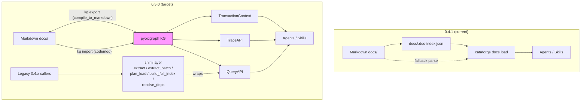
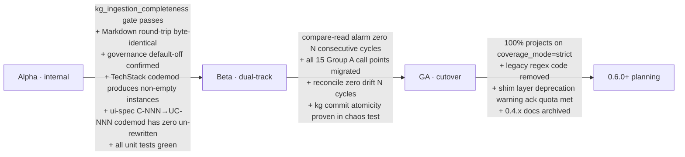

# CataForge 0.5.0 — Knowledge Graph Migration Design

Multi-agent orchestrated design proposal for replacing CataForge 0.4.1 Markdown-only tooling with a knowledge-graph layer modeling business-document domain entities and first-class cross-SDLC traceability.

## Executive summary

CataForge is a document-driven SDLC framework whose 6 role agents (product-manager / architect / tech-lead / ui-designer / qa-engineer / devops) produce business documents (PRD / Arch / UI-Spec / Dev-Plan / Test / DevOps) for user software projects. 0.4.1 stores those documents as Markdown plus a JSON index (`docs/.doc-index.json`). The 0.5.0 release replaces the index with an embedded RDF knowledge graph (pyoxigraph + LinkML) while preserving Markdown as a derived export for human review and version control.

**Why migrate:** 0.4.1 suffers from three structural defects audited in [Task 1](task-1-current-system.md) §1.4 — LLM query inefficiency (full-parse fallback when the index is stale), document rot (ID-continuity warnings are non-blocking, content-hash staleness needs manual `validate`), and cross-document semantic relationships implemented as regex glob matching (false-positive bidirectional coverage, false-negative xref checks). A graph layer addresses all three structurally: SPARQL replaces full-parse, SHACL replaces regex precondition checks, and typed traceability predicates (`cf:verifies`, `cf:implements`, `cf:satisfies`, `cf:delivers`, `cf:affects`) replace string-presence heuristics.

**Scope boundary:** the graph models **business-document domain entities** (Requirement, Feature, Component, Task, TestCase, Deployment, …). CataForge's own framework assets (`.cataforge/skills/*/SKILL.md`, `.cataforge/agents/*/AGENT.md`, `.cataforge/rules/*.md`) stay file-system-resident. A `governance.yaml` sub-ontology is shipped alongside `core.yaml` but `KGConfig.governance = False` by default; only internal skills like `framework-review` flip the switch.

## Documents in this proposal

| File | Author | Concern |
|------|--------|---------|
| [task-1-current-system.md](task-1-current-system.md) | Agent-T1 (sonnet) | 0.4.1 audit: generation flow, 16-row call-point inventory, defect cases, 9 entity prefixes (F/AC/M/API/E/C/P/T-NNN + SR), SDLC role × artifact map |
| [task-2-toolstack.md](task-2-toolstack.md) | Agent-T2 (sonnet) | Tool-stack selection: **pyoxigraph 0.5.8** + **LinkML 1.11.1** + **oxrdflib 0.5.0** + optional pyshacl; Kùzu / Neo4j / SPARQLWrapper eliminated |
| [task-3-domain-ontology.md](task-3-domain-ontology.md) | Agent-T3 (opus) | Business domain ontology: 34 LinkML classes under abstract `cf:SoftwareArtifact`, 5 traceability predicates, waterfall+agile dual-track, governance sub-ontology, plugin extension protocol |
| [schemas/core.yaml](schemas/core.yaml) | Agent-T3 + Orchestrator errata | LinkML schema, business ontology — single source of truth |
| [schemas/governance.yaml](schemas/governance.yaml) | Agent-T3 | LinkML schema, framework governance (default off) |
| [queries/traceability.sparql](queries/traceability.sparql) | Agent-T3 | 6 SPARQL templates for coverage / impact / delivery / chain queries |
| [task-4-export-pipeline.md](task-4-export-pipeline.md) | Agent-T4 (sonnet) | Graph → Markdown pipeline (5-stage: SPARQL → hydrate → Jinja2 → post-process → write), byte-identical idempotency, JSON-Lines diff, incremental export |
| [task-5-cli-api.md](task-5-cli-api.md) | Agent-T5 (sonnet) | 12 `cataforge kg *` subcommands + Python API (`QueryAPI` / `TraceAPI` / `TransactionContext`) + 5-exception hierarchy + 5 0.4.x shim functions |
| [task-6-migration-mapping.md](task-6-migration-mapping.md) | Agent-T6 (opus) | Group A (15 business-doc) + Group B (framework-asset) call-point classification, per-row semantic-equivalence analysis, breaking-change shims, regression suite, efficiency quantification |
| [task-7-rollout-strategy.md](task-7-rollout-strategy.md) | Agent-T7 (sonnet) | Alpha / Beta / GA phased rollout with verifiable entry/exit conditions, six-stage migration pipeline, rollback procedure, 8-row risk register, dual-track design |

## Architecture at a glance

## Consistency check (O1)

Three-way alignment was verified across [Task 3](task-3-domain-ontology.md) (ontology) ↔ [Task 5](task-5-cli-api.md) (API surface) ↔ [Task 6](task-6-migration-mapping.md) (migration mapping). Agent-T6 surfaced 5 inconsistencies during cross-context reasoning; their resolutions are recorded here.

| # | Inconsistency | Resolution | Action item |
|---|---------------|-----------|-------------|
| C1 | [Task 5](task-5-cli-api.md) §5.2 `QueryAPI` exposes typed accessors for Feature / Module / Component / Task / TestCase only. Call-points A2 / A3 / A5 read `API-NNN` and `P-NNN` entities and currently must fall back to generic `kg.query.entity()`. | **Errata for implementation phase**: add `QueryAPI.api(api_id)` and `QueryAPI.page(page_id)` mirroring the five existing accessors. Patterns already declared in `core.yaml` (`API-NNN`, `P-NNN`). | Implementation tracks `QueryAPI.api()` + `QueryAPI.page()` add — open Task 5 follow-up ticket at 0.5.0-alpha kickoff. |
| C2 | [Task 4](task-4-export-pipeline.md) `render_entity(uri, template=...)` is referenced by [Task 6](task-6-migration-mapping.md) §6.5 shims but Task 5's `cataforge.kg` package surface does not name it as a public re-export. | **Errata for implementation phase**: `cataforge.kg.export.render_entity` is a public symbol; re-export from `src/cataforge/kg/__init__.py`. | Implementation tracks `__all__` audit at Alpha gate; doctor adds `import cataforge.kg; cataforge.kg.render_entity` smoke test. |
| C3 | arch §1.4 "Tech-stack narrative" sections have no class in `core.yaml`; call-point A4 (devops) reads this section. | **User decision: add `cf:TechStack` class** — applied to [schemas/core.yaml](schemas/core.yaml) (TechStack class, slots `narrative_body` + `stack_layers` + `affects`, pattern `^(TS-[0-9]{3,}|tech-stack(-[a-z0-9]+)?)$`). [Task 6](task-6-migration-mapping.md) §6.5 #5 `source_section()` shim is now **demoted to deprecated escape hatch** rather than the canonical answer. | Migration codemod ([Task 7](task-7-rollout-strategy.md) §7.2) extends to extract arch §1.4 into TechStack instances; `kg.query.entity(<TechStack URI>)` returns narrative_body. |
| C4 | `Component` and `UIComponent` collide on the `C-NNN` prefix: arch docs use `C-NNN` for architecture components, ui-spec docs use `C-NNN` for UI widgets. Task 3 §3.1 description was contradictory. | **User decision: remap ui-spec C-NNN → UIComponent UC-NNN** via migration codemod. `core.yaml` `Component` description updated to make binding explicit: arch C-NNN → Component, ui-spec C-NNN → UIComponent (renamed). UI fields on Component are kept as legacy disambiguation but deprecated. | Migration codemod ([Task 7](task-7-rollout-strategy.md) §7.2) rewrites ui-spec `C-NNN` headings to `UC-NNN`; xref-resolver maps all inbound references; doctor ERRORs on un-codemodded ui-spec `C-NNN` during Alpha. |
| C5 | Task spec mentioned `cf:coveredBy` as a SPARQL target. `core.yaml` only declares `cf:verifies` ↔ `cf:verified_by` (no `coveredBy`). | **Confirmed: `cf:verified_by` is the correct inverse**; [Task 6](task-6-migration-mapping.md) §6.4 A13 and §6.8 example 3 use `cf:verifies+` transitive closure, which matches the actual schema. No code change. | None — spec wording in [Task 3](task-3-domain-ontology.md) §3.3 will be normalized to `verifies` / `verified_by` at next anti-rot sweep. |

**Traceability completeness check**: every `cf:` predicate declared in [schemas/core.yaml](schemas/core.yaml) is surfaced by [Task 5](task-5-cli-api.md)'s `TraceAPI` (`from_requirement` / `coverage` / property-path traversal). Confirmed.

**Namespace isolation check**: `https://cataforge.dev/ontology/` (business) and `https://cataforge.dev/governance/` (framework governance) remain disjoint; governance imports business but not the reverse. Confirmed in [schemas/governance.yaml](schemas/governance.yaml) `imports:` clause.

**Process-model exposure check**: `Project.process_model` enum + `assigned_to_sprint` / `belongs_to_phase` / unified `belongs_to_work_unit` are exposed via [Task 5](task-5-cli-api.md) `QueryAPI`. Confirmed.

## User decisions (O3)

Captured via interactive prompt:

| Decision | User answer | Affected files |
|----------|-------------|----------------|
| Framework governance sub-ontology release timing | **0.5.0 enabled but default off** — `governance.yaml` ships, `KGConfig.governance=False` default, only internal skills flip the switch | [schemas/governance.yaml](schemas/governance.yaml), [task-5-cli-api.md](task-5-cli-api.md) `KGConfig`, [task-7-rollout-strategy.md](task-7-rollout-strategy.md) Alpha gate |
| arch §1.4 tech-stack content modeling | **Add a `cf:TechStack` class** (recommended) over the `source_section()` escape hatch | [schemas/core.yaml](schemas/core.yaml) (TechStack added), [task-6-migration-mapping.md](task-6-migration-mapping.md) §6.5 #5 demoted to deprecated, [task-7-rollout-strategy.md](task-7-rollout-strategy.md) §7.2 codemod scope extended |
| ui-spec `C-NNN` binding in 0.5.0 | **Remap ui-spec C-NNN → UIComponent UC-NNN** via migration codemod (recommended) | [schemas/core.yaml](schemas/core.yaml) Component description, [task-7-rollout-strategy.md](task-7-rollout-strategy.md) §7.2 codemod gains a UI rewrite pass |

## Roadmap

The phased rollout is fully specified in [task-7-rollout-strategy.md](task-7-rollout-strategy.md) §7.1. Three phases, each gated by **verifiable conditions** rather than time-boxes.

**Rollback triggers** ([Task 7](task-7-rollout-strategy.md) §7.3): data-integrity failure (entity count mismatch / hash drift), semantic-divergence alarm (compare-read sustained ≥3 cycles), or library-deserialization failure (pyoxigraph deserialization broken). Each trigger has a numbered procedural rollback path documented at task-7 §7.3.

**Top risks** ([Task 7](task-7-rollout-strategy.md) §7.4, 8 rows): the highest-impact unknowns are (a) **traceability-extraction false-pos/false-neg** during codemod (mitigation: dry-run codemod produces a structured changeset for human review before write); (b) **agent/skill semantic divergence** during dual-track (mitigation: every Group A call point has a golden-file regression test); (c) **pyoxigraph deprecation** (mitigation: storage interface is abstracted behind `KGConfig.store_backend`; `memory` backend provides escape route for emergency).

## How to read this proposal

If you have to pick **one document**, read [task-3-domain-ontology.md](task-3-domain-ontology.md) — every downstream task derives from it.

If you're implementing 0.5.0:
1. Start at [schemas/core.yaml](schemas/core.yaml) and [schemas/governance.yaml](schemas/governance.yaml) (the source of truth).
2. Run LinkML codegen per [Task 3](task-3-domain-ontology.md) §3.8 to produce pydantic dataclasses.
3. Implement the surfaces declared in [Task 5](task-5-cli-api.md) (CLI + API) and [Task 4](task-4-export-pipeline.md) (export pipeline).
4. Apply [Task 6](task-6-migration-mapping.md) §6.2 mapping per call-point during Beta.
5. Gate progression on [Task 7](task-7-rollout-strategy.md) §7.1 verifiable conditions; never on dates.

If you're reviewing for risk:
1. Read [task-7-rollout-strategy.md](task-7-rollout-strategy.md) §7.4 (risk register) first.
2. Then [task-6-migration-mapping.md](task-6-migration-mapping.md) §6.4 (semantic-equivalence A/B/C analysis per high-risk migration).
3. Cross-check against the consistency findings in this README's **O1** section.

## Open follow-ups

None block 0.5.0 design; these are flagged for the implementation phase.

- **Task 5 errata C1**: `QueryAPI.api()` + `QueryAPI.page()` typed accessors must be added at Alpha kickoff.
- **Task 4 errata C2**: `cataforge.kg.export.render_entity` must be public-exported.
- **`[待验证]` markers in Task 3**: LinkML `union` range syntax, SHACL closed-shape derivation, TC-NNN historical strictness — all are LinkML-tool questions to resolve during codegen integration in Alpha.
- **`[待验证]` markers in Task 4**: pyoxigraph SPARQL property-path `a/rdfs:subClassOf*` behavior on 0.5.x — verify in Alpha smoke test.
- **`[待验证]` markers in Task 5**: `belongs_to_work_unit` SPARQL CONSTRUCT inference rule, `sh:closed true` per-class lockdown, natural-language query LLM config — implementation-phase decisions, not design-phase blockers.

## Conventions used

- Schema and instance URIs: business under `https://cataforge.dev/ontology/`, framework governance under `https://cataforge.dev/governance/`, instance data under `https://cataforge.dev/instance/`.
- Entity-ID prefixes (binding from [Task 1](task-1-current-system.md) §1.6, finalized by [Task 3](task-3-domain-ontology.md) §3.1 plus the C4 / C3 resolutions above): F (Feature), AC (AcceptanceCriteria), M (Module), API (API), E (DataModel — was "entity", remapped), C (Component, arch context), UC (UIComponent — ui-spec C-NNN remapped here), P (Page), T (Task), TC (TestCase), SR (StoryRequirement / Risk pending), EP (Epic), TS (TechStack, new in C3), ADR (ArchitectureDecision), and others declared in `core.yaml`.
- `sort_key` (format `<code>:<padded-numeric>`) is the deterministic traversal key. Required on every `cf:SoftwareArtifact` instance for [Task 4](task-4-export-pipeline.md) export idempotency.
- All write operations go through `async with kg.transaction() as txn:` ([Task 5](task-5-cli-api.md) §5.2). Direct store writes are forbidden — they bypass SHACL post-validation.
- Exit conditions for every phase are **verifiable**, never time-based ([Task 7](task-7-rollout-strategy.md) §7.1). This is a global project rule and applies to all schedules referenced in this proposal.
