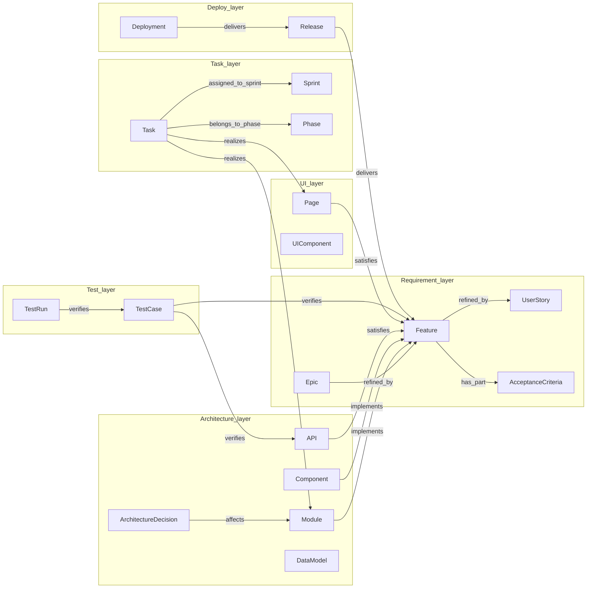

# Task 3 — Business Domain Ontology Design

> KG Migration 0.5.0 · Agent-T3 produced · grounded in Task 1 (`task-1-current-system.md` §1.6/§1.7/§1.3) and Task 2 (`task-2-toolstack.md` §2.4)

Anchors:
- Schema language: **LinkML 1.11.x YAML** (Task 2 §2.4)
- Storage: **pyoxigraph 0.5.x** (RocksDB embedded); query language **SPARQL 1.1** (Task 2 §2.4)
- Business namespace: `https://cataforge.dev/ontology/` (`cf:`)
- Governance namespace: `https://cataforge.dev/governance/` (`cfgov:`) — strictly isolated
- Instances namespace: `https://cataforge.dev/instance/` (`cfprj:`)

Companion artifacts produced by this task:
- `docs/proposals/kg-migration-0.5.0/schemas/core.yaml` — full LinkML business ontology
- `docs/proposals/kg-migration-0.5.0/schemas/governance.yaml` — governance sub-ontology skeleton
- `docs/proposals/kg-migration-0.5.0/queries/traceability.sparql` — six query templates

---

## §3.1 Business Entity-Type Inventory

Source columns abbreviated: T1.§1.6 = Task-1 §1.6 entity inventory table; T1.§1.7 = role × artifact mapping.

| 实体类型 | 所属 SDLC 层 | 来源 (doc_type / frontmatter ID 模式) | LinkML class 名 | 父类 | 关键标识属性 |
|----------|-------------|----------------------------------------|-----------------|------|-------------|
| Project | Process | （项目根 — 不在 frontmatter） | `Project` | — | `id`, `title`, `process_model` |
| ProcessModel | Process | enum on Project | `ProcessModelEnum` | — | `waterfall` / `agile` / `hybrid` |
| Phase | Process (waterfall) | `P-NNN`（仅当 doc_type≠ui-spec；见 §3.9 决策 2） | `Phase` | `WorkUnit` | `entity_id ^P-[0-9]{3,}$`, `start_date`, `end_date` |
| Sprint | Process (agile) | `S-NNN`（dev-plan-sprint 分卷后缀） | `Sprint` | `WorkUnit` | `entity_id ^S-[0-9]{3,}$` |
| Iteration | Process (agile) | `I-NNN`（agile-lite 模式） | `Iteration` | `WorkUnit` | `entity_id ^I-[0-9]{3,}$` |
| Milestone | Process | `MS-NNN`（changelog 节点） | `Milestone` | `SoftwareArtifact` | `entity_id ^MS-[0-9]{3,}$` |
| Requirement | Requirement (abstract) | abstract — 三 concrete 子类 | `Requirement` | `SoftwareArtifact` | — (abstract) |
| Feature | Requirement | prd §2 `F-NNN` — **T1.§1.6 ✓** | `Feature` | `Requirement` | `entity_id ^F-[0-9]{3,}$` |
| UserStory | Requirement | prd-lite / brief `US-NNN`（新增） | `UserStory` | `Requirement` | `entity_id ^US-[0-9]{3,}$` |
| Epic | Requirement | 新前缀 `EP-NNN`（**E-NNN 保留给 DataModel，T1.§1.6 ✓**；见 §3.9 决策 1） | `Epic` | `Requirement` | `entity_id ^EP-[0-9]{3,}$` |
| AcceptanceCriteria | Requirement | prd §2.F.AC-NNN 内嵌 + dev-plan T.tdd_acceptance — **T1.§1.6 ✓** | `AcceptanceCriteria` | `SoftwareArtifact` | `entity_id ^AC-[0-9]{3,}$`, `acceptance_text` (required) |
| Module | Architecture | arch §2 `M-NNN` — **T1.§1.6 ✓** | `Module` | `SoftwareArtifact` | `entity_id ^M-[0-9]{3,}$` |
| Component (architecture sub-block) | Architecture | 重用 `Module` —（见 §3.9 决策 1：`C-NNN` 历史上专属 UI；架构子组件统一为 Module） | (mapped to `Module`) | — | — |
| Interface | Architecture | `IF-NNN`（非 HTTP 抽象接口） | `Interface` | `SoftwareArtifact` | `entity_id ^IF-[0-9]{3,}$` |
| API | Architecture | arch §3 `API-NNN` — **T1.§1.6 ✓** | `API` | `Interface` | `entity_id ^API-[0-9]{3,}$`, `endpoint_path`, `http_method` |
| DataModel | Architecture | arch §4 `E-NNN` — **T1.§1.6 ✓**（Entity → DataModel 重命名以避开 RDF 通用语义 “entity”；详 §3.9 决策 1） | `DataModel` | `SoftwareArtifact` | `entity_id ^E-[0-9]{3,}$`, `field_definitions` |
| ArchitectureDecision | Architecture | `ADR-NNN` | `ArchitectureDecision` | `SoftwareArtifact` | `entity_id ^ADR-[0-9]{3,}$`, `rationale`, `decision_outcome` |
| Screen / Page | UI | ui-spec §3 `P-NNN` — **T1.§1.6 ✓** | `Page` (Screen 为别名父类) | `Screen → SoftwareArtifact` | `entity_id ^P-[0-9]{3,}$` |
| UserFlow | UI | `UF-NNN` | `UserFlow` | `SoftwareArtifact` | `entity_id ^UF-[0-9]{3,}$` |
| Wireframe | UI | `WF-NNN` | `Wireframe` | `SoftwareArtifact` | `entity_id ^WF-[0-9]{3,}$` |
| UIComponent | UI | ui-spec §2 — 在 KG 层，**`C-NNN` 映射为 `Component` 类**（同时持有 UI 语义 + 架构语义；见 §3.9 决策 1） | `Component` | `SoftwareArtifact` | `entity_id ^C-[0-9]{3,}$` |
| Task | Task/Plan | dev-plan §3 `T-NNN` — **T1.§1.6 ✓** | `Task` | `SoftwareArtifact` | `entity_id ^T-[0-9]{3,}$`, `task_status` |
| Subtask | Task/Plan | `ST-NNN` | `Subtask` | `Task` | `entity_id ^ST-[0-9]{3,}$` |
| TestCase | Test | test-report §2 `TC-NNN` — **T1.§1.6 ✓** (待验证: 历史无强制前缀，见 §3.9 决策 1) | `TestCase` | `SoftwareArtifact` | `entity_id ^TC-[0-9]{3,}$` |
| TestSuite | Test | `TS-NNN` | `TestSuite` | `SoftwareArtifact` | `entity_id ^TS-[0-9]{3,}$` |
| TestPlan | Test | `TP-NNN` | `TestPlan` | `SoftwareArtifact` | `entity_id ^TP-[0-9]{3,}$` |
| TestRun | Test | `TR-NNN`（执行实例） | `TestRun` | `SoftwareArtifact` | `entity_id ^TR-[0-9]{3,}$`, `test_result` |
| CoverageRule | Test | `CR-NNN`（声明式覆盖律） | `CoverageRule` | `SoftwareArtifact` | `entity_id ^CR-[0-9]{3,}$` |
| Deployment | Deploy | deploy-spec `DP-NNN` | `Deployment` | `SoftwareArtifact` | `entity_id ^DP-[0-9]{3,}$`, `environment` |
| Pipeline | Deploy | `PL-NNN` | `Pipeline` | `SoftwareArtifact` | `entity_id ^PL-[0-9]{3,}$`, `pipeline_steps` |
| Release | Deploy | changelog `REL-NNN` | `Release` | `SoftwareArtifact` | `entity_id ^REL-[0-9]{3,}$`, `version` |
| Environment | Deploy | `ENV-NNN` | `Environment` | `SoftwareArtifact` | `entity_id ^ENV-[0-9]{3,}$` |
| Glossary | Support | `GL-NNN` | `Glossary` | `SoftwareArtifact` | `glossary_term`, `glossary_definition` |
| Risk | Support | `RK-NNN`（research / arch §risk） | `Risk` | `SoftwareArtifact` | `risk_level`, `mitigation` |
| ChangeRequest | Support | `CHG-NNN` | `ChangeRequest` | `SoftwareArtifact` | `change_status`, `affects` |
| ReviewReport | Support | `REV-NNN` / `REVIEW-{doc_id}-r{N}.md` — **T1.§1.1 ✓** | `ReviewReport` | `SoftwareArtifact` | `targets_artifact`, `rationale` |
| SprintReviewIssue | Support | `SR-NNN` — **T1.§1.6 ✓** | `SprintReviewIssue` | `ReviewReport` | `entity_id ^SR-[0-9]{3,}$` |

T1.§1.6 9-prefix coverage check: F (Feature ✓), AC (AcceptanceCriteria ✓), M (Module ✓), API (API ✓), E (DataModel — renamed, see §3.9 #1 ✓), C (Component ✓), P (Page ✓), T (Task ✓), TC (TestCase ✓), SR (SprintReviewIssue ✓). All honored.

---

## §3.2 Core Ontology Design (LinkML YAML)

Full schema lives in `schemas/core.yaml`. Key fragments inline.

### §3.2.1 Class hierarchy (top abstract base)

Every concrete business class is a descendant of `cf:SoftwareArtifact`:

```yaml
classes:
  SoftwareArtifact:
    abstract: true
    class_uri: cf:SoftwareArtifact
    slots:
      - id                  # uriorcurie, identifier
      - entity_id           # F-001, M-014, T-007 ... (pattern enforced per subclass)
      - sort_key            # deterministic export key (REQUIRED, format <code>:<padded>)
      - title
      - description
      - status              # ArtifactStatusEnum
      - priority
      - created_at
      - updated_at
      - content_hash        # SHA-256 of source markdown section
      - source_doc          # path under docs/
      - source_section      # §N.ITEM anchor
      - tags
      - authored_by
      - belongs_to_project  # REQUIRED — every artifact belongs to one Project
      - depends_on
      - dependency_of
      - part_of
      - has_part
      - replaces            # dcterms:replaces  (versioning)
      - replaced_by         # dcterms:isReplacedBy
      - was_revision_of     # prov:wasRevisionOf
      - reviewed_by
```

### §3.2.2 Data slots — sample required/multivalued/pattern

```yaml
slots:
  entity_id:
    range: EntityID
    required: true              # enforced on concrete classes via slot_usage.pattern

  acceptance_text:
    range: string
    required: true              # AcceptanceCriteria MUST carry verifiable text

  sort_key:
    range: SortKey
    required: true              # idempotent export depends on this

  tags:
    range: string
    multivalued: true

  test_steps:
    range: string
    multivalued: true
```

Concrete pattern example (`Feature` honoring `F-NNN`):

```yaml
Feature:
  is_a: Requirement
  class_uri: cf:Feature
  slot_usage:
    entity_id:
      pattern: "^F-[0-9]{3,}$"
      required: true
```

### §3.2.3 Object properties — intra-layer + cross-layer

| Predicate | Domain | Range | Cardinality | Inverse | Functional? | Notes |
|-----------|--------|-------|-------------|---------|-------------|-------|
| `cf:part_of` | SoftwareArtifact | SoftwareArtifact | 0..1 | `has_part` | yes | composition |
| `cf:has_part` | SoftwareArtifact | SoftwareArtifact | 0..* | `part_of` | no | |
| `cf:depends_on` | SoftwareArtifact | SoftwareArtifact | 0..* | `dependency_of` | no | task/module deps |
| `cf:satisfies` | Feature / Module / API / Component / Page | Requirement | 0..* | `satisfied_by` | no | implementation → requirement |
| `cf:refines` | Requirement | Requirement | 0..1 | `refined_by` | yes | Epic→Feature→UserStory |
| `cf:implements` | Module / Component | Requirement | 0..* | `implemented_by` | no | arch → req |
| `cf:realizes` | Task | Module / Component / Page | 0..* | `realized_as` | no | task → arch/UI |
| `cf:verifies` | TestCase / TestRun | SoftwareArtifact | 0..* | `verified_by` | no | test → req/task/api |
| `cf:delivers` | Release / Deployment | SoftwareArtifact | 0..* | `delivered_by` | no | release → features |
| `cf:affects` | ChangeRequest / ArchitectureDecision / Risk | SoftwareArtifact | 0..* | `affected_by` | no | impact set |
| `cf:targets_artifact` | ReviewReport | SoftwareArtifact | 1..1 | `reviewed_by` | yes | review subject |
| `dcterms:replaces` | SoftwareArtifact | SoftwareArtifact | 0..1 | `replaced_by` | yes | version supersession |
| `prov:wasRevisionOf` | SoftwareArtifact | SoftwareArtifact | 0..1 | — | yes | revision lineage |

Cross-layer traceability is therefore expressed as a small set of typed predicates rather than reified link entities (see §3.9 #3 for the trade-off).

### §3.2.4 Constraints (LinkML → derived SHACL)

LinkML's `gen-shacl` produces three kinds of shape per class:

1. **Cardinality** — `required: true` and `multivalued: false` lift to `sh:minCount` / `sh:maxCount`.
2. **Domain/Range** — each slot's `range` becomes `sh:class` or `sh:datatype`.
3. **Pattern** — `pattern:` regex lifts to `sh:pattern` (entity_id format check).

Plus three custom SHACL invariants we will hand-write in `schemas/shapes/extra.shacl.ttl` (Task-5 deliverable; declared here so it is visible from §3.2):

- Every `cf:Feature` SHOULD have at least one inbound `cf:verifies` path (advisory — promotes Task-1 §1.4 case A from WARN to SHACL `sh:Warning`).
- Every `cf:Task` MUST realize at least one Module/Component/Page (`sh:minCount 1` on `cf:realizes`).
- Every concrete subclass MUST carry `cf:sort_key` matching `^[A-Z]{1,3}:[0-9]{6,}$`.

### §3.2.5 Version semantics

Two complementary predicates (see §3.9 #6 for the explicit decision rationale):

- `dcterms:replaces` / `dcterms:isReplacedBy` — semantic supersession at logical-entity level (Feature F-007 replaces F-005 because requirements changed). Inverse pair.
- `prov:wasRevisionOf` — physical revision of one snapshot to the next, preserving lineage across content_hash bumps without altering logical identity.

Both are model-level optional; agents pick the semantics that match the change kind. SPARQL queries normalise via `(dcterms:replaces|prov:wasRevisionOf)+`.

---

## §3.3 Traceability Matrix Design — CORE VALUE

### §3.3.1 The five trace chains

```
Requirement → implementation:
  Requirement  ─cf:implemented_by→  Module/Component
               ─cf:realized_as→     Task
               (─optional cf:code_repo→ external; deferred to Task-5)

Requirement → verification:
  Requirement  ─cf:verified_by→     TestCase
  TestCase     ─cf:verifies→        TestRun (instance)
                (TestRun ─cf:test_result→ TestResultEnum)

Requirement → delivery:
  Requirement  ─cf:delivered_by→    Release
  Release      ─cf:delivers→        Deployment

ArchitectureDecision retroactive:
  ArchitectureDecision ─cf:affects→ Module/Component/API

Change-impact reverse closure:
  ChangeRequest        ─cf:affects+→ {SoftwareArtifact}
  (SPARQL closure: cf:affects+ resolves transitive impact set)
```

### §3.3.2 SPARQL templates (3 mandatory + 3 bonus, full text in `queries/traceability.sparql`)

**Q1 — Features NOT covered by any TestCase** (replaces Task-1 §1.4 case A regex coverage check):

```sparql
PREFIX cf: <https://cataforge.dev/ontology/>
SELECT ?feature ?entity_id ?title
WHERE {
  ?feature a cf:Feature ; cf:entity_id ?entity_id ; cf:title ?title .
  FILTER NOT EXISTS { ?tc a cf:TestCase ; cf:verifies+ ?feature . }
}
ORDER BY ?entity_id
```

**Q2 — All upstream Requirements affected by a given Component** (impact analysis for code change):

```sparql
PREFIX cf:    <https://cataforge.dev/ontology/>
PREFIX cfprj: <https://cataforge.dev/instance/>
PREFIX rdfs:  <http://www.w3.org/2000/01/rdf-schema#>
SELECT DISTINCT ?req ?req_id ?req_title ?kind
WHERE {
  BIND(cfprj:C-014 AS ?target)
  ?target (cf:satisfies|cf:implements|cf:part_of|cf:realizes)+ ?req .
  ?req a ?kind ; cf:entity_id ?req_id ; cf:title ?req_title .
  ?kind rdfs:subClassOf* cf:Requirement .
}
ORDER BY ?req_id
```

**Q3 — Features delivered by Release v1.2 with test status** (delivery + verification join):

```sparql
PREFIX cf: <https://cataforge.dev/ontology/>
SELECT ?feature ?feature_id ?feature_title ?test_status
WHERE {
  ?release a cf:Release ; cf:version "1.2" ; cf:delivers ?feature .
  ?feature a cf:Feature ; cf:entity_id ?feature_id ; cf:title ?feature_title .
  OPTIONAL {
    ?tc  a cf:TestCase ; cf:verifies+ ?feature .
    ?run a cf:TestRun  ; cf:verifies ?tc ; cf:test_result ?test_status .
  }
}
ORDER BY ?feature_id
```

Bonus templates Q4 (change-impact transitive closure), Q5 (cross-process query — same Feature in waterfall view vs agile view) and Q6 (deterministic export sort) are in `queries/traceability.sparql`.

---

## §3.4 Process-Model Support (Waterfall + Agile, Single Schema)

### §3.4.1 Project-level switch

```yaml
Project:
  slots:
    - process_model        # ProcessModelEnum: waterfall | agile | hybrid
```

### §3.4.2 Abstract WorkUnit, concrete Phase / Sprint / Iteration

```yaml
WorkUnit:
  abstract: true
  is_a: SoftwareArtifact
  slots: [ start_date, end_date ]

Phase:     { is_a: WorkUnit, slot_usage: { entity_id: { pattern: "^P-[0-9]{3,}$" } } }
Sprint:    { is_a: WorkUnit, slot_usage: { entity_id: { pattern: "^S-[0-9]{3,}$" } } }
Iteration: { is_a: WorkUnit, slot_usage: { entity_id: { pattern: "^I-[0-9]{3,}$" } } }
```

### §3.4.3 Business-entity attachment

Both attachment slots coexist on `Feature` and `Task` to support hybrid projects:

```yaml
Feature:
  slots:
    - assigned_to_sprint     # range: Sprint   (agile mode)
    - belongs_to_phase       # range: Phase    (waterfall mode)
    - belongs_to_work_unit   # range: WorkUnit (unified query handle)
```

Convention: writers populate the typed slot matching the project's `process_model`; the generic `belongs_to_work_unit` slot is asserted by an inference rule (SPARQL CONSTRUCT in Task-5) so cross-process queries can be one-shot. [待验证: 是否在 LinkML 层直接 declare `belongs_to_work_unit` 等价于 union(Phase | Sprint | Iteration) 需在 Task-5 验证]

### §3.4.4 Cross-process query

Q5 in `queries/traceability.sparql` resolves a Feature into either its Phase or its Sprint via `UNION` — the same Markdown export step can render a Gantt chart (waterfall) or a sprint board (agile) without schema branching.

---

## §3.5 Extension Point Design (3rd-Party Plugins)

### §3.5.1 Plugin schema file layout

```
.cataforge/plugins/
└── <plugin-id>/
    ├── plugin.yaml                # LinkML schema file
    ├── shapes.shacl.ttl           # optional SHACL
    └── queries/*.sparql           # optional plugin-supplied templates
```

### §3.5.2 Namespace isolation

Plugin namespace: `https://cataforge.dev/plugins/<plugin-id>/`

This namespace is **disjoint** from `cf:` (business core) and `cfgov:` (governance). Cross-namespace edges are allowed (plugin → core) but core never resolves a plugin URI.

### §3.5.3 LinkML `imports:` mechanism

Plugin schemas import `core`; they MAY add new classes and new slots; they MAY constrain a core slot's `slot_usage` for plugin-introduced subclasses; they MUST NOT redeclare a core slot's `range` (LinkML rejects this at validation time).

### §3.5.4 Core-protection guarantee

The Task-5 plugin loader does three things at load time:

1. Reads each plugin YAML; passes through `linkml-validate`.
2. Asserts the loaded schema's `imports:` includes `core` and the plugin's classes all inherit (directly or transitively) from `cf:SoftwareArtifact`.
3. Locks core class URIs with a SHACL `sh:closed true` shape — any plugin attempt to add a slot whose `domain` is a core class fails validation. [待验证: linkml `tree_root` + closed-shape derivation does not yet support per-class lock-down by default — confirm in Task-5 implementation]

### §3.5.5 Full plugin example — `ComplianceRule`

```yaml
# .cataforge/plugins/compliance-iso27001/plugin.yaml
id: https://cataforge.dev/plugins/compliance-iso27001/
name: compliance-iso27001
prefixes:
  linkml:  https://w3id.org/linkml/
  cf:      https://cataforge.dev/ontology/
  comp:    https://cataforge.dev/plugins/compliance-iso27001/
default_prefix: comp
imports:
  - linkml:types
  - https://cataforge.dev/ontology/core    # mandatory

enums:
  ControlClassEnum:
    permissible_values: { preventive: {}, detective: {}, corrective: {} }

slots:
  control_id:
    range: string
    required: true
    pattern: "^A\\.\\d+\\.\\d+\\.\\d+$"   # ISO 27001 Annex A clause
  control_class:
    range: ControlClassEnum
  enforces_on:
    range: cf:SoftwareArtifact            # cross-ns edge to business core
    multivalued: true

classes:
  ComplianceRule:
    is_a: cf:SoftwareArtifact
    class_uri: comp:ComplianceRule
    slots: [ control_id, control_class, enforces_on ]
    slot_usage:
      entity_id:
        pattern: "^CMP-[0-9]{3,}$"
        required: true
```

---

## §3.6 Framework Governance Sub-Ontology (Optional)

Drafted in `schemas/governance.yaml`. Highlights:

- Namespace `https://cataforge.dev/governance/` (`cfgov:`) — strictly isolated from `cf:`.
- Direction guarantee: `governance.yaml` imports `core`; `core.yaml` does **not** import `governance`. An agent (cfgov:Agent) may declare `cfgov:generates ?feature` where `?feature` is a `cf:Feature`. Business artifacts never carry a slot whose `range` is a `cfgov:*` class.
- **Business-only mode toggle:** `KGConfig.governance = false` (default for downstream user projects) disables loading `governance.yaml` and skips lifting `docs/EVENT-LOG.jsonl` into the graph. The framework-review skill (Task-1 §1.3 row 17) can still operate on the file system directly.
- Asset kinds covered: `Skill`, `Agent`, `Rule`, `ScriptTool`, `DocumentTemplate`, `SkillLoader`, `EventLogEntry`.
- Cross-namespace predicate `cfgov:generates` carries `range: cf:SoftwareArtifact` so PROV-style attribution queries (“which agent produced M-014?”) become first-class SPARQL.

---

## §3.7 Ontology Diagrams

### §3.7.1 Class hierarchy (Mermaid `classDiagram`)

```mermaid
classDiagram
  class SoftwareArtifact { <<abstract>> }
  class WorkUnit { <<abstract>> }
  class Requirement { <<abstract>> }

  SoftwareArtifact <|-- Project
  SoftwareArtifact <|-- WorkUnit
  SoftwareArtifact <|-- Milestone
  SoftwareArtifact <|-- Requirement
  SoftwareArtifact <|-- AcceptanceCriteria
  SoftwareArtifact <|-- Module
  SoftwareArtifact <|-- Component
  SoftwareArtifact <|-- Interface
  SoftwareArtifact <|-- DataModel
  SoftwareArtifact <|-- ArchitectureDecision
  SoftwareArtifact <|-- Screen
  SoftwareArtifact <|-- Wireframe
  SoftwareArtifact <|-- UIComponent
  SoftwareArtifact <|-- UserFlow
  SoftwareArtifact <|-- Task
  SoftwareArtifact <|-- TestCase
  SoftwareArtifact <|-- TestSuite
  SoftwareArtifact <|-- TestPlan
  SoftwareArtifact <|-- TestRun
  SoftwareArtifact <|-- CoverageRule
  SoftwareArtifact <|-- Deployment
  SoftwareArtifact <|-- Pipeline
  SoftwareArtifact <|-- Release
  SoftwareArtifact <|-- Environment
  SoftwareArtifact <|-- Glossary
  SoftwareArtifact <|-- Risk
  SoftwareArtifact <|-- ChangeRequest
  SoftwareArtifact <|-- ReviewReport

  WorkUnit <|-- Phase
  WorkUnit <|-- Sprint
  WorkUnit <|-- Iteration

  Requirement <|-- Feature
  Requirement <|-- UserStory
  Requirement <|-- Epic

  Interface <|-- API
  Screen <|-- Page
  Task <|-- Subtask
  ReviewReport <|-- SprintReviewIssue
```



### §3.7.2 Cross-layer relation graph (Mermaid `graph`)



### §3.7.3 Turtle instance fragment

A minimal end-to-end thread: one Feature satisfied by one Module, realised as one Task, verified by one TestCase, delivered by one Release.

```turtle
@prefix cf:      <https://cataforge.dev/ontology/> .
@prefix cfprj:   <https://cataforge.dev/instance/> .
@prefix rdf:     <http://www.w3.org/1999/02/22-rdf-syntax-ns#> .
@prefix rdfs:    <http://www.w3.org/2000/01/rdf-schema#> .
@prefix xsd:     <http://www.w3.org/2001/XMLSchema#> .

cfprj:F-001 a cf:Feature ;
  cf:entity_id "F-001" ;
  cf:sort_key  "F:000001" ;
  cf:title     "User authentication flow" ;
  cf:status    "approved" ;
  cf:content_hash "9f3a…ab12" ;
  cf:source_doc     "docs/prd/prd-demo.md" ;
  cf:source_section "§2.F-001" ;
  cf:belongs_to_project cfprj:proj-demo ;
  cf:implemented_by cfprj:M-014 ;
  cf:verified_by    cfprj:TC-007 ;
  cf:delivered_by   cfprj:REL-1_2 .

cfprj:M-014 a cf:Module ;
  cf:entity_id "M-014" ;
  cf:sort_key  "M:000014" ;
  cf:title     "AuthService" ;
  cf:satisfies cfprj:F-001 ;
  cf:realized_as cfprj:T-021 ;
  cf:belongs_to_project cfprj:proj-demo .

cfprj:T-021 a cf:Task ;
  cf:entity_id "T-021" ;
  cf:sort_key  "T:000021" ;
  cf:title     "Implement password hashing in AuthService" ;
  cf:realizes  cfprj:M-014 ;
  cf:assigned_to_sprint cfprj:S-003 ;
  cf:task_status "done" ;
  cf:belongs_to_project cfprj:proj-demo .

cfprj:TC-007 a cf:TestCase ;
  cf:entity_id "TC-007" ;
  cf:sort_key  "TC:000007" ;
  cf:title     "Login with valid credentials returns 200" ;
  cf:verifies  cfprj:F-001 ;
  cf:belongs_to_project cfprj:proj-demo .

cfprj:REL-1_2 a cf:Release ;
  cf:entity_id "REL-002" ;
  cf:sort_key  "REL:000002" ;
  cf:version   "1.2" ;
  cf:delivers  cfprj:F-001 ;
  cf:belongs_to_project cfprj:proj-demo .

cfprj:proj-demo a cf:Project ;
  cf:title         "Demo Auth Project" ;
  cf:process_model "agile" .
```

---

## §3.8 Python Schema Examples

### §3.8.1 LinkML code-gen command

```bash
# Pydantic v2 models — agent-facing typed API
gen-pydantic docs/proposals/kg-migration-0.5.0/schemas/core.yaml \
  --pydantic-version 2 \
  > src/cataforge/kg/_models_core.py

# SHACL shapes — write-time validation
gen-shacl docs/proposals/kg-migration-0.5.0/schemas/core.yaml \
  > src/cataforge/kg/shapes/core.shacl.ttl

# OWL ontology — interoperability export
gen-owl docs/proposals/kg-migration-0.5.0/schemas/core.yaml \
  > src/cataforge/kg/exports/core.owl.ttl
```

### §3.8.2 Sample generated Pydantic output (excerpt — 3 classes)

```python
# Auto-generated by linkml.generators.pydanticgen 1.11.x — DO NOT EDIT
from __future__ import annotations
from typing import List, Optional
from pydantic import BaseModel, Field, ConfigDict

class SoftwareArtifact(BaseModel):
    model_config = ConfigDict(populate_by_name=True, extra="forbid")
    id:             str
    entity_id:      str
    sort_key:       str
    title:          str
    description:    Optional[str] = None
    content_hash:   Optional[str] = None
    source_doc:     Optional[str] = None
    source_section: Optional[str] = None
    belongs_to_project: str
    depends_on:     List[str] = Field(default_factory=list)
    part_of:        Optional[str] = None
    replaces:       Optional[str] = None
    replaced_by:    Optional[str] = None
    was_revision_of: Optional[str] = None

class Requirement(SoftwareArtifact):
    refines:        Optional[str] = None
    refined_by:     List[str] = Field(default_factory=list)
    implemented_by: List[str] = Field(default_factory=list)

class Feature(Requirement):
    entity_id:           str = Field(pattern=r"^F-[0-9]{3,}$")
    assigned_to_sprint:  Optional[str] = None
    belongs_to_phase:    Optional[str] = None
    belongs_to_work_unit: Optional[str] = None

class Component(SoftwareArtifact):
    entity_id:    str = Field(pattern=r"^C-[0-9]{3,}$")
    satisfies:    List[str] = Field(default_factory=list)
    realized_as:  List[str] = Field(default_factory=list)
    implements:   List[str] = Field(default_factory=list)
    ui_route:     Optional[str] = None
    layout_spec:  Optional[str] = None

class TestCase(SoftwareArtifact):
    entity_id:        str = Field(pattern=r"^TC-[0-9]{3,}$")
    verifies:         List[str] = Field(default_factory=list)
    test_steps:       List[str] = Field(default_factory=list)
    expected_result:  Optional[str] = None
    test_result:      Optional[str] = None
```

### §3.8.3 rdflib + pyoxigraph snippet — create entities, run a traceability query (≤40 lines)

```python
# kg_traceability_demo.py — runs against pyoxigraph 0.5.x via oxrdflib bridge.
from rdflib import Graph, Namespace, Literal, URIRef, RDF

CF    = Namespace("https://cataforge.dev/ontology/")
CFPRJ = Namespace("https://cataforge.dev/instance/")

g = Graph(store="Oxigraph")           # oxrdflib drop-in store
g.bind("cf", CF); g.bind("cfprj", CFPRJ)

def add(node, typ, **props):
    g.add((CFPRJ[node], RDF.type, CF[typ]))
    for p, v in props.items():
        g.add((CFPRJ[node], CF[p],
               v if isinstance(v, URIRef) else Literal(v)))

add("F-001", "Feature",  entity_id="F-001", sort_key="F:000001",
    title="Login flow", verified_by=CFPRJ["TC-007"])
add("M-014", "Module",   entity_id="M-014", sort_key="M:000014",
    satisfies=CFPRJ["F-001"], realized_as=CFPRJ["T-021"])
add("T-021", "Task",     entity_id="T-021", sort_key="T:000021",
    realizes=CFPRJ["M-014"])
add("TC-007", "TestCase", entity_id="TC-007", sort_key="TC:000007",
    verifies=CFPRJ["F-001"])

q = """
PREFIX cf: <https://cataforge.dev/ontology/>
SELECT ?f WHERE {
  ?f a cf:Feature .
  FILTER NOT EXISTS { ?tc a cf:TestCase ; cf:verifies+ ?f . }
}"""
uncovered = [str(row[0]) for row in g.query(q)]
print("Uncovered features:", uncovered)        # → []
```

---

## §3.9 Design Decision Log

Format: **Chose what → Why → Rejected alternatives**.

### Decision 1 — Entity ID namespace strategy (URI pattern + prefix remap)

**Chose:** Instance URIs follow `cfprj:<entity_id>` (e.g. `https://cataforge.dev/instance/F-001`). Class URIs live under `cf:` (e.g. `cf:Feature`). The frontmatter `entity_id` (`F-001`, `T-007`) remains the human-facing identifier and is preserved verbatim as a slot value; the URI is `cfprj:` + that identifier. Two remaps from Task-1 §1.6:

- **`E-NNN` → `DataModel` class** (renamed from “Entity”) — Entity is too generic a word in RDF land (every node is an entity); `DataModel` is unambiguous and the `E-` prefix is retained on the `entity_id` slot for round-trip with existing arch documents.
- **Epic uses `EP-NNN`** (not `E-NNN`) — the `E-` prefix is already taken by DataModel per Task-1 §1.6. Epic gets a fresh, unambiguous prefix.

The remaining 9-prefix set (F / AC / M / API / C / P / T / TC / SR) is honored verbatim.

**Why:**
- Stable, dereferenceable URIs decoupled from filesystem layout (KG can be exported / reloaded across `docs/` rearrangements).
- Frontmatter ID preserved → backward compatibility with `cataforge docs load` reference syntax (`prd#§2.F-001`).
- Class-vs-instance URI separation matches OWL/SPARQL conventions.

**Rejected:**
- Path-based URIs (`https://cataforge.dev/docs/prd/prd-demo.md#F-001`) — couples graph identity to filesystem layout; breaks on file move.
- Hash-based URIs (`cfprj:9f3a…`) — opaque, defeats human readability and breaks PROV revision chains.

### Decision 2 — `content_hash` is on `SoftwareArtifact`, not duplicated per subclass

**Chose:** Put `content_hash`, `source_doc`, `source_section` on `SoftwareArtifact` as optional slots.

**Why:**
- Every concrete subclass instance is exported back to Markdown, so the round-trip pointer is universal.
- Optional (not required) — generated/inferred entities (e.g., a TestRun ingested from a CI artifact) may have no source Markdown.

**Rejected:** Mixin trait `MarkdownExportable` — over-engineered for a property every subclass needs.

### Decision 3 — Traceability via direct predicate, not reification

**Chose:** Direct typed predicates (`cf:verifies`, `cf:implements`, `cf:satisfies`, `cf:delivers`, `cf:affects`).

**Why:**
- SPARQL property paths (`cf:verifies+`, `cf:affects+`) give transitive closure for free; reification would force every query to traverse a `LinkAssertion → ?p ?s ?o` join.
- One triple per relation keeps the graph compact; for a project with 100 Features × 5 TestCases × 3 TestRuns the triple count is ~2× lower than the reified shape.
- LinkML `slot_uri` maps cleanly to OWL ObjectProperty; reification requires manual SHACL.

**Rejected:**
- Reified `LinkAssertion` entity (separate node per `(subject, predicate, object)` triple plus provenance) — needed only when each relation has rich attributes (timestamps, authors, confidence). For CataForge's stable schema, attributes belong on the subject node (`authored_by`, `created_at`), not on the edge.
- RDF-star (`<<...>> :statedBy :Agent-X .`) — pyoxigraph supports it but agent-facing Pydantic models would lose the edge attributes; revisit in a later RFC if needed.

### Decision 4 — Single schema with both Phase and Sprint slots, not split schemas

**Chose:** One `core.yaml` declares `Phase`, `Sprint`, `Iteration` all under `WorkUnit`; `Feature` / `Task` carry both `assigned_to_sprint` and `belongs_to_phase` slots.

**Why:**
- Hybrid projects (waterfall outer + sprint inner) are common in CataForge's user base; split schemas would force project-scoped `imports:` switching at runtime.
- The unified `belongs_to_work_unit` slot lets cross-process queries fire once instead of UNIONing over two schema variants.
- SHACL can enforce “exactly one of {assigned_to_sprint, belongs_to_phase} required per Task” conditionally on `Project.process_model` if strictness is wanted (Task-5).

**Rejected:**
- `core-waterfall.yaml` + `core-agile.yaml` with shared parent — doubles maintenance and complicates plugin authors who must target one variant.
- Generic untyped `work_unit_ref: string` — loses type safety and breaks SPARQL `?wu a cf:Sprint` projections.

### Decision 5 — Framework assets in optional `governance.yaml`, not in business graph

**Chose:** Two-namespace split. `cf:` is the business ontology, always-on. `cfgov:` is governance, opt-in via `KGConfig.governance = true`; framework-internal assets (Skill, Agent, Rule, ScriptTool, DocumentTemplate, SkillLoader, EventLogEntry) live there.

**Why:**
- Downstream user projects (the dominant case) never care about Skill/Agent identity — including them would inflate triple counts and SPARQL query surface for zero business value.
- Strict directional import (`governance imports core; core never imports governance`) means business-only mode is achieved by simply not loading `governance.yaml`.
- CataForge itself (the dogfood project, Task-1 §1.1 “框架自身也是 CataForge 项目”) and any framework-review-style downstream tooling can flip the toggle.

**Rejected:**
- Framework assets in business graph — pollutes the namespace, forces every user project to load the governance schema.
- Framework assets out of graph entirely — loses framework-review's ability to issue SPARQL queries on agent invocation patterns; today it scans `.cataforge/` files directly with no closure support.

### Decision 6 — Both `dcterms:replaces` and `prov:wasRevisionOf` available; not picking only one

**Chose:** Expose both predicates as optional slots; document the semantics so writers pick the right one.

- `dcterms:replaces` — logical-entity supersession (F-007 replaces F-005 because the requirement was reframed). Inverse: `dcterms:isReplacedBy`.
- `prov:wasRevisionOf` — physical snapshot lineage (F-007 v2 wasRevisionOf F-007 v1 because the content_hash changed but the logical entity is the same).

**Why:**
- Locking to one of them forces a semantics mismatch in the other case (using `prov:wasRevisionOf` for full supersession breaks PROV's intended use; using `dcterms:replaces` for in-place revisions inflates the version graph).
- Both are W3C-grade vocabularies with broad tooling support; cost of including both is two slot declarations.
- SPARQL queries normalize via `(dcterms:replaces|prov:wasRevisionOf)+` when they need either flavour of history walk.

**Rejected:**
- `dcterms:replaces` only — collapses revision history into supersession chains; loses the “same logical artifact, two physical snapshots” distinction needed for `content_hash`-aware export.
- `prov:wasRevisionOf` only — overloads PROV semantics to express logical supersession; downstream PROV-O tools would misinterpret.
- Custom `cf:supersedes` predicate — reinvents `dcterms:replaces` with no interoperability benefit.

---

## [依赖传递摘要]

**关键决策**：
- LinkML 单源 schema 位于 `docs/proposals/kg-migration-0.5.0/schemas/core.yaml`，34 个业务类共享抽象基类 `cf:SoftwareArtifact` —— Task 4 的 agent 集成（typed Pydantic API）和 Task 5 的 SHACL / 迁移脚本都必须以此为唯一真源。
- 9 个已有前缀 (F/AC/M/API/E/C/P/T-NNN + SR-NNN) 全部保留；唯一非平凡重映射是 `E-NNN → DataModel` 类（避免 RDF 通用语义“entity”冲突），`Epic` 改用 `EP-NNN` 避撞。Task 4 写 Markdown→KG 摄取器、Task 6 写 KG→Markdown 导出器必须沿用此映射。
- 跨层可追溯性采用直接命名谓词 (`cf:verifies` / `cf:implements` / `cf:satisfies` / `cf:delivers` / `cf:affects`) + SPARQL property path `+` 闭包；不引入 reification —— Task 4/5 的查询模板与 SHACL 规则需基于这套谓词。
- 双轨流程支持单 schema（`Project.process_model` enum + `assigned_to_sprint` / `belongs_to_phase` 双槽 + `belongs_to_work_unit` 统一访问器）—— Task 4 的导出排序、Task 6 的视图渲染只需走 `belongs_to_work_unit`。
- 治理 sub-ontology (`cfgov:`) 严格单向：`governance.yaml` 可引用 `core`，反向禁止；`KGConfig.governance=false` 默认关闭，业务-only 模式开箱即用 —— Task 4 默认不加载 governance，仅 framework-review 等内部 skill 翻开关。
- 所有 `cf:SoftwareArtifact` 子类必须携带 `sort_key`（格式 `<code>:<padded>`），是 Task 4 KG→Markdown 幂等导出的确定性遍历键，下游不可省略。

**输出物路径/位置**：
- `docs/proposals/kg-migration-0.5.0/task-3-domain-ontology.md`（本文档）
- `docs/proposals/kg-migration-0.5.0/schemas/core.yaml`
- `docs/proposals/kg-migration-0.5.0/schemas/governance.yaml`
- `docs/proposals/kg-migration-0.5.0/queries/traceability.sparql`

**阻塞标记**：NONE。三个 `[待验证]` 标记（TC-NNN 历史前缀强制性 / LinkML union 范围语法 / SHACL closed-shape 在 LinkML 派生路径上的支持）属于 Task 5 实施时的工程验证项，不阻塞 Task 4/6 设计。
