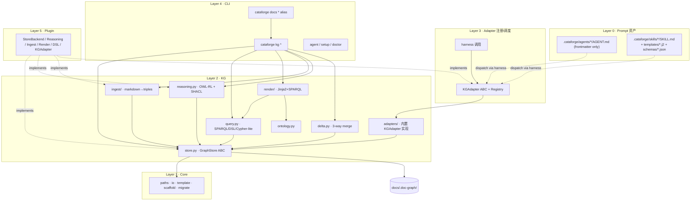

# 知识图谱（KG）功能特性升级 — 最终设计与执行计划

## 0 · Scope 与决策固化

### 0.1 重新定调

KG 成为文档系统的 source of truth；markdown 由 KG 渲染生成；agents/skills 经 `KGAdapter` 抽象层读写图；CLI 以 `cataforge kg *` 为主入口；引入 RDF/OWL + SPARQL 完整技术栈。本设计是 Issue #126 的 superseding epic。

### 0.2 锁定决策表

| 项 | 锁定结果 | 派生约束 |
|---|---|---|
| 技术栈 | rdflib + pyshacl + OWL-RL + SPARQL + Jinja2 | 自带性能 benchmark gate；template-lint 必备；oxigraph plugin 在阈值自动 swap |
| Source of Truth | KG-first，markdown 是渲染产物 + 3-way merge | Render 必须严格 idempotent；PostToolUse auto-ingest；conflicts > 0 阻塞 doctor 与 PR CI |
| Adapter 模型 | 仅 CLI 边界（sidecar `.py` 取消） | 所有 adapter Python 落 `src/cataforge/kg/adapters/`；下游通过 `framework.json` 声明式配置；扩展 = 框架贡献或注册 `KGAdapterPlugin` |
| 迁移节奏 | 大爆炸 v0.5 | 无双写期；`cataforge kg migrate` 必须无损 + 提供 `--rollback`；release notes 必须给出回滚路径 |
| 默认 store | rdflib + sorted N-Quads | 超阈值自动切 oxigraph，阈值由 benchmark 校准 |
| 渲染产物 git-tracked | 是 | 文件头 `generated_by: cataforge-kg-render`；pre-commit `kg render --check` |
| SHACL 严格度 | migrate 时 warn，v0.5 正式 error | migrate report 给 actionable 修复清单 |
| Issue #126 处理 | amendment + close as superseded + 新 epic | 主追踪 issue link 回 #126 |
| conflicts 阻塞 | doctor fail + PR CI fail | 兜底「KG 是 SoT」心智 |
| provenance | RDF-star，fallback named graph | 不破坏 N-Quads 序列化稳定性 |

### 0.3 影响半径

- 新增 Python 模块：`src/cataforge/kg/` 子包约 14 个文件
- 重写：[`src/cataforge/docs/indexer.py`](../../src/cataforge/docs/indexer.py) 与 [`src/cataforge/docs/loader.py`](../../src/cataforge/docs/loader.py) 在 v0.5 删除
- 保留：[`src/cataforge/docs/migrate_nav.py`](../../src/cataforge/docs/migrate_nav.py) 与 [`src/cataforge/docs/migrate_review_frontmatter.py`](../../src/cataforge/docs/migrate_review_frontmatter.py) 迁移到 `src/cataforge/core/migrate/`
- CLI 新增：`cataforge kg *` 顶层 group 约 18 个子命令；`cataforge docs *` 全部保留作为 alias
- Agent/Skill 改动：13 agents + 28 skills 共 24 文件 frontmatter 改动 + 11 个 JSON Schema 文件
- 模板改动：约 40 个 markdown 模板转 Jinja2 + SPARQL DSL
- Migration tool：`cataforge kg migrate` 一次性把现有 `.doc-index.json` + `docs/**/*.md` 摄入到 KG，提供 `--rollback`
- 新增依赖：`rdflib >= 7.0`（pure Python，BSD），可选 `pyoxigraph`（Rust，MIT/Apache）
- 测试套件：约 30 个新测试 + 现有依赖 markdown 的测试需要 golden roundtrip 改造

### 0.4 与现有约束的协调

| 原约束 | 协调方式 |
|---|---|
| Issue #126「metadata layer on top of .doc-index.json」 | 关闭 #126 as superseded by 本 epic |
| Issue #126「No external database, single JSON file」 | 保留离线 + git-trackable 约束；放宽至「目录级图存储」（`docs/.doc-graph/*.nq` 排序后 N-Quads） |
| Issue #126「SKILL/AGENT files are read-only」 | 覆盖 — 本方案改 frontmatter 但不改主体 |
| Issue #126「<200ms full build」 | 放宽至 <2s @ 100 docs 全量 rebuild，<200ms 增量；理由 RDF 序列化无法压到 200ms |
| [CLAUDE.md](../../CLAUDE.md) 硬约束 1（SKILL/AGENT 最小可行） | 决策 3 让 sidecar 不存在；frontmatter +1 个块，主体 0-1 行改动 |
| [CLAUDE.md](../../CLAUDE.md) 硬约束 2（语言解耦） | SPARQL/Turtle/SHACL 与编程语言无关；Python adapter 全部在 framework runtime |
| [CLAUDE.md](../../CLAUDE.md) 硬约束 3（编号连续） | 全文遵守 |
| user-global「无时间估算」 | 全程依赖关系与并行可行性表达 |

---

## 1 · 知识图谱本体设计（Ontology）

### 1.1 本体分层

```
+---------------------------------------------------------+
| Layer 3: project-domain（下游自定义，可选）              |
|   e.g. <proj>:Persona, <proj>:KPI                       |
+---------------------------------------------------------+
| Layer 2: cfa (artifact ontology)                        |
|   Feature / Module / Task / AC / Component / TestCase   |
+---------------------------------------------------------+
| Layer 1: cfp (process ontology)                         |
|   Agent / Skill / Phase / Invocation / Event            |
+---------------------------------------------------------+
| Layer 0: cfk (kernel)                                   |
|   Document / Section / Identifier / Hash / Provenance   |
+---------------------------------------------------------+
```

依赖方向严格向下（L2 可引 L1，L1 不可引 L2）。L3 完全可选；框架核心不消费 L3，仅 SHACL 提供加载机制。

### 1.2 Namespace 注册

```turtle
@prefix cfk:  <https://cataforge.dev/ontology/kernel#> .
@prefix cfp:  <https://cataforge.dev/ontology/process#> .
@prefix cfa:  <https://cataforge.dev/ontology/artifact#> .
@prefix rdf:  <http://www.w3.org/1999/02/22-rdf-syntax-ns#> .
@prefix rdfs: <http://www.w3.org/2000/01/rdf-schema#> .
@prefix owl:  <http://www.w3.org/2002/07/owl#> .
@prefix dct:  <http://purl.org/dc/terms/> .
```

下游项目在 `.cataforge/framework.json`：

```json
{
  "kg": {
    "namespaces": {
      "myproj": "https://example.com/ontology/myproj#"
    },
    "ontology_files": [".cataforge/ontology/myproj.ttl"]
  }
}
```

### 1.3 L0 Kernel 本体

```turtle
cfk:Resource    a owl:Class .
cfk:Document    a owl:Class ; rdfs:subClassOf cfk:Resource .
cfk:Section     a owl:Class ; rdfs:subClassOf cfk:Resource .
cfk:Identifier  a owl:Class ; rdfs:subClassOf cfk:Resource .

cfk:hasId       a owl:DatatypeProperty , owl:FunctionalProperty ;
                rdfs:domain cfk:Resource ; rdfs:range xsd:string ;
                rdfs:comment "Display ID — 人或 LLM 在正文中引用的字符串（F-001/M-002）。Functional 保证单节点一个 hasId。" .

cfk:contentHash a owl:DatatypeProperty ;
                rdfs:domain cfk:Resource ; rdfs:range xsd:string .

cfk:definedIn   a owl:ObjectProperty ;
                rdfs:domain cfk:Resource ; rdfs:range cfk:Document .

cfk:replacedBy  a owl:ObjectProperty ;
                rdfs:domain cfk:Resource ; rdfs:range cfk:Resource ;
                rdfs:comment "Rename 后旧 IRI 指向新 IRI；ingest 解析正文 ID 时透传。" .

cfk:provenance  a owl:AnnotationProperty .
cfk:confidence  a owl:DatatypeProperty ; rdfs:range xsd:decimal .
```

### 1.4 L1 Process 本体

```turtle
cfp:Agent       a owl:Class .
cfp:Skill       a owl:Class .
cfp:Invocation  a owl:Class .
cfp:Event       a owl:Class .

cfp:invokes     a owl:ObjectProperty ;
                rdfs:domain cfp:Agent ; rdfs:range cfp:Skill .
cfp:produces    a owl:ObjectProperty ;
                rdfs:domain cfp:Invocation ; rdfs:range cfk:Resource .
cfp:consumes    a owl:ObjectProperty ;
                rdfs:domain cfp:Invocation ; rdfs:range cfk:Resource .
cfp:succeededBy a owl:ObjectProperty , owl:TransitiveProperty .
```

### 1.5 L2 Artifact 本体

```turtle
cfa:Feature             a owl:Class ; rdfs:subClassOf cfk:Resource .
cfa:Module              a owl:Class ; rdfs:subClassOf cfk:Resource .
cfa:Task                a owl:Class ; rdfs:subClassOf cfk:Resource .
cfa:AcceptanceCriterion a owl:Class ; rdfs:subClassOf cfk:Resource .
cfa:Component           a owl:Class ; rdfs:subClassOf cfk:Resource .
cfa:TestCase            a owl:Class ; rdfs:subClassOf cfk:Resource .

cfa:implements   a owl:ObjectProperty ;
                 rdfs:domain cfa:Module ; rdfs:range cfa:Feature .
cfa:decomposes   a owl:ObjectProperty ;
                 rdfs:domain cfa:Task   ; rdfs:range cfa:Module .
cfa:validates    a owl:ObjectProperty ;
                 rdfs:domain cfa:AcceptanceCriterion ; rdfs:range cfa:Feature .
cfa:renders      a owl:ObjectProperty ;
                 rdfs:domain cfa:Component ; rdfs:range cfa:Feature .
cfa:dependsOn    a owl:ObjectProperty , owl:TransitiveProperty .
cfa:references   a owl:ObjectProperty .

cfa:implementedBy a owl:ObjectProperty ; owl:inverseOf cfa:implements .
cfa:decomposedBy  a owl:ObjectProperty ; owl:inverseOf cfa:decomposes .
cfa:validatedBy   a owl:ObjectProperty ; owl:inverseOf cfa:validates .
cfa:renderedBy    a owl:ObjectProperty ; owl:inverseOf cfa:renders .

cfa:Feature owl:disjointWith cfa:Module , cfa:Task , cfa:AcceptanceCriterion .
```

### 1.6 SHACL 约束

SHACL 表达结构约束（ID 格式、必填字段、值域），不用 OWL 公理做这件事。OWL open-world 语义跟「必须有 label」反着；SHACL 是 closed-world，恰好匹配文档校验场景。

```turtle
@prefix sh: <http://www.w3.org/ns/shacl#> .

cfk:HasIdUniquenessShape a sh:NodeShape ;
    sh:targetClass cfk:Resource ;
    sh:property [
        sh:path cfk:hasId ;
        sh:maxCount 1 ;
        sh:datatype xsd:string ;
        sh:pattern "^[A-Z]+-\\d+$"
    ] .

cfa:FeatureShape a sh:NodeShape ;
    sh:targetClass cfa:Feature ;
    sh:property [
        sh:path cfk:hasId ;
        sh:pattern "^F-\\d+$" ;
        sh:minCount 1 ; sh:maxCount 1 ;
        sh:message "Feature id 必须形如 F-NNN"
    ] ;
    sh:property [
        sh:path rdfs:label ;
        sh:minCount 1 ; sh:datatype xsd:string ;
        sh:message "Feature 必须有 label"
    ] ;
    sh:property [
        sh:path cfk:definedIn ;
        sh:minCount 1 ; sh:class cfk:Document
    ] .
```

### 1.7 JSON-LD 实例样本

```json
{
  "@context": {
    "cfk": "https://cataforge.dev/ontology/kernel#",
    "cfa": "https://cataforge.dev/ontology/artifact#",
    "rdfs": "http://www.w3.org/2000/01/rdf-schema#",
    "label":      { "@id": "rdfs:label" },
    "id":         { "@id": "cfk:hasId" },
    "hash":       { "@id": "cfk:contentHash" },
    "definedIn":  { "@id": "cfk:definedIn", "@type": "@id" },
    "implements": { "@id": "cfa:implements", "@type": "@id" },
    "decomposes": { "@id": "cfa:decomposes", "@type": "@id" }
  },
  "@graph": [
    {
      "@id": "cfa:prd-myproject/F-001",
      "@type": "cfa:Feature",
      "id": "F-001",
      "label": "用户登录",
      "hash": "a3f8c2",
      "definedIn": "cfk:doc/prd-myproject"
    },
    {
      "@id": "cfa:arch-myproject/M-001",
      "@type": "cfa:Module",
      "id": "M-001",
      "label": "认证模块",
      "implements": "cfa:prd-myproject/F-001"
    },
    {
      "@id": "cfa:dev-plan-myproject/T-001",
      "@type": "cfa:Task",
      "id": "T-001",
      "decomposes": "cfa:arch-myproject/M-001"
    }
  ]
}
```

### 1.8 Display-ID 与 IRI 双向映射规则

明确规范，避免正文弱引用与 IRI 之间产生歧义：

1. `cfk:hasId` 是唯一显示 ID 来源，唯一性由 SHACL 保障
2. IRI 形式：`cfa:<doc-slug>/<display-id>`，e.g. `cfa:prd-myproject/F-001`
3. 正文扫描器（`ingest/prose_refs.py`）匹配 `\b[A-Z]+-\d+\b` 后查询 `cfk:hasId` 索引解析 IRI；解析失败的引用以 `cfa:references` + `cfk:confidence` < 1.0 摄入并产出 warn
4. Rename 操作：更新 `cfk:hasId` + 保留旧 IRI 节点并插 `cfk:replacedBy` 指向新 IRI；后续查询自动透传旧 ID
5. 仅在 markdown 文本节点扫描，code block / inline code 内 ID 不解析（防止误匹配）

### 1.9 L3 项目自定义扩展（可选）

```turtle
# .cataforge/ontology/myproj.ttl
@prefix myproj: <https://example.com/ontology/myproj#> .

myproj:Persona  a owl:Class ; rdfs:subClassOf cfk:Resource .
myproj:targets  a owl:ObjectProperty ;
                rdfs:domain myproj:Persona ; rdfs:range cfa:Feature .

myproj:PersonaShape a sh:NodeShape ;
    sh:targetClass myproj:Persona ;
    sh:property [ sh:path cfk:hasId ; sh:pattern "^P-\\d+$" ] .
```

本 release 不强制 L3 编写；下游不存在则跳过，存在则加载。L3 编写器作为 follow-up 独立 issue。

---

## 2 · 知识图谱功能实现与 CLI 接口

### 2.1 存储后端选型矩阵

| 选项 | SPARQL | git-diff-friendly | 离线 | 性能 @10k 三元组 | 依赖足迹 | Python 集成度 |
|---|---|---|---|---|---|---|
| A. rdflib + N-Quads (sorted) | 1.1 完整 | 排序后稳定 | 纯 Python | 中（约 1s 查询） | rdflib (pure Py, BSD) | 原生 |
| B. oxigraph (embedded) | 完整 | binary | 是 | 极高（<10ms） | Rust binary | bindings 良好 |
| C. Kuzu | Cypher 子集 | binary | 是 | 极高 | Rust | bindings 良好 |
| D. TerminusDB | Datalog+GraphQL | git-like 内部 | 需 server | 高 | Rust+server | HTTP |
| E. Apache Jena | 完整 | TDB binary | 需 JVM | 高 | JVM | py4j 桥 |

默认 A（rdflib + sorted N-Quads），可插拔切换到 B（oxigraph）。理由：

1. 默认必须 git-trackable（继承 Issue #126 精神）— sorted N-Quads 是逐行三元组，git diff 完美
2. 默认必须零编译依赖（pip install 即用）— pure Python rdflib 唯一满足
3. 性能瓶颈场景（>5k 三元组）由 `GraphStorePlugin` 自动切换至 oxigraph
4. 排除 JVM 与 server-mode 方案，保留单进程嵌入式

### 2.2 物理布局

```
docs/
├── .doc-graph/                 ← KG 存储根（替代 .doc-index.json）
│   ├── kernel.nq               ← L0/L1/L2 框架本体（构建时由 src/ 内 .ttl 物化）
│   ├── instances.nq            ← 所有项目实例三元组（核心，git 主体）
│   ├── inferred.nq             ← OWL 推理结果（gitignore，可重生成）
│   ├── shacl-report.json       ← 最近一次 validate 结果
│   ├── provenance.nq           ← RDF-star reification 来源
│   ├── conflicts/              ← 当前未解决 3-way merge 冲突
│   └── _meta.json              ← schema_version / generated_at / store_backend
└── (markdown 文件保留，但变成 KG 的渲染产物)
```

`instances.nq` 必须排序写出（subject → predicate → object → graph 词典序），让 git diff 稳定。

### 2.3 Python 包结构

```
src/cataforge/kg/
├── __init__.py
├── store.py              # GraphStore 抽象基类 + RDFLibStore 默认实现
├── store_oxigraph.py     # OxigraphStore（可选 backend，pyoxigraph extras）
├── ontology.py           # Namespace 注册、.ttl 加载、SHACL shape 注册
├── ingest/
│   ├── __init__.py
│   ├── markdown.py       # markdown → triples
│   ├── frontmatter.py    # YAML deps → cfa:dependsOn triples
│   ├── prose_refs.py     # 正文 ID 识别 → cfa:references triples
│   └── canonical.py      # whitespace/ordering normalize，让 ingest idempotent
├── render/
│   ├── __init__.py
│   ├── engine.py         # Jinja2 环境 + kg.query 全局函数
│   ├── filters.py        # mermaid_diagram / bullet_list / table 过滤器
│   └── checker.py        # render-twice idempotency 验证
├── query.py              # SPARQL 查询包装 + Cypher-lite DSL 转译
├── reasoning.py          # OWL-RL（限定 profile）+ SHACL 校验
├── delta.py              # 3-way merge 与 conflict detection
├── adapters/             # 内置 adapter 集中存放（无 sidecar）
│   ├── __init__.py       # 注册表
│   ├── base.py           # KGAdapter ABC
│   ├── feature_authoring.py
│   ├── module_implements.py
│   ├── task_decompose.py
│   ├── test_validates.py
│   ├── doc_read.py
│   └── ...
├── migrate.py            # v1 .doc-index.json → 新 KG 的一次性迁移 + --rollback
└── benchmark.py          # 性能 gate harness
```

### 2.4 核心 API

```python
# src/cataforge/kg/store.py
from abc import ABC, abstractmethod
from collections.abc import Iterable
from typing import NamedTuple

class Triple(NamedTuple):
    s: str
    p: str
    o: str | int | float | bool

class GraphStore(ABC):
    @abstractmethod
    def load(self, project_root: str) -> None: ...
    @abstractmethod
    def persist(self) -> None: ...
    @abstractmethod
    def add(self, triples: Iterable[Triple], named_graph: str | None = None) -> None: ...
    @abstractmethod
    def remove(self, pattern: Triple) -> int: ...
    @abstractmethod
    def query(self, sparql: str) -> list[dict[str, str]]: ...
    @abstractmethod
    def update(self, sparql_update: str) -> None: ...
    @abstractmethod
    def validate(self, shape_graph: str | None = None) -> "ValidationReport": ...
```

```python
# src/cataforge/kg/query.py
def q(store: GraphStore, *, sparql: str | None = None, dsl: dict | None = None) -> list[dict]:
    """统一查询入口。dsl 形如 {'rel': 'implements', 'src_type': 'Module'} 内部转 SPARQL。"""

def impact(store: GraphStore, node: str, max_depth: int = 5) -> list[str]:
    """传递性影响 — 利用 owl:TransitiveProperty 上的反向推理。"""
    return [r["dep"] for r in store.query(f"""
        SELECT ?dep WHERE {{
            ?dep cfa:dependsOn+ <{node}> .
        }}
    """)]

def cypher_lite(store: GraphStore, expr: str) -> list[dict]:
    """子集 Cypher → SPARQL 编译。仅单模式匹配，无副作用。"""
```

### 2.5 CLI 设计

`cataforge kg` 顶层 group 作为主入口；`cataforge docs` 保留全部命令名但底层全部 delegate 到 `cataforge kg` 等价命令。

```bash
# === 存储管理 ===
cataforge kg init                       # 在 docs/.doc-graph/ 初始化空 store
cataforge kg migrate                    # 一次性从 .doc-index.json + docs/**/*.md 摄入
cataforge kg migrate --rollback         # 反向迁移恢复 .doc-index.json
cataforge kg gc                         # 删除孤立 blank nodes、压缩 N-Quads
cataforge kg backend [--use rdflib|oxigraph]

# === 实体 CRUD ===
cataforge kg add-entity --type Skill --id summarize \
    --props '{"lang":"python", "version":"0.2.0"}'
cataforge kg get-entity cfa:prd-myproject/F-001 [--format jsonld|turtle|table]
cataforge kg update-entity F-001 --set 'rdfs:label="新登录"'
cataforge kg delete-entity F-001 [--cascade]

# === 关系 CRUD ===
cataforge kg add-relation M-001 implements F-001
cataforge kg remove-relation M-001 implements F-001

# === 查询 ===
cataforge kg query --sparql "SELECT ?m WHERE { ?m a cfa:Module }"
cataforge kg query --sparql-file q.rq
cataforge kg query --dsl '{"rel":"implements","src_type":"Module"}'
cataforge kg query --cypher "MATCH (t:Task)-[:decomposes]->(m:Module) RETURN t,m"

# === 推理与校验 ===
cataforge kg infer                      # OWL-RL（限定 profile）
cataforge kg validate [--shape FILE]    # SHACL 校验，exit-code 反映 conformance
cataforge kg validate --skills          # 校验所有 SKILL.md 中的 kg_adapter 配置
cataforge kg impact F-001 [--depth 5]
cataforge kg explain F-001 implements F-002

# === 导出与可视化 ===
cataforge kg export --format turtle|jsonld|n-quads|graphml --out FILE
cataforge kg viz [--scope Feature|--node F-001] --format mermaid|dot|svg

# === 渲染 ===
cataforge kg render --doc prd-myproject [--out docs/prd/prd-myproject.md]
cataforge kg render --all
cataforge kg render --check             # 渲染并对比，diff 非空 exit 1（pre-commit 用）

# === 摄入 ===
cataforge kg ingest --file docs/prd/prd-myproject.md
cataforge kg ingest --auto              # PostToolUse hook 入口（quiet-fail）
cataforge kg diff --file docs/prd/prd-myproject.md
cataforge kg conflicts                  # 列出未解决冲突
cataforge kg resolve <conflict-id> --pick file|kg|merge

# === Adapter 自审与批改 ===
cataforge kg adapter list / show <name>
cataforge kg adapter-migrate            # 批量改写 24 个 frontmatter

# === Lint / Benchmark ===
cataforge kg template-lint [--all]      # 静态检查 Jinja2 + 嵌入 SPARQL
cataforge kg benchmark [--budget FILE]  # 跑性能 gate

# === 兼容 alias ===
cataforge docs index        → cataforge kg ingest --all
cataforge docs load <ref>   → cataforge kg query --resolve-ref <ref>
cataforge docs validate     → cataforge kg validate
cataforge docs reverse-deps F-001 → cataforge kg query --dsl '{"rel":"references","dst":"F-001"}'
cataforge docs rename-item F-002 F-003 → cataforge kg update-entity F-002 --set 'cfk:hasId="F-003"'
```

### 2.6 插件接入点

```python
# src/cataforge/kg/plugin_hooks.py
class StoreBackendPlugin(Protocol):
    name: str
    def on_load(self, project_root: str) -> GraphStore: ...
    def on_register(self, ontology_graph) -> None: ...
    def on_dispose(self) -> None: ...

class ReasoningEnginePlugin(Protocol):
    name: str
    def supports(self, profile: str) -> bool: ...
    def infer(self, base_graph, ontology_graph) -> list[Triple]: ...

class IngestPlugin(Protocol):
    extensions: list[str]
    def parse(self, file_path: str) -> list[Triple]: ...

class RenderTargetPlugin(Protocol):
    target_name: str
    def render(self, sparql_results, template_path: str) -> bytes: ...

class QueryDSLPlugin(Protocol):
    dsl_name: str
    def compile(self, expr: str) -> str: ...

class KGAdapterPlugin(Protocol):
    """下游扩展 KGAdapter 的唯一通路（替代原 sidecar .py 机制）。"""
    name: str
    config_schema: dict
    def create(self, store, invocation_id, config) -> "KGAdapter": ...
```

注册：

```json
{
  "kg": {
    "plugins": [
      { "module": "cataforge_kg_oxigraph", "hook": "StoreBackendPlugin" },
      { "module": "myproj_kg_extras",      "hook": "KGAdapterPlugin" }
    ]
  }
}
```

---

## 3 · Agent 与 Skill 适配改造（CLI 边界 adapter 模型）

### 3.1 设计原则

所有 KGAdapter Python 代码集中在 `src/cataforge/kg/adapters/`（framework runtime），prompt 资产层不含 `.py`。下游通过 `framework.json` 声明式参数化内置 adapter；扩展走 `KGAdapterPlugin`。

### 3.2 KGAdapter 抽象层

```python
# src/cataforge/kg/adapters/base.py
from abc import ABC, abstractmethod

class KGAdapter(ABC):
    name: str
    config_schema: dict   # JSON Schema，校验 framework.json / skill frontmatter 中的 config 块

    def __init__(self, store, invocation_id: str, config: dict):
        self.store = store
        self.invocation_id = invocation_id
        self.config = config

    @abstractmethod
    def pre_dispatch_context(self, params: dict) -> dict:
        """返回字典 {key: value}，harness 序列化为 markdown 注入 LLM prompt。"""

    @abstractmethod
    def write_back(self, agent_output: dict) -> list[Triple]:
        """LLM 完成后调用，把产出反序列化为三元组追加到 store。
        返回的三元组 graph 上下文必须设为 cfk:invocation/{invocation_id}。"""

    def validate_output(self, triples: list[Triple]) -> "ValidationReport":
        return self.store.validate(triples)
```

### 3.3 内置 adapter 与声明式配置

```python
# src/cataforge/kg/adapters/feature_authoring.py
class FeatureAuthoringAdapter(KGAdapter):
    name = "feature_authoring"
    config_schema = {
        "type": "object",
        "properties": {
            "doc_id_param": {"type": "string", "default": "doc_id"},
            "pre_dispatch_queries": {
                "type": "object",
                "additionalProperties": {"type": "string"}
            },
            "write_back_schema": {"type": "string"}
        },
        "required": ["pre_dispatch_queries", "write_back_schema"]
    }

    def pre_dispatch_context(self, params):
        doc_id = params[self.config.get("doc_id_param", "doc_id")]
        ctx = {}
        for key, sparql_template in self.config["pre_dispatch_queries"].items():
            ctx[key] = self.store.query(sparql_template.format(doc_id=doc_id))
        return ctx

    def write_back(self, agent_output):
        return triples_from_schema(agent_output, self.config["write_back_schema"])
```

内置 adapter 清单：

| 名称 | 用途 | 主要消费者 |
|---|---|---|
| `feature_authoring` | 创建/更新 Feature | product-manager, architect |
| `module_implements` | 创建/更新 Module + implements 边 | architect |
| `task_decompose` | 创建 Task + decomposes 边 | tech-lead |
| `test_validates` | 创建 TestCase + validates 边 | test-writer, qa-engineer |
| `doc_read` | 只读 — 注入上下文，不 write_back | reviewer, reflector, debugger |
| `ui_renders` | 创建 Component + renders 边 | ui-designer |

### 3.4 SKILL.md / AGENT.md 改造

#### 改造前

```markdown
---
name: doc-gen
description: 生成 PRD/ARCH/DEV-PLAN 等文档
---
## 流程
1. 从用户输入获取目标文档类型
2. 调用 cataforge docs load 加载上游依赖
3. 按模板写文档
4. cataforge docs index 重建索引
```

#### 改造后

```markdown
---
name: doc-gen
description: 生成 PRD/ARCH/DEV-PLAN 等文档
kg_adapter:
  name: feature_authoring
  config:
    doc_id_param: target_doc
    pre_dispatch_queries:
      existing_features: |
        SELECT ?id ?label WHERE {
          ?f a cfa:Feature ; cfk:hasId ?id ; rdfs:label ?label ;
             cfk:definedIn <cfk:doc/{doc_id}> .
        } ORDER BY ?id
      depended_by: |
        SELECT ?down WHERE { ?down cfa:dependsOn <cfk:doc/{doc_id}> } ORDER BY ?down
    write_back_schema: .cataforge/skills/doc-gen/schemas/feature_output.schema.json
---
## 流程
1. 从用户输入获取目标文档类型
2. KG 上下文已由 harness 注入（existing_features / depended_by）
3. 输出符合 adapter 期望的 JSON 结构（schema 见 frontmatter）
4. harness 自动 write_back 并触发渲染
```

SPARQL 字符串嵌在 frontmatter — 每次 dispatch 重新加载，但相对 Python sidecar 更安全且 YAML 比 Python 易审。frontmatter 体积纳入 `claude_md_limits` 类规则监控。

### 3.5 13 agents + 28 skills 改造分类

| 类别 | 文件数 | 改动 |
|---|---|---|
| Read-only agents（reviewer, reflector, debugger, qa-engineer） | 4 | frontmatter `kg_adapter` 块（doc_read）；主体删「调 cataforge docs load」一句 |
| Authoring agents（pm, architect, tech-lead, ui-designer, test-writer） | 5 | frontmatter `kg_adapter` 块 + JSON Schema 文件 |
| Pure executors（implementer, refactorer, devops, orchestrator） | 4 | 不动 |
| Doc skills（doc-gen, doc-nav, doc-review, arc-design, req-analysis, task-decomp） | 6 | frontmatter + Jinja2 模板更新 + JSON Schema |
| Review/audit skills | 9 | frontmatter only |
| Tool/dispatch skills | 13 | 不动 |

合计 **24 文件 frontmatter 改动 + 11 个 JSON Schema 文件 + 约 40 模板转 .j2**。批量改写由 `cataforge kg adapter-migrate` 一次性完成，避免人工逐文件。

### 3.6 下游扩展三档

| 档位 | 方式 | 适用 |
|---|---|---|
| L0 直接用 | 仅 yaml 配置内置 adapter | 约 90% 下游 |
| L1 注册 plugin | pip install + `framework.json` `kg.plugins` 注册 `KGAdapterPlugin` | 业务定制 |
| L2 上游贡献 | PR 到 `src/cataforge/kg/adapters/` | 通用能力 |

Sidecar `.py` 路径不存在，[CLAUDE.md](../../CLAUDE.md) 硬约束 1 自动满足。

### 3.7 兼容性策略：大爆炸 v0.5

无双写期。release notes 明确：

1. 升级前自动 `cataforge upgrade --dry-run` 检测可迁移性
2. `cataforge upgrade apply` 完成后强制运行 `cataforge kg migrate`
3. `cataforge kg migrate --rollback` 提供单命令回滚（重建 .doc-index.json + 移除 .doc-graph/）
4. SHACL 校验在 v0.5 默认 `error`，migrate 阶段降级为 `warn` 输出 actionable 修复清单

---

## 4 · 文档生成流程与模板改造

### 4.1 渲染管道（KG → Markdown）

```
+---------------------------------------------------------+
|  KG Store (.doc-graph/instances.nq)                     |
+--------------------+------------------------------------+
                     | SPARQL queries
                     v
+---------------------------------------------------------+
| render/engine.py                                        |
|   Jinja2 Environment                                    |
|   globals: kg, sparql, namespaces                       |
|   filters: bullet_list, table, mermaid_diagram, link_to |
+--------------------+------------------------------------+
                     | Jinja2 render
                     v
+---------------------------------------------------------+
| .cataforge/skills/doc-gen/templates/                    |
|   prd.md.j2 / arch.md.j2 / dev-plan.md.j2 / ...         |
+--------------------+------------------------------------+
                     | markdown output
                     v
            docs/prd/prd-myproject.md
            (rendered, header marker generated)
```

### 4.2 Jinja2 模板示例

```jinja
{# .cataforge/skills/doc-gen/templates/arch.md.j2 #}
---
id: arch-{{ project }}
doc_type: arch
status: {{ kg.get_attr(doc, 'status', default='draft') }}
generated_by: cataforge-kg-render
generated_at: {{ now() }}
---
<!--
  此文件由 KG 渲染生成；直接编辑会在下次 render 时被覆盖。
  如需修改，使用 cataforge kg update-entity 或 cataforge kg ingest --file <self>。
-->

# 架构文档：{{ kg.get_attr(doc, 'rdfs:label') }}

## 模块清单


### {{ m.id }}: {{ m.label }}

**实现的功能**:
{{ kg.query("""
    SELECT ?fid ?flabel WHERE {
        <cfa:{{doc}}/{{m.id}}> cfa:implements ?f .
        ?f cfk:hasId ?fid ; rdfs:label ?flabel .
    } ORDER BY ?fid
""") | bullet_list(format="{fid}: {flabel}", link_to="prd") }}

**被以下任务分解**:
{{ kg.query("""
    SELECT ?tid ?tlabel WHERE {
        ?t cfa:decomposes <cfa:{{doc}}/{{m.id}}> .
        ?t cfk:hasId ?tid ; rdfs:label ?tlabel .
    } ORDER BY ?tid
""") | bullet_list }}

**依赖图**:
```mermaid
{{ kg.subgraph(root="cfa:{{doc}}/{{m.id}}", depth=2) | mermaid_diagram }}
```

```

### 4.3 Render Idempotency 硬约束

所有 SPARQL 必须显式 `ORDER BY ?id`；filters 输出经 `canonical.py` 处理（trim/normalize newline/dedupe whitespace）；测试强制：

```python
# tests/cataforge/kg/test_render_idempotent.py
@pytest.mark.parametrize("doc_id", ALL_DOC_TYPES)
def test_render_twice_identical(doc_id):
    a = render(doc_id)
    b = render(doc_id)
    assert a == b, "Render must be deterministic"

def test_render_after_noop_ingest_unchanged():
    original = read_file(doc)
    ingest_then_render(doc)
    assert read_file(doc) == original
```

`template-lint` 强制每个 SPARQL 包含 `ORDER BY`，否则 lint fail。

### 4.4 双向同步流程

```
markdown 编辑 (LLM Edit / 人工)
   |
   v
PostToolUse hook: cataforge kg ingest --auto --file <path>
   |
   v
candidate triples vs current triples vs rendered triples  (3-way)
   |
   v
无冲突 -> 直接 apply + 立即 render-back（normalization 变动也接受）
有冲突 -> 写 conflicts/，写 EVENT-LOG kg_ingest_conflict 事件，不阻断 LLM
   |
   v
doctor 检查时 conflicts > 0 ⇒ FAIL
PR CI: cataforge kg render --check + cataforge kg validate + doctor
```

quiet-fail 设计的理由：阻断 LLM Edit 会让 LLM 反复重试或绕开。先记账后清算。

### 4.5 冲突表达

```json
// docs/.doc-graph/conflicts/2026-05-24T15-30-12_M-001.json
{
  "conflict_id": "c_a3f8c2",
  "doc": "arch-myproject",
  "subject": "cfa:arch-myproject/M-001",
  "predicate": "rdfs:label",
  "kg_value":   { "value": "认证模块", "provenance": "agent:architect/inv-42" },
  "file_value": { "value": "鉴权模块", "provenance": "manual_edit:user@2026-05-24" },
  "resolution_options": [
    { "pick": "kg",    "command": "cataforge kg resolve c_a3f8c2 --pick kg" },
    { "pick": "file",  "command": "cataforge kg resolve c_a3f8c2 --pick file" },
    { "pick": "merge", "command": "cataforge kg resolve c_a3f8c2 --pick merge --value '...'" }
  ]
}
```

### 4.6 模板迁移策略

| 现有模板路径 | 类型 | 迁移路径 |
|---|---|---|
| `.cataforge/skills/doc-gen/templates/prd.md` | 纯 markdown，含 `{{ project }}` 占位 | 改名 `prd.md.j2` + 加 SPARQL 块；语法 90% 复用 |
| `.cataforge/skills/doc-gen/templates/arch.md` | 同上 | 同上 |
| `.cataforge/skills/doc-gen/templates/lite/*.md` | 简化版 | 同上但 SPARQL 查询更少 |
| `.cataforge/skills/doc-gen/templates/prototype/brief.md` | brief 模板 | 直接转 brief.md.j2 |
| 用户自定义模板 | 不可控 | 提供 `cataforge kg template-lint` 静态检查，识别用了被废弃占位符的模板 |

### 4.7 渲染产物的归宿

```
docs/                             ← 用户可读、git-tracked
├── prd/
│   └── prd-myproject.md          ← KG 渲染产物，文件头有 "generated_by" 标记
├── arch/
│   └── arch-myproject.md         ← 同
└── .doc-graph/                   ← KG 主存储
    ├── instances.nq              ← 主数据，git-tracked
    ├── kernel.nq                 ← 物化的本体，git-tracked
    ├── inferred.nq               ← 推理结果，.gitignore
    └── conflicts/                ← 当前未解决冲突，git-tracked（强制 review）
```

渲染产物（`docs/**/*.md`）仍然 git-tracked，不放入 .gitignore。理由：

1. 让 PR review 能看到内容变化，否则审 KG triple diff 几乎不可能
2. 外部消费者（GitHub web 阅读、wiki 导入）仍然按 markdown 工作
3. 文件头 generated 标记 + pre-commit hook（`cataforge kg render --check`）确保 render 结果与 KG 同步

---

## 5 · 整体架构升级

### 5.1 五层架构

```
+-------------------------------------------------------------------+
| Layer 5 · Plugin 层                                                |
|   StoreBackendPlugin / ReasoningEnginePlugin / IngestPlugin       |
|   RenderTargetPlugin / QueryDSLPlugin / KGAdapterPlugin           |
+-------------------------------------------------------------------+
                            ^
                            | injected
+-------------------------------------------------------------------+
| Layer 4 · CLI 层                                                   |
|   cataforge kg * (primary)   cataforge docs * (compat alias)      |
|   cataforge agent / skill / setup / doctor / ...                  |
+-------------------------------------------------------------------+
                            |
                            v uses
+-------------------------------------------------------------------+
| Layer 3 · Adapter 注册与调度层                                      |
|   KGAdapter ABC + 内置 adapter 注册表（src/cataforge/kg/adapters/）|
|   harness dispatch 前后调 pre_dispatch_context / write_back       |
+-------------------------------------------------------------------+
                            |
                            v uses
+-------------------------------------------------------------------+
| Layer 2 · KG 层 (src/cataforge/kg/)                                |
|   store / ontology / ingest / render / query / reasoning / delta  |
+-------------------------------------------------------------------+
                            |
                            v uses
+-------------------------------------------------------------------+
| Layer 1 · Core 层 (src/cataforge/core/)                            |
|   paths / io / template / scaffold / config / events / migrate    |
+-------------------------------------------------------------------+
                            ^
                            | 通过 CLI 调用，不直接 import
+-------------------------------------------------------------------+
| Layer 0 · Prompt 资产层 (.cataforge/agents, .cataforge/skills)     |
|   markdown prompts + frontmatter 声明 kg_adapter                  |
|   通过 harness 注入 KG 上下文，自身不含 .py                         |
+-------------------------------------------------------------------+
```

### 5.2 依赖方向

- Layer N 只能依赖 Layer < N；严格单向
- Plugin 层用 Protocol 注入到 Layer 4/3/2，不被 1/2 直接 import
- Layer 0 与 Python runtime 解耦：通过 frontmatter 声明 + CLI 调用通信
- Adapter 实现全部落 Layer 2 内部子模块 `src/cataforge/kg/adapters/`，对外仅暴露 ABC + 注册表

### 5.3 Mermaid 架构图



---

## 6 · 实施路线（大爆炸 v0.5）

按依赖关系组织，无时间估算，仅描述并行可行性与优先级。

### 6.1 Wave A · 本体与存储基础设施（阻塞所有下游）

- A1 `src/cataforge/kg/store.py` — GraphStore ABC + RDFLibStore
- A2 `src/cataforge/kg/ontology.py` — .ttl 加载 + namespace 注册
- A3 三份本体文件 `kernel.ttl` / `process.ttl` / `artifact.ttl`
- A4 完整 SHACL shapes（含 hasId uniqueness）
- A5 `src/cataforge/kg/reasoning.py` — OWL-RL（限定 profile：subClassOf / inverseOf / transitive）+ pyshacl
- A6 `tests/cataforge/kg/` 单元测试 + golden triple 文件
- A7 benchmark harness `cataforge kg benchmark` + `.cataforge/kg/perf-budget.json`

A1→A2→(A3,A4) 串行；A5/A6/A7 与 A1-A4 完成后并行。

### 6.2 Wave B · Ingest 与 Migration（依赖 A）

- B1 `ingest/markdown.py` + `ingest/frontmatter.py` + `ingest/prose_refs.py` + `ingest/canonical.py`
- B2 `migrate.py` — 大爆炸迁移 + `--rollback` + actionable SHACL warn report
- B3 `delta.py` — 3-way merge
- B4 端到端测试：dogfood 仓做迁移 + rollback round-trip

B1→B2 串行；B3 与 B2 并行；B4 在最后。

### 6.3 Wave C · Query / Render / CLI（依赖 A+B，并行链）

- C1 `query.py` — SPARQL/DSL/cypher-lite 三入口
- C2 `render/engine.py` + `filters.py` + `checker.py`（idempotency 校验）
- C3 模板 .md→.md.j2 迁移（约 40 个，按 doc_type 分批）
- C4 `cli/kg_cmd.py` 全部子命令 + `docs_cmd.py` alias 改写
- C5 `template-lint` 工具
- C6 渲染 golden + CLI e2e 测试

C1 / (C2→C3→C5) / C4 三链可并行；C6 收尾。

### 6.4 Wave D · Adapter 层与 Agent/Skill 改造（依赖 A+C）

- D1 `kg/adapters/` 内置 6 个 adapter + 注册表
- D2 harness 集成（dispatch 前后调 adapter）
- D3 `cataforge kg adapter-migrate` 批量改写 24 个 frontmatter + 11 个 JSON Schema
- D4 集成测试 — 模拟 dispatch 链，验证 KG 状态变化
- D5 `check_no_design_residue.py` 增 `allow-kg-migration` escape hatch（一次性 PR）

D1→D2 串行；D3 与 D2 并行（D3 是模板化批改，不依赖 harness）。

### 6.5 Wave E · 推理 / 可视化 / Plugin（与 D 并行，依赖 A）

- E1 `cataforge kg infer / validate / impact / explain`
- E2 `cataforge kg viz` — mermaid/dot/svg
- E3 Plugin 注册机制（StoreBackend / Reasoning / Ingest / Render / DSL / KGAdapter）
- E4 示范 plugin `cataforge-kg-oxigraph` 包
- E5 文档：`docs/reference/kg-cookbook.md` + `docs/reference/kg-sparql-recipes.md`

E1-E5 内部并行。

### 6.6 Wave F · Cutover（依赖 A-E 全部完成）

- F1 PostToolUse hook 接入（默认 quiet-fail）
- F2 doctor 集成（conflicts > 0 / SHACL fail / render --check 异常）
- F3 pre-commit hook：`cataforge kg render --check` + `cataforge kg validate`
- F4 PR CI gate：同上 + benchmark threshold
- F5 删除 `src/cataforge/docs/indexer.py` 与 `src/cataforge/docs/loader.py`；`migrate_nav.py` / `migrate_review_frontmatter.py` 迁移到 `src/cataforge/core/migrate/`
- F6 release notes + `cataforge upgrade` 自动跑 `kg migrate`（带显式确认 prompt）
- F7 Issue #126 加 amendment 关闭 as superseded；新主追踪 issue link 回

---

## 7 · 验收标准

每个 Wave 输出必须满足下列硬性 gate：

1. **A 输出**：本体三文件无 SHACL self-violation；OWL-RL 闭包计算 < 1.5s @ 100 docs；benchmark harness 可独立运行
2. **B 输出**：`cataforge kg migrate` round-trip 用 dogfood 仓库无损（reverse migrate 后 .doc-index.json 字节级一致或语义一致）；3-way merge 单元覆盖率 ≥ 90%
3. **C 输出**：所有 .md.j2 渲染 idempotent（render-twice 测试通过）；template-lint 在 dogfood 仓全绿；CLI e2e 覆盖所有 `cataforge kg *` 子命令
4. **D 输出**：dispatch 集成测试覆盖 6 内置 adapter；24 个 frontmatter 由 `adapter-migrate` 工具一次生成；JSON Schema 全部有效
5. **E 输出**：plugin 注册文档化；oxigraph plugin 在 >5k triples 项目跑 SPARQL < 200ms
6. **F 输出**：dogfood 仓 v0.5 cutover 测试通过（含 PR CI 全绿）；release notes 包含 rollback 指令；upgrade 提供 dry-run

---

## 8 · 性能预算（C-05 实证替代断言）

`.cataforge/kg/perf-budget.json`：

```json
{
  "full_rebuild": { "max_ms": 2000, "docs": 100 },
  "incremental_update": { "max_ms": 200 },
  "shacl_validate": { "max_ms": 1000, "triples": 5000 },
  "owl_rl_infer": { "max_ms": 1500, "triples": 5000 },
  "single_sparql_query": { "max_ms": 50 },
  "oxigraph_autoswap_threshold_triples": 5000
}
```

benchmark 用 dogfood 仓 + 合成 fixture（5k/10k/50k triples）；超阈触发 oxigraph 建议而非硬失败（防止 CI 因机器差异翻车）。

---

## 9 · 风险清单

### 9.1 P0 — 必须在 Wave A 之前对齐

| # | 风险 | 影响 | 缓解 |
|---|---|---|---|
| R-01 | Issue #126 scope 已被超越，公开 roadmap 与新方案不符 | 社区/用户预期错位；现有 PR 失效 | 在 Issue #126 顶部加 amendment 关闭 as superseded；新建主追踪 issue link 回 #126 |
| R-02 | rdflib 性能在 >10k 三元组场景下 SPARQL 查询 >1s | 用户体验崩塌、CI 超时 | 阈值（5k triples）自动 swap oxigraph；benchmark gate 兜底 |
| R-03 | three-way merge 冲突频发导致用户被迫每次都解冲突 | adoption 障碍 | render 必须 idempotent；ingest 容忍 whitespace/段落顺序差异（canonical.py） |
| R-04 | renaming `cfk:hasId` 是 destructive update，可能让外部引用整体失效 | 外部链接、wiki、grep 全部断 | 强制 `--dry-run` 默认 + 生成 redirect map（`cfk:replacedBy` triples） |
| R-17 | 大爆炸 v0.5 让下游升级失败，无回滚路径 | 升级阻塞、下游回退到老版本 | `cataforge kg migrate --rollback` + `cataforge upgrade --dry-run` 必须可逆；release notes 给完整回滚命令 |

### 9.2 P1 — Wave 实施期间监控

| # | 风险 | 影响 | 缓解 |
|---|---|---|---|
| R-06 | OWL-RL 推理对环依赖图爆炸 | infer 步骤超时/OOM | 限定推理 profile 仅启用 subClassOf / inverseOf / transitive；禁用 someValuesFrom 等重型公理 |
| R-07 | Jinja2 模板里写 SPARQL 让模板调试极难（错一个引号 silent fail） | doc-gen 用户体验下降 | `cataforge kg template-lint` 强制覆盖；render 时未匹配 query 给 stderr warning 而非空字符串 |
| R-08 | RDF blank nodes 在 git diff 中改 hash 产生噪音 | 假 diff 让 review 失焦 | 禁用 blank nodes，所有节点必须有 IRI；ingest 时遇 anonymous structure 强制生成 deterministic IRI |
| R-10 | SHACL 校验严格性导致老项目升级后全部 FAIL | 用户被迫一次性清理大量历史数据 | migration tool 默认 `--shacl-mode=warn` + actionable 报告；v0.5 正式启用 error |
| R-11 | 双向同步：人编辑 markdown 后 conflict 累积无人处理 | conflicts/ 目录堆积成垃圾场 | doctor 把 conflicts 数计入失败条件；render --check 在 PR CI 强制要求 0 conflicts |
| R-18 | SPARQL 嵌入 yaml frontmatter，多行字符串易语法错 | skill 调度失败 | template-lint 覆盖 frontmatter SPARQL；`cataforge kg validate --skills` 单命令校验所有 skill 配置 |
| R-19 | rdflib 7.x 升级断 API | 框架重大维护成本 | rdflib 版本精确 pin（==7.x.y）；integration smoke 每 release 跑 |
| R-20 | OxigraphStore 与 RDFLibStore 行为不一致（SPARQL 1.1 子集差异） | KG behavior 不稳定 | 共享 conformance test suite，两 backend 跑同一 query 套件断言结果一致 |

### 9.3 P2 — 长期演进

| # | 风险 | 影响 | 缓解 |
|---|---|---|---|
| R-09 | 大量 agents/skills 同时改 frontmatter，design-residue 守卫误判 | PR 反复被 block | 守卫脚本加 `<!-- allow-kg-migration: ... -->` escape hatch；v0.5 cutover 后批量清除 |
| R-12 | 自定义 namespace / ontology 演化版本管理 | 项目升级框架后 schema 不兼容 | 强制本体文件带 `owl:versionInfo`；framework upgrade 时跑 schema diff |
| R-13 | 多 agent 并发 write_back 引入 race condition | KG 状态不一致 | store.persist 加文件锁；harness 串行化 write_back（同一 invocation graph 内禁止并发） |
| R-14 | 渲染产物 git diff 与 KG diff 双重 review 负担 | reviewer 疲劳 | PR template 增加 KG-only / Doc-only 区分；提供 GH Action 自动生成 KG diff 摘要 |
| R-16 | LLM 直接编辑 markdown 不走 KG 路径，导致 KG-as-source-of-truth 名存实亡 | 核心架构假设动摇 | PostToolUse hook 自动 ingest（quiet-fail）；doctor 把 conflicts > 0 计入失败；render --check CI gate |
| R-21 | 正文 ID 引用解析正则误匹配（e.g. 代码块里的 `R-2D` 类标识） | 误产生 cfa:references triple | 仅在 markdown 文本节点扫描，跳过 code block / inline code；ingest 给 confidence 字段 |

---

## 10 · 下游 Migration Cookbook

```bash
# 升级前
cataforge upgrade --dry-run        # 看变更
git stash                          # 保险

# 执行升级 + 迁移
cataforge upgrade apply
cataforge kg migrate               # 一次性迁移 .doc-index.json → docs/.doc-graph/
cataforge kg validate              # SHACL 体检（warn 模式）
cataforge kg render --check        # 验证 markdown 与 KG 一致

# 提交
git add docs/.doc-graph/ docs/     # 渲染产物若有变动一并提交
git commit -m "chore: cataforge v0.5 KG migration"

# 如果回滚
cataforge kg migrate --rollback    # 恢复 .doc-index.json
pip install "cataforge<0.5"
```

---

## 11 · 与 CLAUDE.md 硬约束的最终对账

- **硬约束 1（SKILL/AGENT 最小化）**：决策 3 让 sidecar `.py` 不存在；frontmatter 增量 1 个 `kg_adapter` 块；主体 0-1 行改动。R-09 escape hatch 用于 v0.5 一次性迁移 PR，迁移完成后 `adapter-migrate` 同步清理迁移注释
- **硬约束 2（语言解耦）**：SPARQL/Turtle/SHACL 是查询/本体 DSL，与编程语言无关，天然符合。Adapter Python 全部隐藏在 framework runtime，不进 prompt 资产
- **硬约束 3（文档结构）**：本设计所有编号列表用连续整数；执行计划无子步骤编号
- **user-global「无时间估算」**：全程依赖关系/并行可行性表达，无任何时间数字

---

## 12 · 与现状的破坏性变更清单

给下游项目升级 v0.4 → v0.5 的用户参考。

1. 存储路径：`docs/.doc-index.json` 删除，迁移到 `docs/.doc-graph/`
2. CLI：所有 `cataforge docs *` 命令仍可用（alias），但官方推荐改用 `cataforge kg *`
3. 模板：`doc-gen` 模板从 `.md` → `.md.j2`，含 SPARQL 块
4. frontmatter：所有 AGENT.md/SKILL.md 增加 `kg_adapter:` 块（仅相关者，约 24 文件）
5. CI：建议加 `cataforge kg validate` + `cataforge kg render --check` 两个 gate
6. 依赖：pyproject.toml 新增 `rdflib >= 7.0`，可选 `pyoxigraph`
7. 本体扩展：项目自定义实体类型从硬编码改为 `.cataforge/ontology/*.ttl`（完全可选）
8. hooks：PostToolUse 增加 `cataforge kg ingest --auto --file` 自动回流（quiet-fail）
9. 守卫：`check_no_design_residue.py` 增 `allow-kg-migration` escape hatch（一次性 PR 用）

---

## 13 · 后续延伸（不在 v0.5 范围）

记录但不立即实施，留待 v0.6+ 评估：

1. L3 project-domain ontology 编写器 skill（让下游 PM/Dev 不必学 Turtle）
2. KG diff 自动摘要 GH Action（缓解 R-14 reviewer 疲劳）
3. 远程 KG endpoint 接入（让多仓库共享 KG，目前仅支持本地）
4. SPARQL Federation（跨项目 KG join 查询）
5. Visualization Server — `cataforge kg viz --serve` 本地浏览器交互式探索
6. 反向：从 KG 生成 OpenAPI / GraphQL schema（用于业务侧消费）
