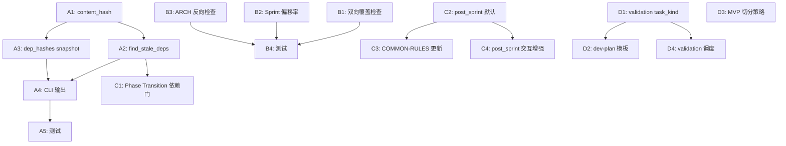

# 修订计划：文档漂移防护与迭代检查点

基于 [feedback-analysis-doc-drift-and-iteration.md](feedback-analysis-doc-drift-and-iteration.md) 的分析结论，本文档为非知识图谱类改进项制定完整修订计划。知识图谱相关改进已归入独立 backlog（GitHub issue #126）。

## 修订范围总览

```
修订项 10 项，涉及文件 12 个，分 4 个批次串行实施。
批次 A: 基础设施层（indexer 内容哈希 + 依赖新鲜度验证）
批次 B: 检查层（双向覆盖矩阵 + Sprint 偏移检测）
批次 C: 协议层（Phase Transition 依赖新鲜度门 + post_sprint 默认启用）
批次 D: 规划层（validation 任务类型 + MVP 切分 + 里程碑）
```

---

## 批次 A：基础设施层 — 内容哈希与依赖新鲜度

### A1. indexer.py — 文档内容哈希计算

**文件**: `src/cataforge/docs/indexer.py`

**变更 1**: 新增 `_content_hash()` 函数（在 `_estimate_tokens()` 之后）

```python
import hashlib

def _content_hash(content: str) -> str:
    """Compute short hash of document body (post-frontmatter)."""
    from cataforge.utils.frontmatter import split_yaml_frontmatter
    _, body = split_yaml_frontmatter(content)
    text = body if body is not None else content
    return hashlib.sha256(text.encode("utf-8")).hexdigest()[:8]
```

**变更 2**: 在 `build_document_entry()` 的 `entry` 字典中增加 `content_hash` 字段

位置：`indexer.py:158-170`，在 entry 构建时追加：

```python
entry: dict[str, Any] = {
    "file_path": rel_path.replace("\\", "/"),
    "doc_type": doc_type, "volume": volume, "status": status,
    "total_lines": total_lines, "est_tokens": _estimate_tokens(content),
    "content_hash": _content_hash(content),  # ← 新增
    "sections": sections,
}
```

**变更 3**: deps 字段保持兼容，不改 frontmatter 格式

当前 deps 是纯字符串列表 `["prd-myproject"]`。内容哈希不写入 frontmatter（避免每次 body 变更都要改 frontmatter），而是在 index 层面记录。新鲜度比对在 `validate_docs()` 中完成。

### A2. indexer.py — 依赖新鲜度验证

**文件**: `src/cataforge/docs/indexer.py`

**变更**: 新增 `find_stale_deps()` 函数，加入 `validate_docs()` 结果

```python
def find_stale_deps(project_root: str) -> list[dict[str, str]]:
    """Return deps whose upstream doc content_hash changed since index build.

    For each document's deps list, resolve the upstream doc_id and compare
    the upstream's current content_hash with the hash recorded when the
    downstream doc was last finalized. A mismatch signals that the upstream
    was revised after the downstream was written against it.
    """
    index_path = os.path.join(project_root, "docs", INDEX_FILENAME)
    if not os.path.isfile(index_path):
        return []
    try:
        with open(index_path, encoding="utf-8") as f:
            index = json.load(f)
    except (OSError, json.JSONDecodeError):
        return []

    stale: list[dict[str, str]] = []
    documents = index.get("documents") or {}

    for doc_id, entry in documents.items():
        deps = entry.get("deps") or []
        if not isinstance(deps, list):
            continue
        dep_hashes = entry.get("dep_hashes") or {}
        for dep in deps:
            # Extract bare doc_id from refs like "prd-foo#§2"
            bare_id = dep.split("#")[0] if "#" in dep else dep
            upstream = documents.get(bare_id)
            if not upstream:
                continue  # xref_errors already catches missing refs
            upstream_hash = upstream.get("content_hash", "")
            pinned_hash = dep_hashes.get(bare_id, "")
            if pinned_hash and upstream_hash and pinned_hash != upstream_hash:
                stale.append({
                    "doc_id": doc_id,
                    "file_path": entry.get("file_path", ""),
                    "upstream_id": bare_id,
                    "pinned_hash": pinned_hash,
                    "current_hash": upstream_hash,
                })
    return stale
```

**变更**: 更新 `validate_docs()` 增加 stale_deps

```python
def validate_docs(project_root: str) -> dict[str, list]:
    return {
        "orphans": find_orphan_docs(project_root),
        "stale": find_stale_index_entries(project_root),
        "xref_errors": find_xref_errors(project_root),
        "alias_conflicts": find_alias_conflicts(project_root),
        "invalid_ids": find_invalid_doc_ids(project_root),
        "stale_deps": find_stale_deps(project_root),  # ← 新增
    }
```

### A3. indexer.py — doc-gen finalize 时记录依赖哈希快照

**文件**: `src/cataforge/docs/indexer.py`

**变更**: 在 `build_document_entry()` 中，当文档有 deps 时，记录各上游文档的当前 content_hash 快照到 `dep_hashes` 字段。

这需要两步索引：先构建所有文档的 entry（含 content_hash），再做第二遍填充 dep_hashes。

在 `build_full_index()` 中追加第二遍：

```python
def build_full_index(project_root: str) -> dict[str, Any]:
    docs_dir = os.path.join(project_root, "docs")
    documents: dict[str, Any] = {}
    if not os.path.isdir(docs_dir):
        return _make_index(documents)
    for md_path in sorted(glob.glob(...)):
        ...
        if doc_id and entry:
            documents[doc_id] = entry

    # Second pass: snapshot upstream content_hashes into dep_hashes
    _fill_dep_hashes(documents)

    return _make_index(documents)


def _fill_dep_hashes(documents: dict[str, Any]) -> None:
    """For each doc with deps, record upstream docs' current content_hash."""
    for doc_id, entry in documents.items():
        deps = entry.get("deps") or []
        if not isinstance(deps, list) or not deps:
            continue
        dep_hashes: dict[str, str] = {}
        for dep in deps:
            bare_id = dep.split("#")[0] if "#" in dep else dep
            upstream = documents.get(bare_id)
            if upstream and upstream.get("content_hash"):
                dep_hashes[bare_id] = upstream["content_hash"]
        if dep_hashes:
            entry["dep_hashes"] = dep_hashes
```

同样在 `update_single_doc()` 中，更新单文档后也需要刷新 dep_hashes（使用已有索引中其它文档的 content_hash）。

### A4. CLI 输出 — validate 命令展示 stale deps

**文件**: `src/cataforge/cli/docs_cmd.py`

**变更**: 在 `docs_validate` 命令的输出中增加 stale_deps 展示。

```python
stale_deps = result.get("stale_deps", [])
if stale_deps:
    click.echo(f"[WARN] {len(stale_deps)} stale dependency(ies):")
    for sd in stale_deps:
        click.echo(
            f"  {sd['doc_id']} → {sd['upstream_id']} "
            f"(pinned={sd['pinned_hash']}, current={sd['current_hash']})"
        )
```

### A5. 测试

**文件**: `tests/cli/test_docs_validate.py`（追加）

```
test_stale_deps_detected_when_upstream_hash_changes
  — 构建含 PRD 和 ARCH 的索引，记录 dep_hashes
  — 修改 PRD body，重建 PRD 的 content_hash（但不刷新 ARCH 的 dep_hashes）
  — validate 返回 stale_deps 含 ARCH→PRD 条目

test_stale_deps_clean_when_hashes_match
  — 构建含 PRD 和 ARCH 的索引，dep_hashes 与 content_hash 一致
  — validate 返回空 stale_deps

test_content_hash_stability
  — 同一 body 多次计算 hash，结果一致
  — 修改 body 一个字符，hash 改变
```

---

## 批次 B：检查层 — 双向覆盖矩阵与 Sprint 偏移检测

### B1. checker.py — 双向覆盖检查

**文件**: `src/cataforge/skill/builtins/doc_review/checker.py`

**变更**: 在 `DocChecker` 中新增 `check_bidirectional_coverage()` 方法，在 `run()` 中调用。

```python
def check_bidirectional_coverage(self) -> None:
    """Verify downstream doc covers all items from its upstream doc."""
    coverage_rules: dict[str, dict] = {
        "arch": {"upstream_type": "prd", "upstream_prefix": "F", "search_in": "body"},
        "dev-plan": {"upstream_type": "arch", "upstream_prefix": "M", "search_in": "body"},
        "ui-spec": {"upstream_type": "prd", "upstream_prefix": "F", "search_in": "body"},
    }
    rule = coverage_rules.get(self.doc_type)
    if not rule or self.volume_type != "main":
        return

    docs_path = Path(self.docs_dir)
    if not docs_path.exists():
        docs_path = docs_path.parent
        if not docs_path.exists():
            return

    upstream_prefix = rule["upstream_prefix"]
    upstream_type = rule["upstream_type"]

    # Find upstream doc files
    upstream_items: set[str] = set()
    for up_file in docs_path.glob(f"**/{upstream_type}*.md"):
        try:
            up_content = up_file.read_text(encoding="utf-8")
        except OSError:
            continue
        for m in re.finditer(
            rf"^### ({upstream_prefix}-\d+)", up_content, re.MULTILINE
        ):
            upstream_items.add(m.group(1))

    if not upstream_items:
        return

    # Check which upstream items are referenced in current doc
    content_no_code = self._strip_code_blocks(self.content)
    covered = {
        item for item in upstream_items
        if re.search(re.escape(item), content_no_code)
    }
    uncovered = upstream_items - covered

    if uncovered:
        sorted_uncovered = sorted(uncovered)
        self.fail(
            f"上游 {upstream_type} 中 {len(uncovered)} 项未被覆盖: "
            f"{', '.join(sorted_uncovered[:5])}"
            + (f" 等 ({len(sorted_uncovered)} 项)" if len(sorted_uncovered) > 5 else "")
        )
```

**变更**: 在 `run()` 方法中追加调用（`check_split_consistency()` 之后）：

```python
self.check_bidirectional_coverage()
```

### B2. sprint-review — Sprint 偏移率检测

**文件**: `.cataforge/skills/sprint-review/SKILL.md`

**变更**: 在 Step 2 Layer 2 审查维度列表末尾追加偏移率检测维度：

在 `scope-drift` 条目后追加：

```markdown
- 偏移率(drift-rate): 对比本 Sprint 实际交付的 AC 与 dev-plan 中规划的 AC：延期的 AC（计划内但未交付）+ 计划外的 AC（交付但未在计划中声明）。偏移率 = (延期 AC + 计划外 AC) / 规划 AC 总数。偏移率 > 20% 时标记 HIGH 并建议用户重新评估剩余 Sprint 规划
```

**变更**: 在 Sprint 审查额外 category 表中追加：

```markdown
| drift-rate | AC 偏移率超过阈值（延期 + 计划外 / 总计划），建议重新评估 |
```

### B3. typed_checks.py — ARCH 模块功能映射反向检查

**文件**: `src/cataforge/skill/builtins/doc_review/typed_checks.py`

**变更**: 在 `check_arch()` 方法末尾追加反向检查逻辑。

当前 `check_arch()` 第 86-90 行检查"每个 M-NNN 是否引用了 F-NNN"（正向）。追加反向：

```python
    # Reverse check: all F-NNN from PRD are referenced in at least one M-NNN
    if self.volume_type in ("main", "modules"):
        all_f_refs = set(re.findall(r"F-\d+", self.content))
        # This is handled by the generic check_bidirectional_coverage;
        # here we add a complementary check for module-level coverage density
        m_to_f: dict[str, list[str]] = {}
        for sec in m_sections:
            m_id_match = re.match(r"### (M-\d+)", sec)
            if m_id_match:
                m_id = m_id_match.group(1)
                f_refs = re.findall(r"F-\d+", sec)
                m_to_f[m_id] = f_refs
        modules_without_features = [
            m_id for m_id, f_list in m_to_f.items() if not f_list
        ]
        if modules_without_features:
            self.fail(
                f"{len(modules_without_features)}个模块未映射到任何PRD功能: "
                f"{', '.join(modules_without_features[:5])}"
            )
```

### B4. 测试

**文件**: `tests/cli/test_doc_review_coverage.py`（新建）

```
test_bidirectional_coverage_arch_missing_feature
  — PRD 含 F-001, F-002, F-003; ARCH 仅引用 F-001, F-002
  — check_bidirectional_coverage() → FAIL: F-003 未被覆盖

test_bidirectional_coverage_arch_full_coverage
  — PRD 含 F-001, F-002; ARCH 引用 F-001, F-002
  — check_bidirectional_coverage() → 无错误

test_bidirectional_coverage_dev_plan_missing_module
  — ARCH 含 M-001, M-002; DEV-PLAN 仅引用 M-001
  — check_bidirectional_coverage() → FAIL: M-002 未被覆盖

test_bidirectional_coverage_skipped_for_non_main_volume
  — volume_type = "modules", upstream 有未覆盖项
  — check_bidirectional_coverage() → 不检查（分卷只覆盖部分）

test_drift_rate_category_in_sprint_review
  — 验证 sprint-review SKILL.md 包含 drift-rate category
```

---

## 批次 C：协议层 — Phase Transition 依赖新鲜度门 + post_sprint 默认启用

### C1. ORCHESTRATOR-PROTOCOLS.md — Phase Transition 增加依赖新鲜度检查

**文件**: `.cataforge/agents/orchestrator/ORCHESTRATOR-PROTOCOLS.md`

**变更**: 在 Phase Transition Protocol Step 4（一致性验证）之后、Step 5（EVENT BATCH）之前，插入新的 Step 4.5：

```markdown
4. **一致性验证** — 确认文档头 status 与 CLAUDE.md 字段一致
5. **依赖新鲜度检查** — 运行 `cataforge docs validate`，检查 `stale_deps` 输出：
   - 无 stale deps → 通过，继续 Step 6
   - 存在 stale deps → 向用户展示过期依赖清单并提供选项：
     1. 进入 cascade_amendment 更新受影响文档
     2. 确认变更不影响下游、继续推进（stale deps 降级为 WARN 记录到 EVENT-LOG）
     3. 暂停，手动审查
   - 用户选"确认不影响"时记录 **[EVENT]**: `cataforge event log --event state_change --phase {当前阶段} --detail "stale deps acknowledged: {upstream_ids}"`
6. **[EVENT BATCH]** ...
```

后续步骤编号递增（原 5→6, 6→7, 7→8）。

### C2. framework.json — post_sprint 加入默认检查点

**文件**: `.cataforge/framework.json`

**变更**: 修改 constants.MANUAL_REVIEW_CHECKPOINTS：

```json
"MANUAL_REVIEW_CHECKPOINTS": ["pre_dev", "post_sprint", "pre_deploy"]
```

### C3. COMMON-RULES.md — 更新常量表和执行模式矩阵

**文件**: `.cataforge/rules/COMMON-RULES.md`

**变更 1**: 更新框架配置常量表 MANUAL_REVIEW_CHECKPOINTS 行：

```
| MANUAL_REVIEW_CHECKPOINTS | [pre_dev, post_sprint, pre_deploy] | 阶段转换时需用户确认才能继续的检查点 | orchestrator |
```

**变更 2**: 更新执行模式矩阵中 standard 的人工检查点列：

```
| 人工检查点 | 引用 `MANUAL_REVIEW_CHECKPOINTS`（含 post_sprint） | 仅 pre_dev | none |
```

### C4. ORCHESTRATOR-PROTOCOLS.md — post_sprint 检查点交互增强

**文件**: `.cataforge/agents/orchestrator/ORCHESTRATOR-PROTOCOLS.md`

**变更**: 在 Manual Review Checkpoint Protocol 的 Step 3 中，为 `post_sprint` 检查点增加专用交互模板：

在 pre_deploy + demo_required=true 追加选项 4 之后添加：

```markdown
   post_sprint 专用选项（当 checkpoint = `post_sprint` 时替换基础模板）:
   ```
   === Sprint {N} 完成确认 ===
   已完成任务: {Sprint 任务 ID 和名称列表}
   通过率: {passed}/{total}
   新增/变更功能: {本 Sprint 用户可感知的功能摘要}

   选项:
   1. 确认继续下一 Sprint
   2. 暂停，我需要手动验证功能
   3. 发现偏移，需要调整需求（进入 Change Request）
   ```
   当本 Sprint 包含 `user_facing_critical_path: true` 的任务时，追加选项 4：
   ```
   4. 已手动验证核心功能正常工作
   ```
```

---

## 批次 D：规划层 — validation 任务类型、MVP 切分、里程碑

### D1. task-decomp SKILL.md — validation 任务类型

**文件**: `.cataforge/skills/task-decomp/SKILL.md`

**变更 1**: 在"输出规范"的任务卡字段列表中，task_kind 可选值追加 `validation`:

在第一个 bullet 之后追加字段说明：

```markdown
  - task_kind: feature|fix|chore|config|docs|validation
```

**变更 2**: 在"执行流程"Step 7 之后追加 Step 8：

```markdown
8. 插入验证任务: 每个包含 `user_facing_critical_path: true` 任务的 Sprint 末尾，追加一个 `task_kind: validation` 的验证任务。验证任务不产出代码，orchestrator 遇到时暂停并向用户展示验证清单
```

**变更 3**: 在"Anti-Patterns"末尾追加：

```markdown
- 禁止: Sprint 内全部为后端 API 任务而无任何用户可感知的功能交付（Sprint 1 例外：基础设施任务集中在首个 Sprint），除非项目为纯后端服务
```

### D2. dev-plan 模板 — validation 任务卡模板 + 里程碑章节

**文件**: `.cataforge/skills/doc-gen/templates/standard/dev-plan.md`

**变更 1**: 在 §3 任务卡详细中，T-001 模板之后追加 validation 任务卡模板：

```markdown
### T-{NNN}: [VALIDATION] {功能流程名称}
- **目标**: 用户手动验证{功能}的完整流程
- **task_kind**: validation
- **模块**: {相关模块 M-NNN}
- **验证清单**:
  - [ ] {操作步骤 1}，确认{预期结果 1}
  - [ ] {操作步骤 2}，确认{预期结果 2}
  - [ ] {边界情况}，确认{错误处理正确}
- **前置任务**: [T-{前置任务 ID 列表}]
- **context_load**: [{关联文档引用}]
```

**变更 2**: 在 §5 风险项之后、§6 之前，插入新章节：

```markdown
## 5.5. 里程碑计划

### Milestone 1: {里程碑名称} (Sprint 1-{N})
- **交付功能**: {用户可感知的完整功能列表}
- **验收标准**: {里程碑级别的验收条件}
- **验证方式**: {用户手动验证 / 自动化回归 / 截图确认}
```

**变更 3**: 更新 `required_sections` frontmatter，将里程碑设为可选（不加入 required，因为小项目可能不需要）。但在 [NAV] 块中加入引用：

```
- §5.5 里程碑计划 (可选)
```

### D3. task-decomp SKILL.md — MVP 切分策略

**文件**: `.cataforge/skills/task-decomp/SKILL.md`

**变更**: 在"执行流程"Step 7 和新 Step 8 之间（重新编号后），追加 Sprint 划分的 MVP 原则：

```markdown
7. 按依赖关系划分Sprint(参考 task-dep-analysis 输出的 sprint_groups)，遵循 MVP 切分原则:
   - 每个 Sprint 的产出应包含至少一个用户可感知的完整功能（后端 API + 前端页面 + 路由集成 = 一个可验证的功能单元）
   - 优先安排用户核心路径（`user_facing_critical_path: true`）的任务到前几个 Sprint
   - Sprint 1 例外: 基础设施任务（数据库、认证、CI/CD）允许集中在首个 Sprint，不要求用户可感知功能
   - 纯后端服务项目无此约束
```

### D4. ORCHESTRATOR-PROTOCOLS.md — validation 任务调度

**文件**: `.cataforge/agents/orchestrator/ORCHESTRATOR-PROTOCOLS.md`

**变更**: 在 Parallel Task Dispatch Protocol 的"适用前提"之后，追加 validation 任务处理规则：

```markdown
**validation 任务调度**:
当 Sprint 中包含 `task_kind: validation` 的任务时:
1. validation 任务**不进入 TDD 流程**，不调度 test-writer / implementer
2. orchestrator 在该任务的所有前置任务完成后，通过 AskUserQuestion 向用户展示验证清单
3. 用户选项:
   - "全部通过": 任务状态 → done
   - "发现问题": 用户描述问题 → 进入 Change Request Protocol
   - "暂时跳过": 任务状态 → deferred，不阻塞后续 Sprint
4. validation 任务不计入 `SPRINT_REVIEW_MICRO_TASK_COUNT` 阈值（它本身已包含用户确认）
```

### D5. 模板注册表 — dev-plan 更新

**文件**: `.cataforge/skills/doc-gen/templates/_registry.yaml`

**变更**: 确认 dev-plan 模板条目无需变更（required_sections 不增加里程碑为必填，里程碑是可选章节）。若 registry 中有 required_sections 字段，确认不包含 `§5.5`。

---

## 实施顺序与依赖关系



批次间依赖: A 必须先于 C（C1 依赖 A2 的 `find_stale_deps()`）。B 和 D 彼此独立，可与 A/C 并行。

推荐实施序: **A → B（并行）+ C → D**

---

## 各批次文件清单

### 批次 A — 4 个文件
| 文件 | 操作 | 行数估算 |
|------|------|---------|
| `src/cataforge/docs/indexer.py` | 修改 | +60 行 |
| `src/cataforge/cli/docs_cmd.py` | 修改 | +15 行 |
| `tests/cli/test_docs_validate.py` | 修改 | +50 行 |
| `tests/cli/test_docs_indexer.py` | 修改 | +20 行 |

### 批次 B — 4 个文件
| 文件 | 操作 | 行数估算 |
|------|------|---------|
| `src/cataforge/skill/builtins/doc_review/checker.py` | 修改 | +40 行 |
| `src/cataforge/skill/builtins/doc_review/typed_checks.py` | 修改 | +15 行 |
| `.cataforge/skills/sprint-review/SKILL.md` | 修改 | +5 行 |
| `tests/cli/test_doc_review_coverage.py` | 新建 | +80 行 |

### 批次 C — 3 个文件
| 文件 | 操作 | 行数估算 |
|------|------|---------|
| `.cataforge/agents/orchestrator/ORCHESTRATOR-PROTOCOLS.md` | 修改 | +30 行 |
| `.cataforge/framework.json` | 修改 | 1 行 |
| `.cataforge/rules/COMMON-RULES.md` | 修改 | 2 行 |

### 批次 D — 3 个文件
| 文件 | 操作 | 行数估算 |
|------|------|---------|
| `.cataforge/skills/task-decomp/SKILL.md` | 修改 | +15 行 |
| `.cataforge/skills/doc-gen/templates/standard/dev-plan.md` | 修改 | +25 行 |
| `.cataforge/agents/orchestrator/ORCHESTRATOR-PROTOCOLS.md` | 修改 | +15 行 |

**总计**: 12 个文件（11 修改 + 1 新建），约 +370 行

---

## 验收标准

### 批次 A
- [ ] `cataforge docs index` 产出的 `.doc-index.json` 中每个文档含 `content_hash` 字段
- [ ] `cataforge docs index` 产出的索引中含 deps 的文档有 `dep_hashes` 字段
- [ ] `cataforge docs validate` 在上游文档变更后输出 `[WARN] stale dependency`
- [ ] 所有既有测试继续通过（向后兼容）

### 批次 B
- [ ] ARCH 审查时若 PRD 中存在未被任何 M-NNN 覆盖的 F-NNN，Layer 1 报 FAIL
- [ ] DEV-PLAN 审查时若 ARCH 中存在未被任何 T-NNN 引用的 M-NNN，Layer 1 报 FAIL
- [ ] Sprint-review Layer 2 包含 drift-rate 维度，偏移率 > 20% 时标 HIGH
- [ ] 分卷文档（volume_type != main）不触发双向覆盖检查

### 批次 C
- [ ] Phase Transition 时自动运行 stale deps 检查，存在过期依赖时暂停并向用户展示选项
- [ ] standard 模式默认在每个 Sprint 完成后暂停等待用户确认
- [ ] agile-lite 模式不受 post_sprint 影响（仅 pre_dev）
- [ ] COMMON-RULES 常量表与 framework.json 值一致

### 批次 D
- [ ] `task_kind: validation` 的任务不进入 TDD 流程
- [ ] orchestrator 遇到 validation 任务时通过 AskUserQuestion 展示验证清单
- [ ] dev-plan 模板包含 validation 任务卡模板和里程碑章节（可选）
- [ ] task-decomp 包含 MVP 切分原则和自动插入 validation 任务的规则
