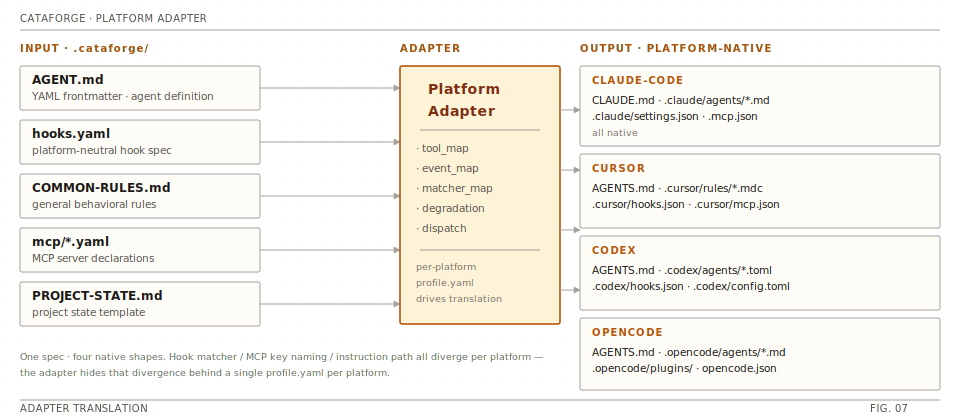

# CataForge 架构与工作流说明

本文档描述 CataForge 框架的整体架构、运行时工作流、核心编排协议与平台适配机制。

> **版本**：0.1.1

## 目录

1. [整体架构](#1-整体架构) — 五层架构栈（FIG. 03）
2. [运行时工作流](#2-运行时工作流) — 执行模式（FIG. 04）· 阶段执行（FIG. 05）· TDD 引擎（FIG. 06）
3. [平台适配机制](#3-平台适配机制) — 适配器翻译（FIG. 07）
4. [质量保障机制](#4-质量保障机制)
5. [学习系统](#5-学习系统)
6. [统一状态码](#6-统一状态码)
7. [文档引用格式](#7-文档引用格式)
8. [事件日志](#8-事件日志)
9. [CLI 命令参考](#9-cli-命令参考)

---

## 1. 整体架构

### 1.1 架构层次

CataForge 采用分层架构，从上到下依次为：依赖方向向下，`PlatformAdapter` 层是屏蔽 IDE 差异的核心抽象。

<p align="center">
  
</p>

### 1.2 核心模块职责

| 模块 | 目录 | 职责 |
|------|------|------|
| **core** | `src/cataforge/core/` | 配置管理（framework.json）、项目路径解析、事件总线、核心类型定义 |
| **platform** | `src/cataforge/platform/` | 平台适配器抽象、4 个平台实现、能力一致性检查、适配器注册中心 |
| **deploy** | `src/cataforge/deploy/` | 部署编排引擎，将 agent/rule/hook/MCP 投放到目标平台 |
| **agent** | `src/cataforge/agent/` | Agent 发现、frontmatter 校验、格式翻译（AGENT.md → 平台原生）、结果解析 |
| **skill** | `src/cataforge/skill/` | Skill 发现、元数据加载、执行框架（支持脚本型与说明型） |
| **hook** | `src/cataforge/hook/` | hooks.yaml 规范解析 → 平台 hook 配置桥接，含 9 个内置 hook 脚本 |
| **mcp** | `src/cataforge/mcp/` | MCP 服务器 YAML 声明注册、start/stop 生命周期管理 |
| **plugin** | `src/cataforge/plugin/` | 插件发现（Python entry points + 本地目录扫描）、manifest 校验 |
| **docs** | `src/cataforge/docs/` | 文档索引（NAV-INDEX）、doc-nav 段落精准加载 |
| **integrations** | `src/cataforge/integrations/` | 外部工具集成（Penpot 设计工具 API 对接） |
| **schema** | `src/cataforge/schema/` | 数据模型校验（插件 manifest 等） |
| **utils** | `src/cataforge/utils/` | YAML frontmatter 解析、Markdown 处理、Docker 工具、通用模式匹配 |
| **cli** | `src/cataforge/cli/` | 统一命令行入口，包含 13 个子命令模块 |

### 1.3 关键配置文件

| 文件 | 位置 | 作用 |
|------|------|------|
| `framework.json` | `.cataforge/framework.json` | 框架单一配置源：版本、运行时平台、常量、功能开关、升级策略、迁移检查 |
| `PROJECT-STATE.md` | `.cataforge/PROJECT-STATE.md` | 项目状态模板：项目信息、执行环境、当前阶段、文档状态追踪 |
| `COMMON-RULES.md` | `.cataforge/rules/COMMON-RULES.md` | 框架通用行为规则：输出语言、状态码、错误处理、执行模式矩阵 |
| `SUB-AGENT-PROTOCOLS.md` | `.cataforge/rules/SUB-AGENT-PROTOCOLS.md` | 子代理执行协议：continuation/revision/amendment 三种任务类型流程 |
| `ORCHESTRATOR-PROTOCOLS.md` | `.cataforge/agents/orchestrator/ORCHESTRATOR-PROTOCOLS.md` | 编排器核心协议：Bootstrap、阶段路由、中断恢复、TDD 编排 |
| `hooks.yaml` | `.cataforge/hooks/hooks.yaml` | 平台无关 hook 规范定义 |
| `profile.yaml` | `.cataforge/platforms/{platform}/profile.yaml` | 各平台能力映射、工具翻译、降级策略 |

---

## 2. 运行时工作流

### 2.1 项目初始化流程（Bootstrap）

当用户通过 `start-orchestrator` 技能启动项目时，编排器执行以下 Bootstrap 流程：

```text
Step 1: 收集项目信息
    ├── 项目名称、技术栈
    ├── 命名规范、提交格式、分支策略
    └── 审查检查点选择

Step 2: 选择执行模式
    ├── standard    → 7 阶段完整流程
    ├── agile-lite  → 轻量敏捷（合并阶段）
    └── agile-prototype → 快速原型（最小阶段）

Step 3: 创建目录结构（按模式不同）

Step 4: 生成 CLAUDE.md（从 PROJECT-STATE.md 模板）

Step 5: 写入框架版本（来自 pyproject.toml）

Step 6: 选择目标平台（claude-code/cursor/codex/opencode）

Step 7: 填充执行环境，应用最小权限

Step 8: 创建 docs/NAV-INDEX.md

Step 9: 进入初始阶段
```

### 2.2 三种执行模式

CataForge 支持三种执行模式，适应不同规模的项目需求。三条流水线用同一 pill 宽度绘制，便于目测仪式量差异：

<p align="center">
  
</p>

- **standard** — 7 阶段完整 SDLC，产出：PRD、Architecture Doc、UI Spec、Dev Plan、Test Report、Deploy Spec。
- **agile-lite** — 5 阶段，合并需求与架构，使用轻量模板（prd-lite / arch-lite / dev-plan-lite 各 ≤ 50 行）。
- **agile-prototype** — 2 阶段，最小流程；brief ≤ 150 行直接进入开发，适合快速验证。

### 2.3 阶段执行流程

每个阶段遵循统一的五段执行流程，分支出口标注在右侧：

<p align="center">
  
</p>

### 2.4 TDD 开发流程（Development 阶段）

Development 阶段使用 TDD Engine 编排，按微任务逐个推进。每个微任务先由 LOC 判定走 standard 还是 light，完成若干微任务后触发 Sprint Review：

<p align="center">
  
</p>

> Sprint Review 触发条件：完成 `SPRINT_REVIEW_MICRO_TASK_COUNT` 个微任务。
> `REFACTOR` 阶段若测试失败，状态回滚为 `rolled-back`，保留 GREEN 阶段产出。

### 2.5 中断恢复协议

当 Agent 返回 `needs_input` 状态时：

```text
1. 编排器暂停当前 Agent
2. 向用户展示问题（最多 MAX_QUESTIONS_PER_BATCH 个）
3. 用户回答后，以 task_type=continuation 重新调度 Agent
4. Agent 加载中间产出 → 应用用户回答 → 从恢复点继续
5. 同一 Agent 同一阶段最多 2 次中断恢复
6. 第 3 次中断请求人工介入
```

### 2.6 修订协议

当 Reviewer 返回 `needs_revision` 时：

```text
1. 编排器加载 REVIEW 报告
2. 以 task_type=revision 重新调度原 Agent
3. Agent 按 CRITICAL > HIGH > MEDIUM > LOW 排序问题
4. 仅修复 CRITICAL 和 HIGH 级别问题
5. 增量修正文档
6. 重新提交 Reviewer 审查
```

### 2.7 手动审查检查点

可配置的检查点，在阶段转换前暂停等待人工确认：

- `phase_transition`：每次阶段转换前暂停
- `pre_dev`：进入开发阶段前暂停
- `pre_deploy`：进入部署阶段前暂停
- `post_sprint`：每个 Sprint 完成后暂停
- `none`：不设检查点

默认配置：`["pre_dev", "pre_deploy"]`

---

## 3. 平台适配机制

### 3.1 适配原理

CataForge 通过 `PlatformAdapter` 抽象层屏蔽 IDE 差异。同一份规范资产（`.cataforge/`）经 Adapter 翻译为各平台原生文件：

<p align="center">
  
</p>

### 3.2 平台能力对比

| 能力 | Claude Code | Cursor | CodeX | OpenCode |
|------|-------------|--------|-------|----------|
| Agent 定义格式 | YAML frontmatter | YAML frontmatter | TOML | 规则注入 |
| 指令文件 | CLAUDE.md | AGENTS.md + .mdc | AGENTS.md | opencode.json |
| Agent 调度 | Agent (同步) | Task (同步) | spawn_agent (异步) | task (同步) |
| Hook 配置 | settings.json | hooks.json | hooks.json (仅 Bash) | 不支持 (降级) |
| MCP 配置 | .mcp.json | .cursor/mcp.json | .codex/config.toml | opencode.json |
| 并行 Agent | 支持 | 支持 (8 并发) | 支持 (best-of-N) | 有限 |
| Worktree 隔离 | 支持 | 支持 | 不支持 | 不支持 |
| 多模型路由 | opus/sonnet/haiku | opus/sonnet/gpt/gemini | gpt-5.4/spark | 有限 |

### 3.3 降级策略

当目标平台不支持某能力时，框架自动采用降级策略：

| 降级方式 | 说明 | 典型场景 |
|----------|------|---------|
| **rules_injection** | 将 hook 逻辑注入到规则文件中 | OpenCode 无原生 hook 支持 |
| **skip** | 跳过该功能，记录日志 | CodeX 不支持 detect_correction |
| **prompt_check** | 在提示词中加入检查指令 | 部分平台无格式检查 hook |
| **degraded** | 功能可用但能力受限 | Cursor 的 AskUserQuestion |

### 3.3a 跨平台目录隔离

每个平台部署只生成**自己命名空间**下的产物（`.claude/` / `.cursor/` / `.codex/` / `.opencode/`），互不干扰。**Cursor 部署默认不会触及 `.claude/` 目录**；仅当 `.cataforge/platforms/cursor/profile.yaml` 设置 `rules.cross_platform_mirror: true` 时，才会在 `.claude/rules` 创建一份 Markdown 镜像，供"同一仓库同时用 Cursor + Claude Code"的双栖场景共享 prompt。干运行时该镜像会以 `SKIP: .claude/rules Markdown mirror` 的行文明示其状态，避免用户误以为 Cursor 部署"莫名碰了 Claude 目录"。

### 3.4 部署流程

`deploy` 命令执行以下步骤：

```text
1. 加载 framework.json 确定目标平台
2. 加载目标平台 profile.yaml
3. 投放指令文件（PROJECT-STATE.md → CLAUDE.md/AGENTS.md）
4. 投放规则文件（COMMON-RULES.md → 平台规则目录）
5. 翻译并投放 Agent 定义（AGENT.md → 平台 agent 格式）
6. 桥接 Hook 配置（hooks.yaml → 平台 hook 配置）
7. 注入 MCP 配置（mcp/*.yaml → 平台 MCP 配置文件）
8. 处理降级（不支持的功能按策略降级或跳过）
9. 生成平台特定附加输出（如 Cursor 的 .mdc 文件）
```

支持 `--check` 干运行模式，仅输出预期动作不实际执行。

---

## 4. 质量保障机制

### 4.1 文档审查（doc-review）

```text
Layer 1 — 脚本检查：
  ├── 结构完整性（必要章节是否齐全）
  ├── 格式合规性（标题层级、编号格式）
  ├── 交叉引用有效性（doc_id#§section 引用是否可解析）
  └── 常量引用正确性

Layer 2 — AI 审查（可按文档类型跳过）：
  ├── 语义一致性（与上游文档是否矛盾）
  ├── 业务逻辑正确性
  ├── 完整性（需求是否遗漏）
  └── 可行性评估

跳过条件：
  - 文档行数 < DOC_REVIEW_L2_SKIP_THRESHOLD_LINES (200)
  - 文档类型 ∈ DOC_REVIEW_L2_SKIP_DOC_TYPES
```

### 4.2 代码审查（code-review）

```text
Layer 1 — Lint 检查：
  ├── ruff / eslint 等工具自动检查
  └── 格式化验证

Layer 2 — AI 审查：
  ├── 架构合规性（是否符合 arch 设计）
  ├── 安全性（OWASP Top 10 等）
  ├── 业务逻辑正确性
  └── 测试覆盖充分性
```

### 4.3 问题分类体系

审查发现的问题按 9 类分类：

| 类别 | 说明 |
|------|------|
| completeness | 内容完整性 |
| consistency | 与上下游文档/代码的一致性 |
| convention | 命名/格式/编码规范 |
| security | 安全性问题 |
| feasibility | 技术可行性 |
| ambiguity | 表述模糊 |
| structure | 文档/代码结构 |
| error-handling | 错误处理 |
| performance | 性能相关 |

严重等级：CRITICAL > HIGH > MEDIUM > LOW

审查结果状态：
- `approved`：审查通过
- `approved_with_notes`：通过但有 MEDIUM/LOW 建议
- `needs_revision`：存在 CRITICAL/HIGH 问题，需要修订

---

## 5. 学习系统

### 5.1 On-Correction Learning

通过 `detect_correction` hook 自动捕获用户对 Agent 决策的覆盖：

```text
1. Agent 通过 AskUserQuestion 提供选项
2. 用户选择了 Agent 未推荐的选项（option-override 信号）
3. Hook 捕获此信号并记录到 CORRECTIONS-LOG.md
4. 当 self-caused 问题累计达到 RETRO_TRIGGER_SELF_CAUSED (5) 次时
5. 触发 reflector Agent 进行回顾分析
```

### 5.2 Reflector 回顾

reflector Agent 按以下流程提取经验：

```text
1. 聚合 CORRECTIONS-LOG.md 中的问题记录
2. 按 (agent, category) 维度分组统计
3. 对每组问题至少需要 2 条证据才生成 EXP 条目
4. 生成经验条目（EXP entries）→ .cataforge/learnings/
5. 提出 SKILL-IMPROVE 建议（改进 Skill 定义）
6. 校准评审标准（Adaptive Review）
```

---

## 6. 统一状态码

所有 Agent 返回统一的状态码：

| 状态码 | 含义 | 后续动作 |
|--------|------|---------|
| `completed` | 正常完成 | 进入审查 |
| `needs_input` | 需要用户决策 | 中断恢复协议 |
| `blocked` | 需要外部干预 | 暂停等待 |
| `rolled-back` | REFACTOR 失败，保留 GREEN 输出 | 记录并继续 |
| `approved` | 审查通过 | 阶段转换 |
| `approved_with_notes` | 通过但有建议 | 用户选择接受或修复 |
| `needs_revision` | 存在严重问题 | 修订协议 |

---

## 7. 文档引用格式

Agent 间通过标准化引用格式传递信息，避免全文复制：

```text
格式：{doc_id}#§{section_number}[.{item_id}]

示例：
  prd#§2.F-003      → PRD 文档第 2 节 Feature F-003
  arch#§3.M-auth    → 架构文档第 3 节 Module auth
  dev-plan#§1.T-005 → 开发计划第 1 节 Task T-005
```

doc-nav Skill 负责按引用格式精准加载对应段落，降低 Agent 上下文占用。

---

## 8. 事件日志

所有关键事件记录到 `docs/EVENT-LOG.jsonl`，格式为 JSON Lines：

典型事件类型：
- `phase_start` / `phase_end`：阶段开始/结束
- `review_verdict`：审查结论
- `state_change`：状态变更
- `agent_dispatch`：Agent 调度
- `correction`：用户纠正

---

## 9. CLI 命令参考

| 命令 | 说明 |
|------|------|
| `cataforge doctor` | 健康诊断：检查框架目录、依赖、外部工具、平台 profile |
| `cataforge setup --platform <id>` | 初始化：设定运行时平台 |
| `cataforge deploy [--check] --platform <id>` | 部署：投放资产到目标平台（--check 干运行） |
| `cataforge agent list` | 列出所有已发现的 Agent |
| `cataforge agent validate` | 校验 Agent 定义合法性 |
| `cataforge skill list` | 列出所有已发现的 Skill |
| `cataforge skill run <id>` | 执行指定 Skill |
| `cataforge hook list` | 列出 hooks.yaml 中定义的 hook |
| `cataforge mcp list` | 列出已注册的 MCP 服务 |
| `cataforge mcp start <id>` | 启动 MCP 服务 |
| `cataforge mcp stop <id>` | 停止 MCP 服务 |
| `cataforge plugin list` | 列出已发现的插件 |
| `cataforge upgrade check` | 检查框架更新 |
